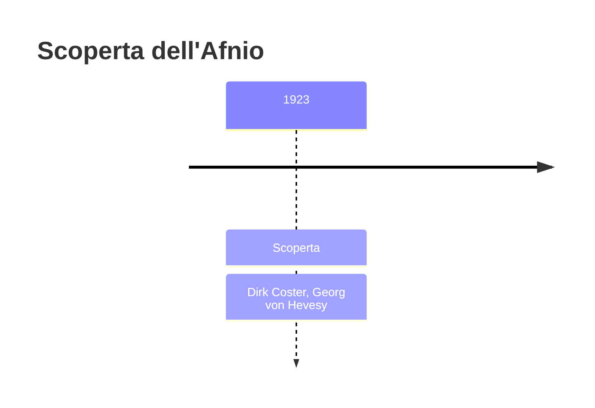
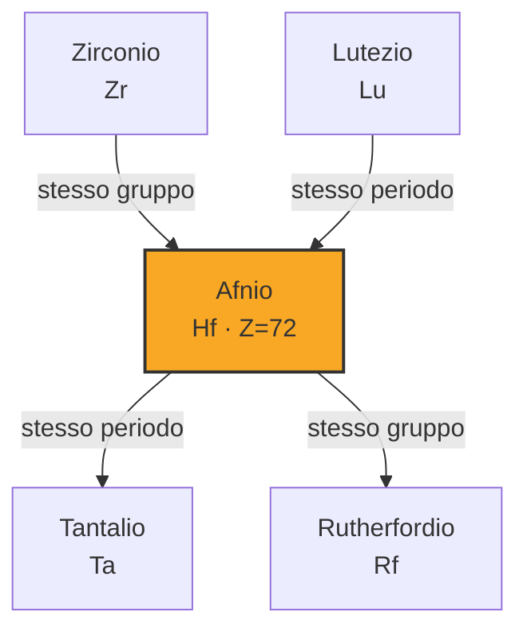
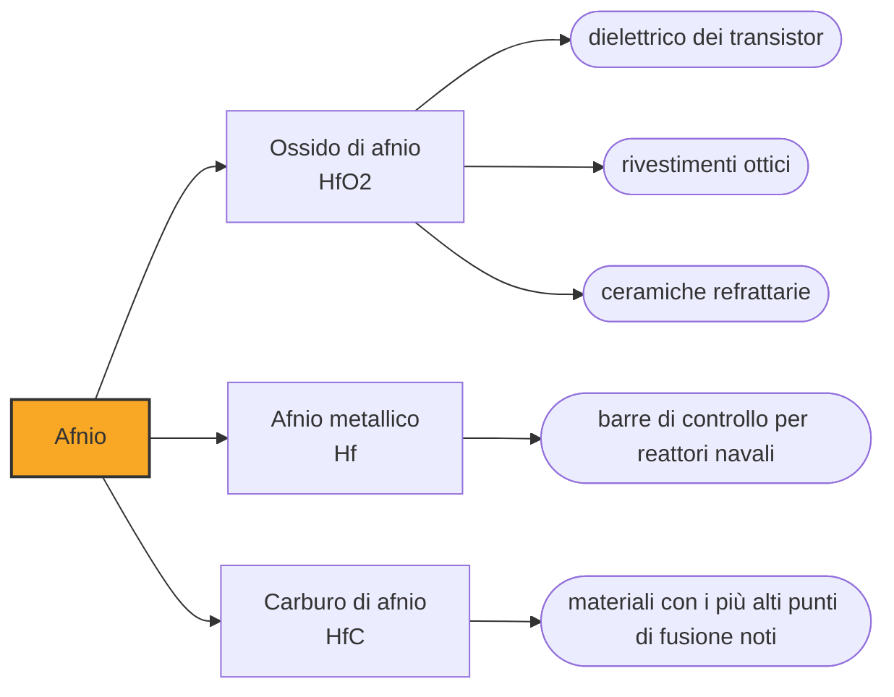

# Afnio (Hf)

> [!abstract] 87° elemento scoperto — 1923
> Per quindici anni l'elemento 72 fu cercato fra le terre rare, e qualcuno annunciò perfino di averlo trovato. Bohr disse che stavano cercando nel posto sbagliato, e aveva ragione per ragioni di meccanica quantistica.

L'afnio è il gemello chimico dello zirconio: stessa colonna, stessa valenza, raggi ionici quasi identici, e per questo i due si separano con difficoltà. È però l'opposto dello zirconio per una proprietà che in un reattore nucleare conta più di tutte: assorbe i neutroni seicento volte meglio.

## Cronologia della scoperta

## Storia della scoperta

Nel primo Novecento la casella 72 della tavola periodica era una delle poche rimaste vuote, e non si sapeva dove collocarla: molti chimici la cercavano fra le terre rare, perché la serie dei lantanidi sembrava non essere ancora finita. Nel 1911 Georges Urbain annunciò di averla riempita con un elemento che chiamò celtium, ricavato dalle terre rare.

Fu la teoria a indicare il posto giusto. Niels Bohr, applicando il proprio modello dell'atomo e il modo in cui gli elettroni riempiono i gusci, sostenne che la serie dei lantanidi doveva chiudersi al lutezio e che l'elemento 72 doveva essere un metallo di transizione, parente dello zirconio: andava cercato nei minerali di zirconio, non nelle terre rare.

Nel 1923, a Copenaghen, nell'istituto diretto da Bohr, Dirk Coster e George de Hevesy esaminarono minerali di zirconio con la spettroscopia a raggi X, che identifica un elemento dal suo numero atomico invece che dal comportamento chimico: è la tecnica con cui Henry Moseley aveva dimostrato dieci anni prima che il numero atomico, e non il peso, è ciò che ordina la tavola periodica. Le righe dell'elemento 72 c'erano, esattamente dove Bohr aveva detto. Lo chiamarono afnio, da Hafnia, il nome latino di Copenaghen.

La rivendicazione di Urbain non resse: né lo spettro né il comportamento chimico che aveva descritto corrispondevano all'elemento trovato a Copenaghen, e dopo una lunga controversia il celtium fu archiviato. È lo stesso Urbain che aveva vinto la disputa sul lutezio quindici anni prima: qui perse, e per una ragione di principio — l'elemento non stava dove lui lo cercava.

La scoperta dell'afnio è uno dei primi casi in cui la struttura elettronica dell'atomo, cioè la fisica, dice alla chimica dove guardare, e ci prende. Da lì in avanti la tavola periodica smette di essere un ordinamento per peso e diventa un ordinamento per numero atomico e configurazione elettronica, cioè per come l'atomo è fatto dentro.

## Posizione nella tavola periodica

## Caratteristiche

Le proprietà chimiche di afnio e zirconio sono quasi identiche, per via della contrazione lantanidica che rende i due ioni praticamente della stessa dimensione: nei minerali stanno sempre insieme, e separarli è una delle operazioni più costose della metallurgia. Ogni zirconio commerciale ne contiene una piccola percentuale, e viceversa.

Dove i due si distinguono nettamente è di fronte ai neutroni: l'afnio ne cattura circa seicento volte più dello zirconio. È la ragione per cui lo zirconio, trasparente ai neutroni, fa i tubi che contengono il combustibile nucleare, e l'afnio, che li mangia, fa le barre di controllo: due elementi quasi indistinguibili con ruoli opposti nella stessa macchina, ed è per questo che vanno separati fino all'ultima traccia.

È un metallo lucente, duttile, resistente alla corrosione, che fonde a 2233 gradi e nei composti sta quasi sempre nello stato +4. In polvere fine è piroforico, cioè si incendia spontaneamente all'aria: una proprietà che ne complica la lavorazione e che si sfrutta in alcuni inneschi.

Nella crosta terrestre è a circa tre parti per milione, più comune del molibdeno, ma non ha minerali propri: si ricava per intero come sottoprodotto della lavorazione dello zircone per lo zirconio. I procedimenti di separazione dei due, per distillazione estrattiva o per scambio ionico, sono stati sviluppati proprio per l'industria nucleare, che aveva bisogno di zirconio senza afnio e di afnio senza zirconio.

### Dati fisico-chimici

| Proprietà | Valore |
|---|---|
| Numero atomico | 72 |
| Massa atomica | 178,492 u |
| Categoria | Metallo di transizione |
| Gruppo | 4 |
| Periodo | 6 |
| Blocco | d |
| Configurazione elettronica | [Xe] 4f¹⁴ 5d² 6s² |
| Punto di fusione | 2232,9 °C |
| Punto di ebollizione | 4602,9 °C |
| Densità | 13,31 g/cm³ |
| Stati di ossidazione | +4 |

## Struttura atomica

![[atomo-Afnio.svg]]

## Usi e presenza in natura

Le barre di controllo all'afnio sono usate soprattutto nei reattori navali, in particolare nei sottomarini, dove servono materiali che assorbano bene i neutroni, resistano alla corrosione dell'acqua ad alta temperatura e durino per l'intera vita del reattore senza essere sostituiti.

Fuori dal nucleare, l'afnio entra nelle superleghe a base di nichel per le palette delle turbine, dove piccole aggiunte migliorano la resistenza alle alte temperature, e nell'elettronica: dal 2007 l'ossido di afnio è il dielettrico che isola il gate dei transistor nei processori più avanzati. Serviva perché il biossido di silicio, sceso a spessori di pochi atomi, aveva cominciato a lasciar passare corrente per effetto tunnel, e senza un isolante migliore la miniaturizzazione dei chip si sarebbe fermata lì.

## Curiosità

George de Hevesy, che trovò l'afnio, è lo stesso che nel 1940, all'arrivo dei nazisti a Copenaghen, sciolse in acqua regia le medaglie Nobel di due colleghi per impedirne il sequestro, lasciando la soluzione su uno scaffale. Finita la guerra l'oro fu recuperato e le medaglie rifuse. Nel 1943 lui stesso ricevette il Nobel per l'uso degli isotopi come traccianti.

Con l'afnio, Copenaghen entra nella tavola periodica accanto a Parigi (lutezio), Stoccolma (olmio), la Scandinavia (scandio), la Francia, la Germania e la Polonia. La geografia dei nomi degli elementi è, in buona sostanza, la mappa dei laboratori europei fra Ottocento e Novecento.

## Nella cronologia

← Precedente: [[Protoattinio]] (1913)
→ Successivo: [[Renio]] (1925)

Epoca: [[Spettroscopia e radioattività]] · Scopritori: [[Dirk Coster]], [[Georg von Hevesy]]

## Fonti

- [Hafnium](https://en.wikipedia.org/wiki/Hafnium) — consultata il 09/09/2026
- [Hafnium — Royal Society of Chemistry](https://periodic-table.rsc.org/element/72/hafnium) — consultata il 09/09/2026
- [George de Hevesy](https://en.wikipedia.org/wiki/George_de_Hevesy) — consultata il 09/09/2026
