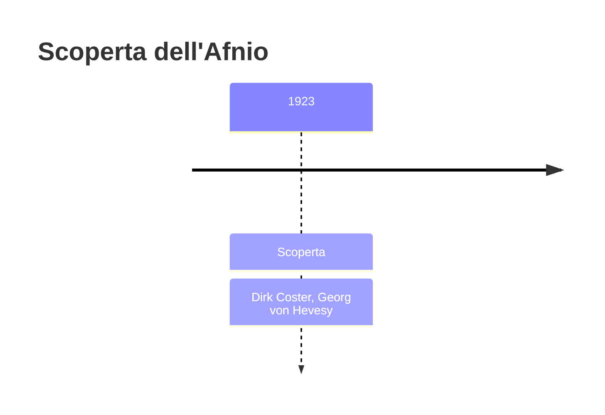
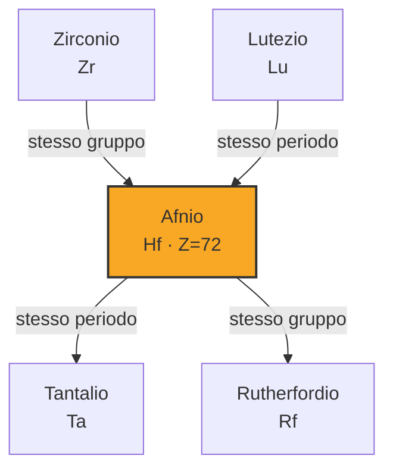

# Afnio (Hf)

> [!abstract] 87° elemento scoperto — 1923
> 

## Cronologia della scoperta

## Storia della scoperta

## Posizione nella tavola periodica

## Caratteristiche

### Dati fisico-chimici

| Proprietà | Valore |
|---|---|
| Numero atomico | 72 |
| Massa atomica | 178,492 u |
| Categoria | Metallo di transizione |
| Gruppo | 4 |
| Periodo | 6 |
| Blocco | d |
| Configurazione elettronica | [Xe] 4f¹⁴ 5d² 6s² |
| Punto di fusione | 2232,9 °C |
| Punto di ebollizione | 4602,9 °C |
| Densità | 13,31 g/cm³ |
| Stati di ossidazione | — |

## Struttura atomica

![[atomo-Afnio.svg]]

## Usi e presenza in natura

## Nella cronologia

← Precedente: [[Protoattinio]] (1913)
→ Successivo: [[Renio]] (1925)

Epoca: [[Spettroscopia e radioattività]] · Scopritore: [[Dirk Coster]], [[Georg von Hevesy]]

## Fonti

