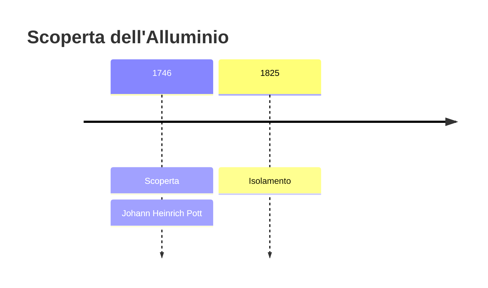
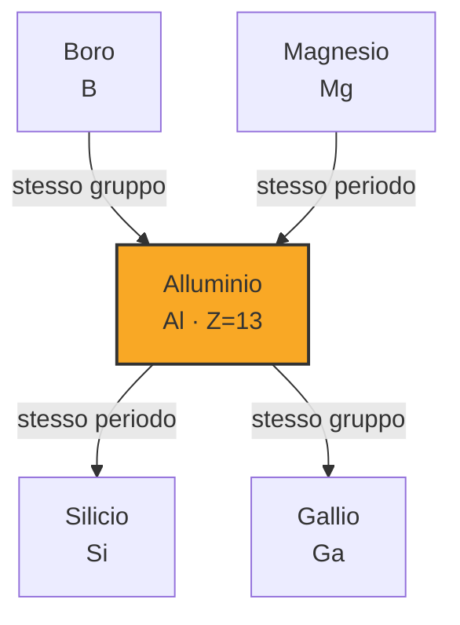
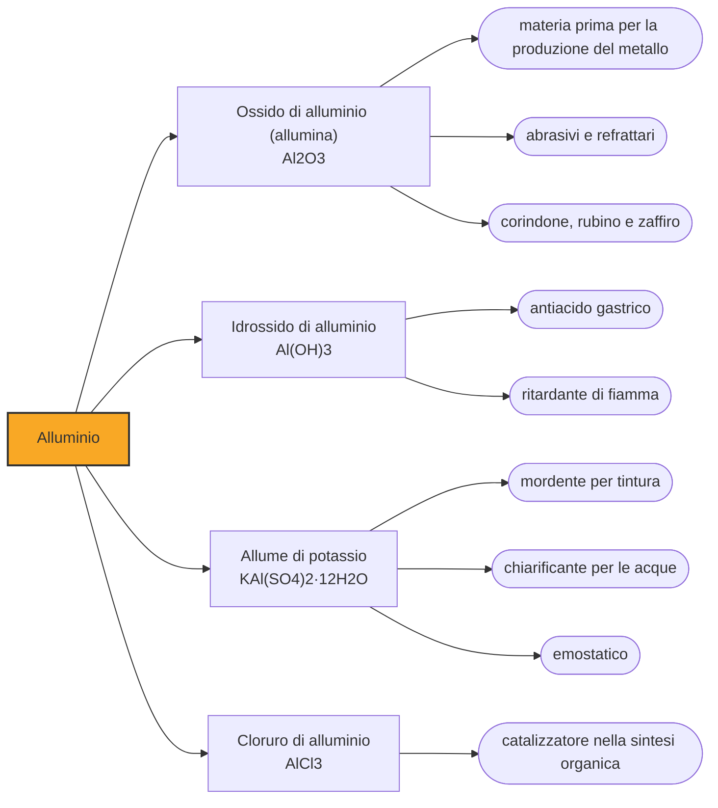

# Alluminio (Al)

> [!abstract] 20° elemento scoperto — 1746
> Nel 1852 costava quasi il doppio dell'oro. Quarant'anni dopo ci si incartavano le caramelle. Nessun altro elemento ha mai fatto un capitombolo simile.

L'alluminio è il metallo più abbondante della crosta terrestre, leggero, resistente alla corrosione e oggi così comune da essere usa e getta. Per gran parte della storia umana è stato invece del tutto invisibile, e per qualche decennio dell'Ottocento è stato un metallo prezioso da vetrina: la sua vicenda è quella di un elemento ovunque presente che nessuno riusciva a tirare fuori.

## Cronologia della scoperta

## Storia della scoperta

Il punto di partenza è l'allume, un sale conosciuto e commerciato fin dall'antichità: Erodoto lo cita nel V secolo a.C., i tintori lo usavano per fissare i colori sulle stoffe e gli assediati per rendere il legno meno infiammabile. Era una merce strategica, oggetto di monopoli e di guerre commerciali, e per tutto quel tempo nessuno immaginò che contenesse un metallo.

Nel 1746 Johann Heinrich Pott, al Collegium Medico-Chirurgicum di Berlino, compie il passo che gli vale la data di scoperta: versando un alcali in una soluzione di allume ottiene un precipitato e dimostra, per confronto sistematico, che quella sostanza è diversa dalla calce e dal gesso. È l'allumina, ed è uno degli ingredienti della comune argilla. Pott non estrae nessun metallo e non sostiene che ce ne sia uno: separa una terra nuova dalle terre già note.

Nel 1782 Lavoisier avanza l'ipotesi che l'allumina sia l'ossido di un metallo che nessuno ha mai visto, e che a tenerlo prigioniero sia un'affinità con l'ossigeno troppo forte per i mezzi disponibili. Humphry Davy tenta ripetutamente di liberarlo con l'elettrolisi, come aveva fatto con sodio, potassio e calcio, e fallisce; gli resta però il merito del nome, che dopo qualche oscillazione si fissa in aluminium.

Nel 1825 il danese Hans Christian Ørsted, più noto per aver scoperto il legame fra elettricità e magnetismo, fa reagire cloruro di alluminio anidro con amalgama di potassio e ottiene un grumo di metallo dall'aspetto simile allo stagno. La priorità è sua, ma il prodotto era probabilmente una lega con il potassio: sarà il tedesco Friedrich Wöhler, dal 1827, a rifare il procedimento e a cavarne, nel 1845, pezzetti abbastanza puri da poterne misurare le proprietà.

Nel 1854 il francese Henri Sainte-Claire Deville mette a punto il primo processo industriale, e l'alluminio esce dai laboratori per entrare nelle vetrine come metallo di lusso. All'Esposizione di Parigi del 1855 viene presentato come argento dall'argilla; poco prima, nel 1852, era quotato trentaquattro dollari l'oncia contro i diciannove dell'oro. Il prezzo scende lentamente — trecento franchi al chilo nel 1855, centoventi nel 1867 — ma resta quello di un metallo da gioielleria.

Il crollo arriva nel 1886, quando Charles Martin Hall negli Stati Uniti e Paul Héroult in Francia mettono a punto indipendentemente, nello stesso anno e alla stessa età, lo stesso procedimento: sciogliere l'allumina in criolite fusa e attraversarla con una forte corrente elettrica. Il metodo è tuttora quello in uso. In pochi anni il prezzo precipita a mezzo dollaro la libbra e l'alluminio smette di essere prezioso per diventare, semplicemente, utile.

> [!warning] Questione aperta
> Fra la data di scoperta dell'alluminio e la sua disponibilità reale corre un secolo e mezzo, e ogni tappa è contesa. Nel 1746 Pott dimostra che l'allumina è una sostanza diversa dalla calce e dal gesso, ma non ne cava alcun metallo. Ørsted, nel 1825, annuncia di averlo ottenuto: il suo campione era però quasi certamente una lega di alluminio e potassio, non il metallo puro, tanto che Friedrich Wöhler dovette rifare il lavoro dal 1827 e ottenne pezzi apprezzabili solo nel 1845. Attribuire l'isolamento a Ørsted è la convenzione corrente e ha buone ragioni, ma è una priorità di annuncio più che di risultato.

## Posizione nella tavola periodica

## Caratteristiche

L'alluminio è chimicamente molto reattivo, eppure non si corrode: la contraddizione si risolve in uno strato di ossido spesso pochi milionesimi di millimetro che si forma istantaneamente all'aria e sigilla il metallo sottostante. A differenza della ruggine, che si sfoglia, questa pellicola è compatta e aderente, e se viene graffiata si riforma da sola. L'anodizzazione non fa che ispessirla di proposito.

Con una densità di 2,7 grammi per centimetro cubo l'alluminio pesa circa un terzo dell'acciaio, ed è questa leggerezza a governarne quasi tutti gli impieghi. Puro è troppo tenero per usi strutturali, ma legato con rame, magnesio, silicio o zinco dà leghe che rivaleggiano con gli acciai a parità di resistenza e li battono nettamente in rapporto fra resistenza e peso. Nei composti d'uso corrente si presenta allo stato più tre, anche se la letteratura ne registra altri, rari e di interesse soprattutto teorico.

Nonostante l'abbondanza, l'alluminio si estrae quasi solo dalla bauxite, una roccia di alterazione tropicale ricca di idrossidi. Il ciclo industriale è in due tempi: prima il processo Bayer separa l'allumina dalla bauxite, poi l'elettrolisi la riduce a metallo. Il secondo passaggio è enormemente energivoro, al punto che le fonderie si costruiscono dove l'energia elettrica costa poco e l'alluminio viene chiamato, non senza ragione, elettricità solidificata.

### Dati fisico-chimici

| Proprietà | Valore |
|---|---|
| Numero atomico | 13 |
| Massa atomica | 26,98153857 u |
| Categoria | Metallo post-transizione |
| Gruppo | 13 |
| Periodo | 3 |
| Blocco | p |
| Configurazione elettronica | [Ne] 3s² 3p¹ |
| Punto di fusione | 660,3 °C |
| Punto di ebollizione | 2469,9 °C |
| Densità | 2,7 g/cm³ |
| Stati di ossidazione | -2, -1, +1, +2, +3 |

## Struttura atomica

![[atomo-Alluminio.svg]]

## Usi e presenza in natura

Il primo mercato dell'alluminio è quello in cui il peso costa carburante: aerei, treni, navi veloci e, sempre di più, automobili, dove ogni chilo risparmiato si traduce in consumi ed emissioni minori. Seguono l'edilizia, con serramenti e facciate che non arrugginiscono, e le linee elettriche ad alta tensione, dove l'alluminio ha soppiantato il rame perché a parità di corrente trasportata pesa la metà.

L'altro grande impiego è l'imballaggio: lattine, fogli sottili, capsule e accoppiati per alimenti, dove conta la barriera totale a luce, aria e umidità. Qui pesa il vantaggio decisivo del riciclo, perché rifondere l'alluminio richiede circa il cinque per cento dell'energia necessaria a produrlo dalla bauxite, e il metallo si rigenera senza perdere qualità. Una lattina può tornare sullo scaffale come lattina nel giro di poche settimane.

## Curiosità

Nel 1884, per completare il Washington Monument, gli Stati Uniti scelsero una punta di alluminio: cento once di metallo, alte poco meno di nove pollici, pagate duecentoventicinque dollari. La scelta fu deliberatamente lussuosa, perché l'alluminio quotava allora un dollaro e dieci l'oncia, esattamente quanto l'argento. Prima di essere installata la punta fu esposta da Tiffany a New York, dove i visitatori potevano scavalcarla per dire di essere passati sopra il monumento.

Si racconta spessissimo che Napoleone III riservasse posate di alluminio agli ospiti più illustri, lasciando l'oro agli altri commensali. L'aneddoto compare ovunque e viene riportato sempre nella stessa forma, senza che le fonti risalgano a un documento dell'epoca: conviene trattarlo come un racconto ben costruito più che come un fatto accertato. Che l'imperatore finanziasse le ricerche di Deville sull'alluminio, quello sì, è documentato.

## Nella cronologia

← Precedente: [[Calcio]] (1739)
→ Successivo: [[Nichel]] (1751)

Epoca: [[Alchimia e primo moderno]] · Scopritore: [[Johann Heinrich Pott]]

## Fonti

- [History of aluminium](https://en.wikipedia.org/wiki/History_of_aluminium) — consultata il 07/09/2026
- [Aluminium](https://en.wikipedia.org/wiki/Aluminium) — consultata il 07/09/2026
- [The Point of the Matter: the aluminum cap of the Washington Monument (National Park Service)](https://www.nps.gov/articles/000/wamocap.htm) — consultata il 07/09/2026
- [The Cast Aluminum Cap on the Washington Monument (Metallography, Microstructure, and Analysis)](https://doi.org/10.1007/s13632-012-0032-x) — consultata il 07/09/2026
- [Timeline of chemical element discoveries](https://en.wikipedia.org/wiki/Timeline_of_chemical_element_discoveries) — consultata il 07/09/2026
- [Topping Off the Tip: How Aluminum Found Its Way onto the Washington Monument (Prologue Magazine, National Archives)](https://www.archives.gov/publications/prologue/2014/summer/aluminum-tip-monument) — consultata il 07/09/2026
