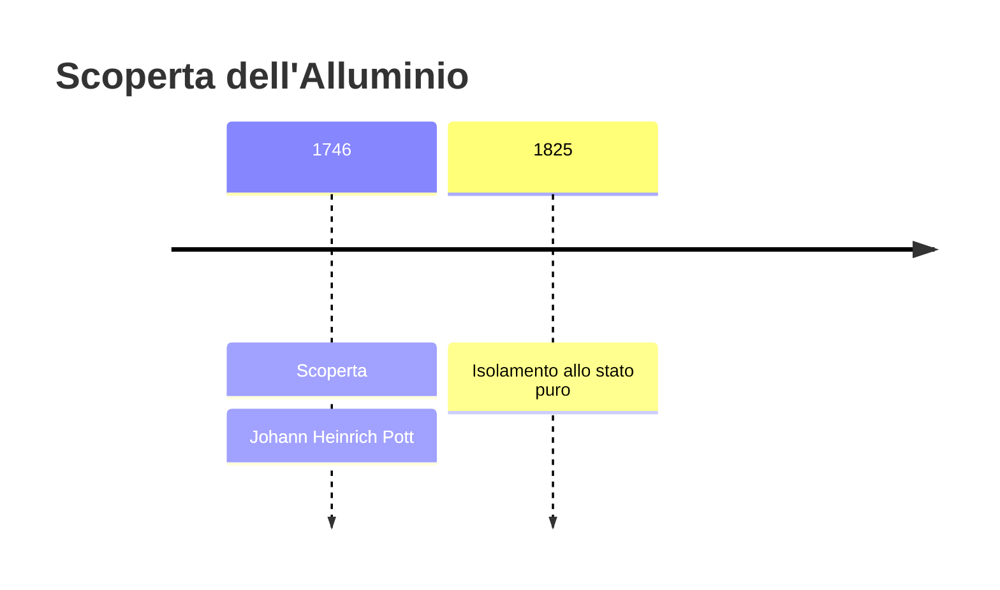
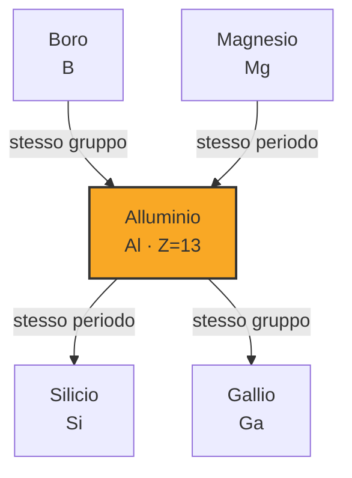

# Alluminio (Al)

> [!abstract] 20° elemento scoperto — 1746
> 

## Cronologia della scoperta

## Storia della scoperta

## Posizione nella tavola periodica

## Caratteristiche

### Dati fisico-chimici

| Proprietà | Valore |
|---|---|
| Numero atomico | 13 |
| Massa atomica | 26,98153857 u |
| Categoria | Metallo post-transizione |
| Gruppo | 13 |
| Periodo | 3 |
| Blocco | p |
| Configurazione elettronica | [Ne] 3s² 3p¹ |
| Punto di fusione | 660,3 °C |
| Punto di ebollizione | 2469,9 °C |
| Densità | 2,7 g/cm³ |
| Stati di ossidazione | — |

## Struttura atomica

![[atomo-Alluminio.svg]]

## Usi e presenza in natura

## Nella cronologia

← Precedente: [[Calcio]] (1739)
→ Successivo: [[Nichel]] (1751)

Epoca: [[Alchimia e primo moderno]] · Scopritore: [[Johann Heinrich Pott]]

## Fonti

