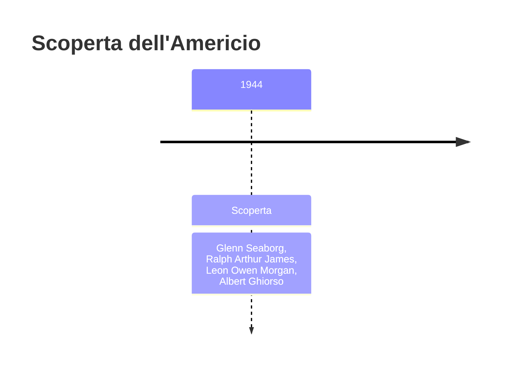
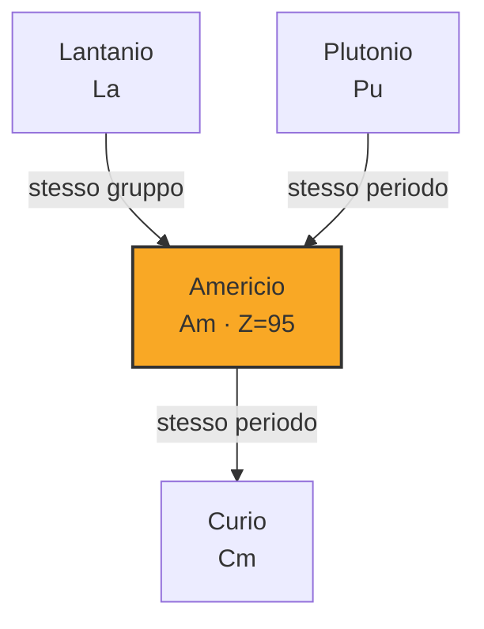
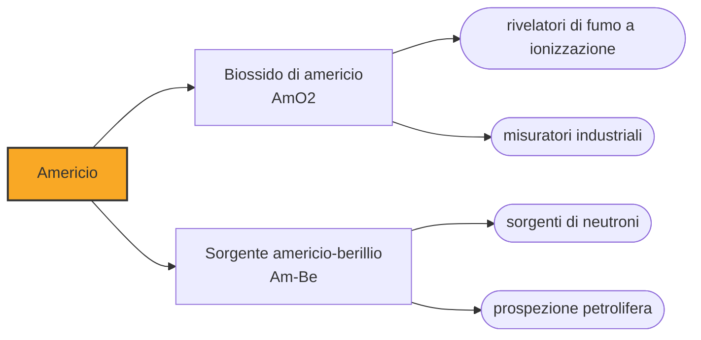

# Americio (Am)

> [!abstract] 94° elemento scoperto — 1944
> La notizia della scoperta di due elementi nuovi uscì per la prima volta non in una rivista scientifica ma in una trasmissione radiofonica per ragazzi, cinque giorni prima dell'annuncio ufficiale.

L'americio è l'unico elemento artificiale che si trova comunemente nelle case: una frazione di microgrammo sta dentro la maggior parte dei rivelatori di fumo a ionizzazione del mondo. È anche il primo transuranico prodotto in quantità industriali, ed è un sottoprodotto inevitabile di ogni reattore nucleare.

## Cronologia della scoperta

> [!info] Nota sulla cronologia
> La data è quella della produzione, nell'autunno del 1944 dentro il progetto Manhattan; l'annuncio pubblico è del novembre 1945. La cronologia di riferimento comprimeva la squadra in «Seaborg et al.»: i quattro nomi sono quelli dell'articolo di Berkeley.

## Storia della scoperta

Nell'autunno del 1944, a Berkeley, il gruppo di Glenn Seaborg bombardò con neutroni un bersaglio di plutonio-239 e ottenne l'elemento 95. La squadra comprendeva Ralph James, Leon Morgan e Albert Ghiorso, e la separazione chimica fu completata al Metallurgical Laboratory dell'Università di Chicago, dentro il progetto Manhattan.

Gli elementi 95 e 96 diedero un filo da torcere: si comportavano chimicamente in modo quasi identico l'uno all'altro e alle terre rare, e separarli fu un incubo che durò mesi. Il gruppo di Berkeley li soprannominò per questo pandemonium e delirium, dal greco «tutti i demoni» e dal latino «follia», e i soprannomi restarono nell'uso interno finché non arrivarono i nomi definitivi.

I nomi ufficiali seguirono la logica che Seaborg stava costruendo: se gli attinidi sono una serie analoga a quella dei lantanidi, allora l'elemento 95 sta sotto l'europio e va chiamato come un continente, e il 96 sta sotto il gadolinio e va dedicato a due scienziati. Nacquero così americio e curio, per analogia esplicita con europio e gadolinio.

L'annuncio arrivò per una via inconsueta. Il 5 novembre 1945 Seaborg era ospite di Quiz Kids, un programma radiofonico americano in cui un gruppo di ragazzi faceva domande a scienziati; uno di loro gli chiese se durante la guerra avesse scoperto elementi nuovi, e Seaborg rispose di sì, nominandoli. La presentazione ufficiale alla società chimica americana era prevista cinque giorni dopo.

Il ragionamento che aveva portato ai nomi era la parte più importante della storia. Collocare gli elementi pesanti in una seconda serie f, staccata dal corpo della tavola, permetteva di prevederne le proprietà chimiche invece di scoprirle a tentoni: era l'ipotesi degli attinidi, che Seaborg propose nel 1944 e che i colleghi gli sconsigliarono di pubblicare, avvertendolo che avrebbe rovinato la propria reputazione scientifica. La pubblicò lo stesso, e da allora la tavola periodica ha la forma che conosciamo.

## Posizione nella tavola periodica

## Caratteristiche

L'isotopo che conta è l'americio-241, che si forma nel combustibile nucleare dal decadimento del plutonio-241 e ha un'emivita di 432 anni. Emette particelle alfa e, cosa che lo rende utile, anche raggi gamma di bassa energia, che sono facilmente rivelabili e facilmente schermabili.

È un metallo argenteo, tenero, che nei composti sta di norma nello stato +3 come i lantanidi cui somiglia; a differenza loro raggiunge però anche stati più alti, fino al +6, e le sue soluzioni cambiano colore di conseguenza. Al buio un campione brilla debolmente, per la ionizzazione dell'aria che lo circonda.

Una tonnellata di combustibile nucleare esausto contiene circa cento grammi di americio, quasi tutto americio-241 e americio-243, e la quantità cresce nel tempo perché il plutonio-241 continua a decadere in americio anche dopo che il combustibile è stato scaricato. È uno degli elementi che rendono le scorie problematiche a lungo termine: con le sue centinaia di anni di emivita resta attivo ben oltre la vita di qualunque struttura costruita per contenerlo, ed è uno dei bersagli principali degli studi sulla trasmutazione delle scorie.

### Dati fisico-chimici

| Proprietà | Valore |
|---|---|
| Numero atomico | 95 |
| Massa atomica | 243,0 u |
| Categoria | Attinide |
| Gruppo | 3 |
| Periodo | 7 |
| Blocco | f |
| Configurazione elettronica | [Rn] 5f⁷ 7s² |
| Punto di fusione | 1175,9 °C |
| Punto di ebollizione | 2606,9 °C |
| Densità | 12,0 g/cm³ |
| Stati di ossidazione | +2, +3, +4, +5, +6, +7 |

## Struttura atomica

![[atomo-Americio.svg]]

## Usi e presenza in natura

Nel rivelatore di fumo a ionizzazione, una sorgente di biossido di americio ionizza l'aria fra due elettrodi e vi fa passare una piccola corrente costante; quando il fumo entra nella camera, le particelle di fuliggine catturano gli ioni, la corrente cala e l'allarme suona. È l'unica applicazione domestica di un elemento artificiale, e ne servono meno di due decimillesimi di grammo per apparecchio: una quantità che, sigillata in una camera metallica, non espone chi vive in casa ad alcuna dose significativa.

Fuori casa, l'americio serve nei misuratori di spessore e di densità, dove si misura quanta radiazione attraversa un materiale in produzione continua, e nelle sorgenti di neutroni: mescolato al berillio dà un flusso costante usato nella prospezione petrolifera e nella misura dell'umidità dei terreni.

L'agenzia spaziale europea sta sviluppando generatori termoelettrici basati sull'americio-241, come alternativa al plutonio-238, che è difficile da produrre e di cui l'Europa non ha una filiera: l'americio scalda meno, ma si può ricavare dalle scorte di plutonio civile invecchiato, dove si forma da solo.

## Curiosità

Il ragazzo dei Quiz Kids che chiese a Seaborg se avesse scoperto elementi nuovi ricevette una risposta che nessun ufficio stampa avrebbe autorizzato: due elementi mai annunciati, nominati in diretta radiofonica. Seaborg raccontò poi l'episodio con divertimento, e resta uno dei rari casi in cui una scoperta chimica è stata resa pubblica da una domanda infantile.

Nel 1994 un ragazzo americano di diciassette anni, David Hahn, raccolse l'americio di centinaia di rivelatori di fumo per costruire nel capanno di casa quello che chiamava un reattore autofertilizzante. Non funzionò come reattore, ma contaminò abbastanza da far intervenire l'agenzia federale per l'ambiente, che smantellò e portò via il capanno.

## Nella cronologia

← Precedente: [[Plutonio]] (1940)
→ Successivo: [[Curio]] (1944)

Epoca: [[Era nucleare]] · Scopritori: [[Glenn Seaborg]], [[Ralph Arthur James]], [[Leon Owen Morgan]], [[Albert Ghiorso]]

## Fonti

- [Americium](https://en.wikipedia.org/wiki/Americium) — consultata il 09/09/2026
- [Americium — Royal Society of Chemistry](https://periodic-table.rsc.org/element/95/americium) — consultata il 09/09/2026
- [Smoke detector](https://en.wikipedia.org/wiki/Smoke_detector) — consultata il 09/09/2026
