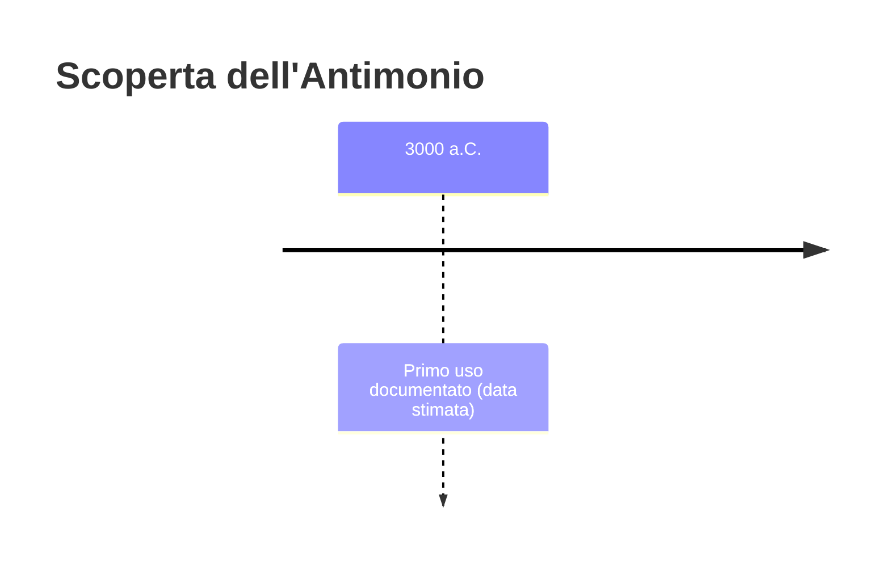
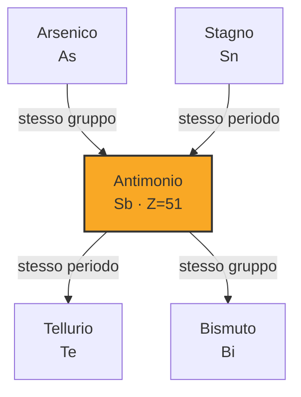

# Antimonio (Sb)

> [!abstract] 8° elemento scoperto — 3000 a.C.
> 

## Cronologia della scoperta

## Storia della scoperta

## Posizione nella tavola periodica

## Caratteristiche

### Dati fisico-chimici

| Proprietà | Valore |
|---|---|
| Numero atomico | 51 |
| Massa atomica | 121,7601 u |
| Categoria | Semimetallo |
| Gruppo | 15 |
| Periodo | 5 |
| Blocco | p |
| Configurazione elettronica | [Kr] 4d¹⁰ 5s² 5p³ |
| Punto di fusione | 630,6 °C |
| Punto di ebollizione | 1634,9 °C |
| Densità | 6,697 g/cm³ |
| Stati di ossidazione | — |

## Struttura atomica

![[atomo-Antimonio.svg]]

## Usi e presenza in natura

## Nella cronologia

← Precedente: [[Stagno]] (3500 a.C.)
→ Successivo: [[Zolfo]] (2000 a.C.)

Epoca: [[Antichità]]

## Fonti

