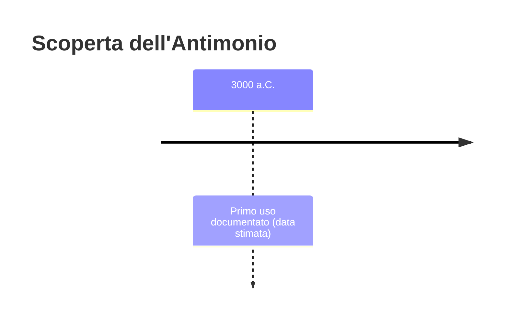
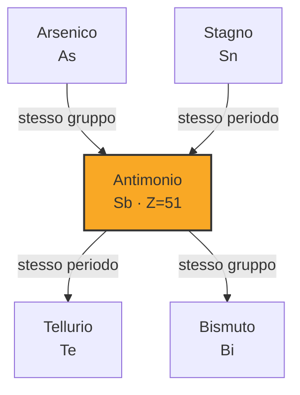
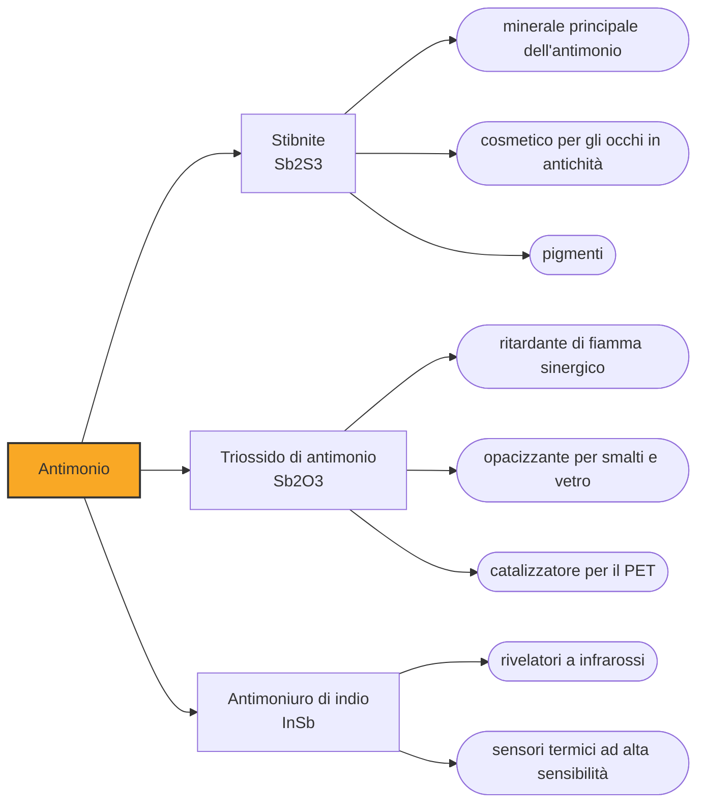

# Antimonio (Sb)

> [!abstract] 8° elemento scoperto — 3000 a.C.
> L'antimonio entra nella storia come cosmetico, non come metallo: per millenni è stato una polvere nera con cui ci si truccava gli occhi, e nessuno lo pensava come materia da cui ricavare qualcosa.

Fra gli elementi noti dall'antichità l'antimonio è il più equivoco. Non è propriamente un metallo ma un semimetallo, fragile invece che malleabile; il suo uso antico riguarda un suo composto e non l'elemento; e persino il suo nome ha un'origine incerta su cui circolano più spiegazioni che prove.

## Cronologia della scoperta

> [!info] Nota sulla cronologia
> La data si riferisce all'uso della stibnite, solfuro di antimonio, come cosmetico e non all'antimonio metallico: sul primo oggetto in antimonio metallico le fonti sono discordi.

## Storia della scoperta

La sostanza che apre la vicenda è la stibnite, solfuro di antimonio, un minerale grigio scuro e lucente facilissimo da ridurre in polvere. Nell'Egitto predinastico, intorno al 3100 a.C., quella polvere è già in uso come cosmetico per gli occhi, il kohl, e da lì si diffonde in tutto il Vicino Oriente e nel Nordafrica, dove è rimasta in uso senza interruzione fino a oggi.

Su questo punto conviene una precisazione, perché la divulgazione tende a semplificare. Le analisi dei contenitori antichi mostrano che il kohl egizio era in prevalenza a base di galena, cioè solfuro di piombo, non di antimonio; la stibnite era comune in altre aree e in altre epoche, e il termine kohl indica una famiglia di preparati, non una ricetta unica. Antimonio e piombo si sono divisi lo stesso ruolo cosmetico per millenni.

Sul primo oggetto di antimonio metallico la questione è aperta. Viene spesso citato un frammento rinvenuto a Tello, nell'antica Caldea, datato intorno al 3000 a.C. e descritto come parte di un vaso di antimonio puro, il che implicherebbe una tecnica sofisticata per rendere lavorabile un materiale intrinsecamente fragile. L'archeologo Roger Moorey ha però contestato sia che si trattasse di un vaso sia che serva ipotizzare una metallurgia perduta: più probabilmente è un piccolo ornamento ricavato da antimonio nativo.

Anche il nome porta i segni di una storia confusa. Il simbolo Sb viene dal latino stibium, che designa il minerale e non il metallo, ed è a sua volta imparentato con l'arabo al-ithmid, il nome della stessa polvere cosmetica. La parola antimonio deriva invece dal latino medievale antimonium, comparso negli scritti degli alchimisti, la cui origine resta tuttora non chiarita.

Alla fortuna dell'antimonio in età moderna contribuisce un libro, il Carro trionfale dell'antimonio, attribuito a un monaco benedettino del Quattrocento di nome Basilio Valentino. L'attribuzione è falsa: l'opera esce nel 1604 ed è con ogni probabilità di Johann Thölde, che se ne servì per dare autorevolezza antica a un testo suo. Il libro fu comunque letto e discusso per due secoli, e l'antimonio divenne uno dei rimedi più prescritti e più contestati della medicina moderna.

> [!warning] Questione aperta
> Il reperto citato come più antico oggetto di antimonio metallico, un frammento da Tello nell'antica Caldea datato intorno al 3000 a.C. e descritto come parte di un vaso, è contestato: Roger Moorey ha argomentato che non si tratti di un vaso e che non serva postulare una perduta tecnica per rendere malleabile un materiale così fragile, trattandosi più verosimilmente di un piccolo ornamento ricavato da antimonio nativo. Ben documentato è invece l'uso del minerale, la stibnite, come cosmetico per gli occhi nell'Egitto predinastico dal 3100 a.C. circa; va però precisato che il kohl egizio analizzato risulta in prevalenza a base di galena, solfuro di piombo, e che l'antimonio prevale in altre aree e in altre epoche.

## Posizione nella tavola periodica

## Caratteristiche

L'antimonio ha l'aspetto di un metallo, lucido e grigio-argenteo, ma non ne ha il comportamento: è talmente fragile da polverizzarsi sotto un colpo di martello, e conduce elettricità e calore molto peggio di qualunque metallo vero. La ragione sta nella sua struttura, fatta di strati legati saldamente al loro interno e debolmente fra loro. È il motivo per cui non è mai stato usato da solo per fabbricare oggetti.

Ha una proprietà che condivide con pochissime sostanze, l'acqua fra queste: solidificando si dilata invece di contrarsi. Aggiunto al piombo fuso, un metallo che invece ritira, produce una lega che riempie perfettamente lo stampo e ne riproduce ogni dettaglio. Su questo si è retta per cinque secoli la tipografia a caratteri mobili, i cui caratteri erano leghe di piombo, stagno e antimonio.

Chimicamente si colloca nello stesso gruppo dell'azoto, del fosforo e dell'arsenico, e ne segue il comportamento con stati di ossidazione -3, +3 e +5. La sua tossicità è reale e i sintomi assomigliano a quelli dell'avvelenamento da arsenico, con disturbi gastrointestinali e cardiaci, ma l'antimonio è meno velenoso dell'arsenico a parità di dose: una differenza che nella medicina di età moderna, che lo somministrava come emetico, non era affatto trascurabile.

### Dati fisico-chimici

| Proprietà | Valore |
|---|---|
| Numero atomico | 51 |
| Massa atomica | 121,7601 u |
| Categoria | Semimetallo |
| Gruppo | 15 |
| Periodo | 5 |
| Blocco | p |
| Configurazione elettronica | [Kr] 4d¹⁰ 5s² 5p³ |
| Punto di fusione | 630,6 °C |
| Punto di ebollizione | 1634,9 °C |
| Densità | 6,697 g/cm³ |
| Stati di ossidazione | -3, +3, +5 |

## Struttura atomica

![[atomo-Antimonio.svg]]

## Usi e presenza in natura

L'uso di gran lunga principale oggi, circa la metà del consumo mondiale, è come ritardante di fiamma. Il triossido di antimonio non spegne nulla da solo, ma in presenza di composti alogenati agisce da sinergico e rende molto meno infiammabili plastiche, tessuti tecnici, rivestimenti di cavi e schiume per imbottiture. È presente in una quantità enorme di oggetti quotidiani senza che nessuno lo sappia.

Il secondo impiego per volume, circa un terzo del totale, resta la lega con il piombo, che l'antimonio irrigidisce sensibilmente: serve alle griglie delle batterie al piombo-acido, dove la resistenza meccanica delle piastre determina la durata dell'accumulatore, e in passato ai proiettili e ai metalli antifrizione per cuscinetti. Quantità minori vanno nell'elettronica, come drogante del silicio e nell'antimoniuro di indio per i rivelatori a infrarossi, e nella lavorazione del vetro per eliminare le microbolle.

## Curiosità

Sull'origine della parola antimonio circolano da secoli spiegazioni pittoresche e mai dimostrate. La più diffusa la scioglie come anti-monaco, perché il metallo avrebbe ucciso i monaci che lo maneggiavano nei laboratori dei conventi; un'altra la fa risalire a un greco «contro la solitudine», perché in natura non si trova mai da solo. Sono etimologie senza alcun riscontro documentale, e sopravvivono perché sono più belle della risposta vera, che è: non lo sappiamo.

Fra il Cinquecento e l'Ottocento circolavano le cosiddette pillole perpetue, palline di antimonio metallico che si ingerivano come purgante. L'antimonio reagisce quel tanto che basta a irritare l'intestino e provocare l'effetto, poi viene espulso pressoché intatto: si recuperava dal vaso da notte, si lavava e si riutilizzava, e ci sono famiglie che se le tramandavano di generazione in generazione. La facoltà di medicina di Parigi le mise al bando più volte nel corso del Seicento, senza riuscire a farle sparire.

## Nella cronologia

← Precedente: [[Stagno]] (3500 a.C.)
→ Successivo: [[Zolfo]] (2000 a.C.)

Epoca: [[Antichità]]

## Fonti

- [Antimony](https://en.wikipedia.org/wiki/Antimony) — consultata il 07/09/2026
- [Kohl (Britannica)](https://www.britannica.com/topic/kohl) — consultata il 07/09/2026
- [Basil Valentine](https://en.wikipedia.org/wiki/Basil_Valentine) — consultata il 07/09/2026
- [Antimony pill](https://en.wikipedia.org/wiki/Antimony_pill) — consultata il 07/09/2026

---

> [!warning] Avvertenza
> Questo progetto è stato realizzato con l'assistenza di sistemi di
> intelligenza artificiale. I contenuti sono verificati sulle fonti citate,
> ma **possono contenere errori e imprecisioni**: prima di riutilizzarli,
> controlla la fonte.
