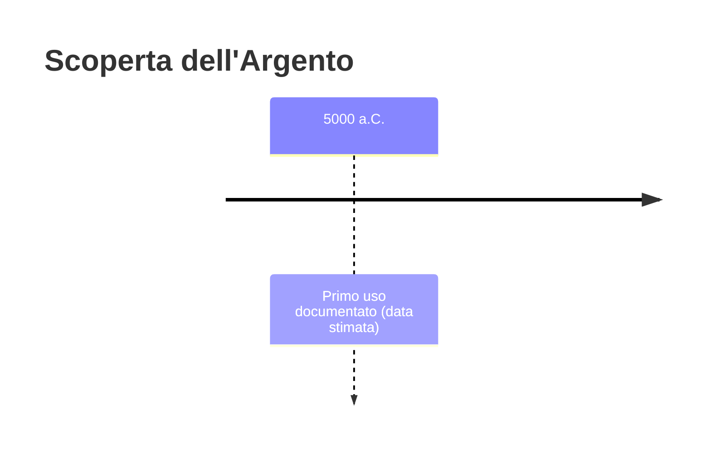
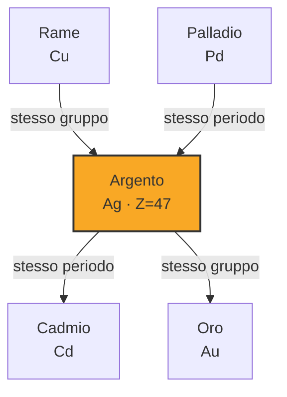

# Argento (Ag)

> [!abstract] 6° elemento scoperto — 5000 a.C.
> 

## Cronologia della scoperta

## Storia della scoperta

## Posizione nella tavola periodica

## Caratteristiche

### Dati fisico-chimici

| Proprietà | Valore |
|---|---|
| Numero atomico | 47 |
| Massa atomica | 107,86822 u |
| Categoria | Metallo di transizione |
| Gruppo | 11 |
| Periodo | 5 |
| Blocco | d |
| Configurazione elettronica | [Kr] 4d¹⁰ 5s¹ |
| Punto di fusione | 961,8 °C |
| Punto di ebollizione | 2161,9 °C |
| Densità | 10,49 g/cm³ |
| Stati di ossidazione | — |

## Struttura atomica

![[atomo-Argento.svg]]

## Usi e presenza in natura

## Nella cronologia

← Precedente: [[Ferro]] (5000 a.C.)
→ Successivo: [[Stagno]] (3500 a.C.)

Epoca: [[Antichità]]

## Fonti

