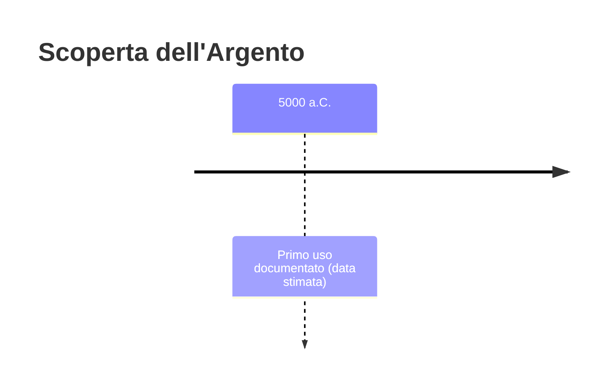
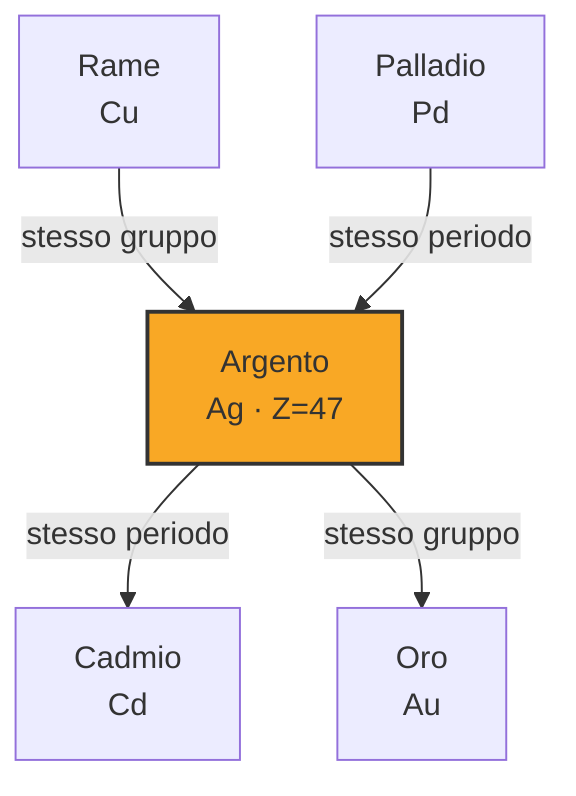
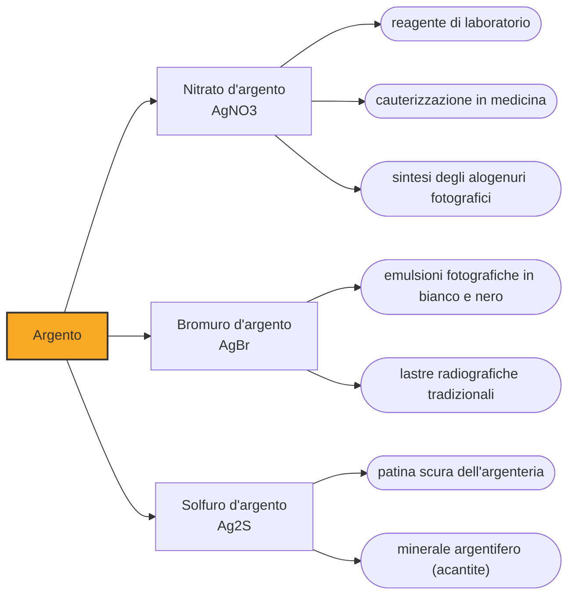

# Argento (Ag)

> [!abstract] 6° elemento scoperto — 5000 a.C.
> L'argento non si raccoglie: si estrae, separandolo dal piombo con una tecnica che è già chimica prima che la chimica esista. Per questo entra nella storia millenni dopo l'oro, benché sia molto più abbondante.

Fra i tre metalli preziosi noti fin dall'antichità, l'argento è quello che ha richiesto più intelligenza tecnica. In natura si trova raramente allo stato nativo, quasi sempre combinato in minerali che non lo dichiarano: ottenerlo significa saperlo riconoscere dove non si vede e saperlo tirare fuori.

## Cronologia della scoperta

> [!info] Nota sulla cronologia
> La data convenzionale segna l'uso più antico dell'argento; la separazione dal piombo per coppellazione è documentata da cumuli di scorie in Asia Minore nel IV millennio a.C.

## Storia della scoperta

Un po' di argento nativo esiste, e con ogni probabilità è così che il metallo si è fatto notare la prima volta: masse contorte di filamenti metallici lucenti che affiorano in superficie in alcune vene minerarie. Ma sono rarità, e non bastano a sostenere un uso diffuso. Fin quando l'argento resta un metallo da raccogliere, resta anche un metallo quasi assente dai corredi; comincia a contare quando lo si sa produrre.

La tecnica che apre la storia dell'argento si chiama coppellazione, e le sue prime tracce sono cumuli di scorie in Asia Minore nel IV millennio a.C. Il minerale argentifero, in genere galena, viene fuso e poi soffiato con aria in un recipiente poroso: il piombo si ossida e viene assorbito dalle pareti, mentre l'argento, che non si ossida, resta al centro come un bottone lucente. È una separazione chimica riuscita, ottenuta millenni prima che esistesse un'idea di reazione chimica.

Su questa tecnica si è retta più di una potenza. Le miniere del Laurion, in Attica, producevano fra il VI e il IV secolo a.C. alcune decine di tonnellate d'argento l'anno, e furono la base materiale della flotta ateniese e della moneta che circolava in tutto l'Egeo. Non è retorica dire che Atene comprò le proprie triremi con il proprio sottosuolo.

Roma spinge la produzione fino a circa duecento tonnellate l'anno, e nel II secolo d.C. si stima che circolassero nell'economia imperiale intorno a diecimila tonnellate di argento. Dopo il crollo dell'impero il baricentro si sposta in Europa centrale, alle miniere di Boemia, Sassonia e Ungheria, che alimentano la moneta medievale finché i giacimenti non si esauriscono.

Il ribaltamento definitivo arriva con la conquista spagnola delle Americhe. Dal Cinquecento in poi il Perù e la Bolivia diventano i produttori dominanti, e l'argento americano finanzia le guerre europee mentre attraversa l'Atlantico e il Pacifico fino alla Cina, creando la prima rete di scambio davvero globale. È la merce che ha cucito insieme i continenti prima di qualunque altra.

## Posizione nella tavola periodica

## Caratteristiche

L'argento detiene un primato che nessun altro metallo gli ha tolto: ha la più alta conducibilità elettrica e la più alta conducibilità termica di qualunque elemento, e per giunta la più alta riflettività nel visibile. Il rame lo insegue da vicino, e lo ha soppiantato in tutta l'elettrotecnica per una sola ragione, il prezzo: dove il costo non è il vincolo dominante, dai contatti dei relè alle apparecchiature di misura, l'argento resta la scelta tecnicamente migliore possibile.

È un metallo duttile e malleabile, ma non abbastanza duro da reggere l'uso quotidiano allo stato puro: l'argenteria e le monete sono da sempre leghe, tipicamente con rame, come nell'argento sterling che ne contiene il 92,5 per cento. La superficie lucidata riflette oltre il novanta per cento della luce che riceve, ed è questo che ha reso l'argento lo specchio per antonomasia prima dell'alluminio.

L'argenteria che annerisce non si sta ossidando, come si crede comunemente: sta reagendo con lo zolfo. La patina scura è solfuro d'argento, prodotto dai composti solforati presenti in tracce nell'aria e in certi alimenti, e per questo un cucchiaino d'argento si annerisce con l'uovo e non con l'acqua. Chimicamente l'argento è quasi sempre monovalente, con stati +2 e +3 rari e instabili.

### Dati fisico-chimici

| Proprietà | Valore |
|---|---|
| Numero atomico | 47 |
| Massa atomica | 107,86822 u |
| Categoria | Metallo di transizione |
| Gruppo | 11 |
| Periodo | 5 |
| Blocco | d |
| Configurazione elettronica | [Kr] 4d¹⁰ 5s¹ |
| Punto di fusione | 961,8 °C |
| Punto di ebollizione | 2161,9 °C |
| Densità | 10,49 g/cm³ |
| Stati di ossidazione | +1, +2, +3 |

## Struttura atomica

![[atomo-Argento.svg]]

## Usi e presenza in natura

Per oltre un secolo l'impiego industriale principale dell'argento è stata la fotografia. Gli alogenuri d'argento, cloruro, bromuro e ioduro, sono sensibili alla luce e si decompongono liberando argento metallico dove il fotone li ha colpiti: l'immagine latente su una pellicola è, letteralmente, un disegno fatto di argento. La transizione al digitale ha fatto crollare questa domanda in pochi anni.

Gli usi attuali si sono spostati altrove, e il maggiore è oggi il fotovoltaico: la pasta d'argento forma i contatti conduttivi sulla faccia delle celle solari, e ogni pannello installato ne consuma qualche grammo. Seguono i contatti elettrici di interruttori e relè, dove l'affidabilità conta più del costo, le leghe per brasatura, la catalisi industriale e gli specchi ottici di precisione.

Gli ioni d'argento sono tossici per batteri e funghi a concentrazioni che non danneggiano i tessuti umani, e questa proprietà, nota empiricamente da secoli, è oggi impiegata in medicazioni per ustioni, cateteri e rivestimenti di dispositivi medici. Vale la pena distinguere questo uso clinico controllato dall'assunzione di argento colloidale a scopo curativo, che non ha basi scientifiche e può causare una colorazione grigio-azzurra permanente della pelle.

## Curiosità

Il simbolo Ag viene dal latino argentum, che risale a una radice indoeuropea legata all'idea di bianco e lucente. La stessa radice ha battezzato l'Argentina, chiamata così dagli europei per l'argento che speravano di trovare risalendo il Río de la Plata: il metallo, in quantità, era invece nelle montagne boliviane.

Per gran parte della storia europea argento e denaro sono stati sinonimi, al punto che diverse lingue non li distinguono ancora: in francese e in spagnolo la parola che indica il denaro, argent e plata, è la stessa che indica il metallo. La lira, la sterlina e il marco nascono come pesi d'argento prima che come monete.

## Nella cronologia

← Precedente: [[Ferro]] (5000 a.C.)
→ Successivo: [[Stagno]] (3500 a.C.)

Epoca: [[Antichità]]

## Fonti

- [Silver](https://en.wikipedia.org/wiki/Silver) — consultata il 07/09/2026
- [Cupellation](https://en.wikipedia.org/wiki/Cupellation) — consultata il 07/09/2026
- [Mines of Laurion](https://en.wikipedia.org/wiki/Mines_of_Laurion) — consultata il 07/09/2026

---

> [!warning] Avvertenza
> Questo progetto è stato realizzato con l'assistenza di sistemi di
> intelligenza artificiale. I contenuti sono verificati sulle fonti citate,
> ma **possono contenere errori e imprecisioni**: prima di riutilizzarli,
> controlla la fonte.
