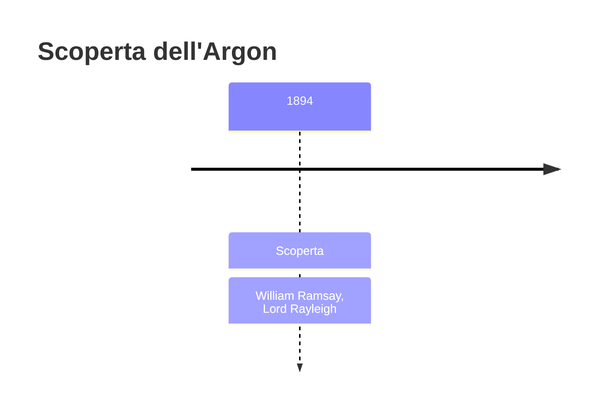
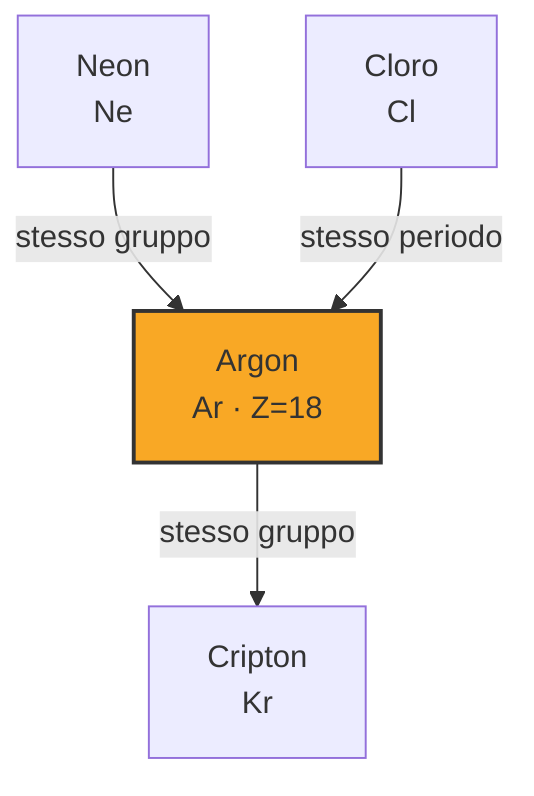
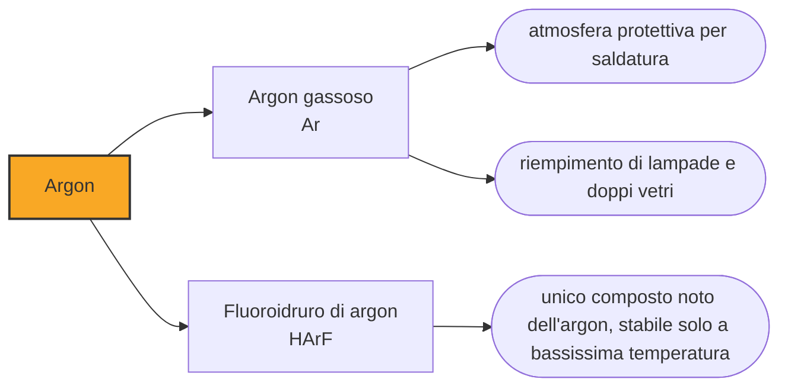

# Argon (Ar)

> [!abstract] 76° elemento scoperto — 1894
> L'azoto ricavato dall'aria pesava lo 0,5 per cento più di quello ricavato dai composti chimici. Era una differenza alla terza cifra decimale, e dentro c'era una colonna intera della tavola periodica.

L'argon è il terzo gas dell'atmosfera terrestre, quasi un punto percentuale dell'aria che respiriamo, e nessuno se n'era accorto per un secolo di chimica pneumatica. Il motivo è nel nome: non reagisce con nulla, e un gas che non reagisce non lascia tracce nelle analisi che si fanno facendolo reagire.

## Cronologia della scoperta

## Storia della scoperta

Nel 1892 Lord Rayleigh stava misurando con estrema precisione la densità dei gas e si accorse di un'anomalia ostinata: l'azoto estratto dall'aria pesava sistematicamente lo 0,5 per cento più di quello ottenuto da composti chimici come l'ammoniaca. La differenza era piccola ma superava di molto l'errore dei suoi strumenti, e non spariva rifacendo le misure.

Un secolo prima Henry Cavendish aveva fatto scoccare scintille elettriche nell'aria per far reagire azoto e ossigeno, e aveva notato che una piccola frazione del gas — meno di un centoventesimo — rifiutava ostinatamente di combinarsi. Aveva registrato il residuo e non ne aveva tratto conclusioni: la chimica del suo tempo non aveva un posto per una sostanza che non fa nulla.

Nel 1894 Rayleigh e William Ramsay ripresero proprio quell'esperimento con mezzi moderni. Ramsay fece passare ripetutamente l'azoto atmosferico su magnesio incandescente, che lo assorbe formando nitruro, e Rayleigh usò le scintille elettriche in presenza di ossigeno e di una soluzione alcalina che ne assorbisse i prodotti. Per due strade diverse arrivarono alla stessa cosa: una bolla di gas che non si combinava con niente, il cui spettro mostrava righe che nessun elemento noto produceva. Lo chiamarono argon, dal greco argos, «pigro».

L'annuncio creò un problema di collocazione. La tavola periodica non aveva una casella per un elemento del genere, e il peso atomico misurato non ne suggeriva una: alcuni chimici proposero che si trattasse di una forma allotropica dell'azoto, altri di una miscela. La soluzione, che Ramsay propose e verificò nei quattro anni successivi trovando elio, neon, cripton e xenon, fu la più radicale possibile: aggiungere alla tavola una colonna intera che prima non c'era, fatta di elementi che si riconoscono per quello che non fanno.

Nel 1904 i due ricevettero il Nobel nello stesso anno, Rayleigh per la fisica e Ramsay per la chimica: una divisione che dice bene com'era stata fatta la scoperta, con una misura di densità da fisico e una separazione da chimico.

## Posizione nella tavola periodica

## Caratteristiche

Il guscio esterno completo di otto elettroni rende l'argon stabile e restio a legarsi: per decenni è stato considerato del tutto inerte. Nel 2000, a Helsinki, si è riusciti a preparare il fluoroidruro di argon, HArF, che esiste solo a temperature bassissime: l'inerzia non è assoluta, ma quasi.

Quasi tutto l'argon dell'atmosfera terrestre è argon-40, e non è primordiale: viene dal decadimento del potassio-40 nella crosta, che nel corso di miliardi di anni lo ha liberato nell'aria. Su altri pianeti la proporzione fra gli isotopi dell'argon è diversa, ed è uno degli indizi con cui si ricostruisce la storia geologica di un corpo celeste.

È incolore, inodore e insapore, con una densità di poco superiore a quella dell'aria, e liquefa a 87 kelvin. Si ricava per distillazione frazionata dell'aria liquida, dove si separa fra l'azoto e l'ossigeno: è il gas nobile di gran lunga più economico, e questo ne ha determinato gli usi.

### Dati fisico-chimici

| Proprietà | Valore |
|---|---|
| Numero atomico | 18 |
| Massa atomica | 39,9481 u |
| Categoria | Gas nobile |
| Gruppo | 18 |
| Periodo | 3 |
| Blocco | p |
| Configurazione elettronica | [Ne] 3s² 3p⁶ |
| Punto di fusione | -189,3 °C |
| Punto di ebollizione | -185,8 °C |
| Densità | 1,784 g/cm³ |
| Stati di ossidazione | 0 |

## Struttura atomica

![[atomo-Argon.svg]]

## Usi e presenza in natura

L'impiego principale è fare atmosfera: nella saldatura ad arco l'argon protegge il bagno di fusione dall'ossigeno e dall'azoto dell'aria, che renderebbero il cordone poroso e fragile. Lo stesso principio vale nei forni per la crescita dei cristalli di silicio, nella produzione di titanio e in tutte le lavorazioni ad alta temperatura di metalli reattivi.

Fuori dall'industria pesante, l'argon riempie le lampade a incandescenza per impedire al filamento di bruciare, sta fra i due vetri delle finestre isolanti perché conduce il calore meno dell'aria, protegge documenti e reperti nelle teche dei musei — la Costituzione degli Stati Uniti è conservata sotto argon — e conserva il vino nelle bottiglie aperte, spostando l'ossigeno senza alterare il gusto perché non reagisce con nulla di quello che c'è dentro.

In laboratorio l'argon è il gas di trasporto della gascromatografia e il plasma in cui si vaporizzano i campioni negli spettrometri a plasma accoppiato induttivamente, che sono oggi lo strumento standard per misurare gli elementi in tracce: l'argon serve a rendere visibili gli altri, senza comparire nel risultato.

## Curiosità

Il decadimento del potassio-40 in argon-40 è alla base della datazione potassio-argon, con cui si stabilisce l'età delle rocce vulcaniche: il metodo ha datato le eruzioni che hanno sepolto i siti dei primi ominidi in Africa orientale, e su di esso si regge buona parte della cronologia della preistoria umana.

Il residuo che Cavendish aveva registrato nel 1785 corrisponde, nelle proporzioni, proprio all'argon dell'aria: aveva in mano il dato giusto e nessuna teoria in cui metterlo. Rayleigh e Ramsay, un secolo dopo, hanno rifatto il suo esperimento sapendo che cosa cercare, ed è la differenza fra registrare un'anomalia e scoprirla.

## Nella cronologia

← Precedente: [[Disprosio]] (1886)
→ Successivo: [[Neon]] (1898)

Epoca: [[Spettroscopia e radioattività]] · Scopritori: [[William Ramsay]], [[Lord Rayleigh]]

## Fonti

- [Argon](https://en.wikipedia.org/wiki/Argon) — consultata il 09/09/2026
- [Argon — Royal Society of Chemistry](https://periodic-table.rsc.org/element/18/argon) — consultata il 09/09/2026
- [K–Ar dating](https://en.wikipedia.org/wiki/K%E2%80%93Ar_dating) — consultata il 09/09/2026
