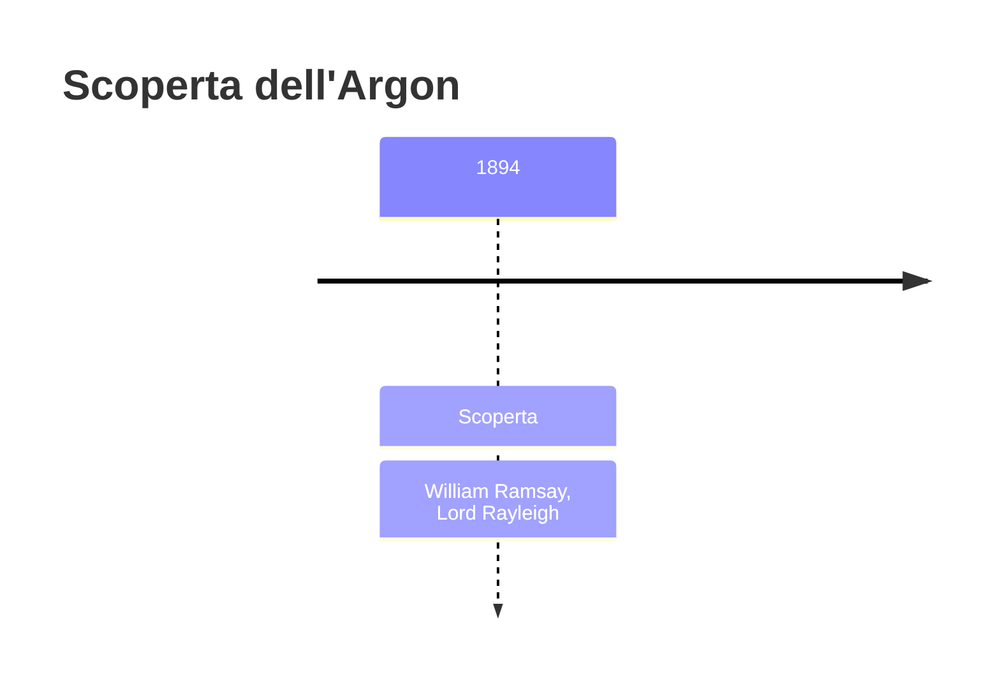
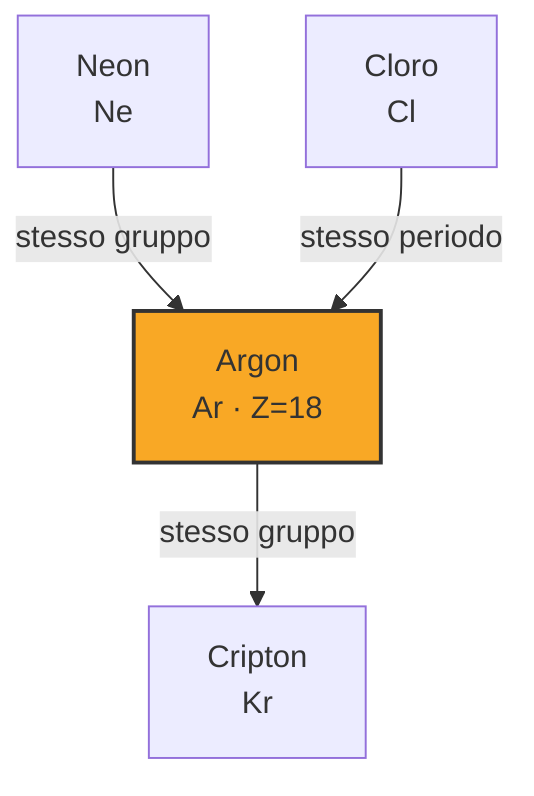

# Argon (Ar)

> [!abstract] 76° elemento scoperto — 1894
> 

## Cronologia della scoperta

## Storia della scoperta

## Posizione nella tavola periodica

## Caratteristiche

### Dati fisico-chimici

| Proprietà | Valore |
|---|---|
| Numero atomico | 18 |
| Massa atomica | 39,9481 u |
| Categoria | Gas nobile |
| Gruppo | 18 |
| Periodo | 3 |
| Blocco | p |
| Configurazione elettronica | [Ne] 3s² 3p⁶ |
| Punto di fusione | -189,3 °C |
| Punto di ebollizione | -185,8 °C |
| Densità | 1,784 g/cm³ |
| Stati di ossidazione | — |

## Struttura atomica

![[atomo-Argon.svg]]

## Usi e presenza in natura

## Nella cronologia

← Precedente: [[Disprosio]] (1886)
→ Successivo: [[Neon]] (1898)

Epoca: [[Spettroscopia e radioattività]] · Scopritore: [[William Ramsay]], [[Lord Rayleigh]]

## Fonti

