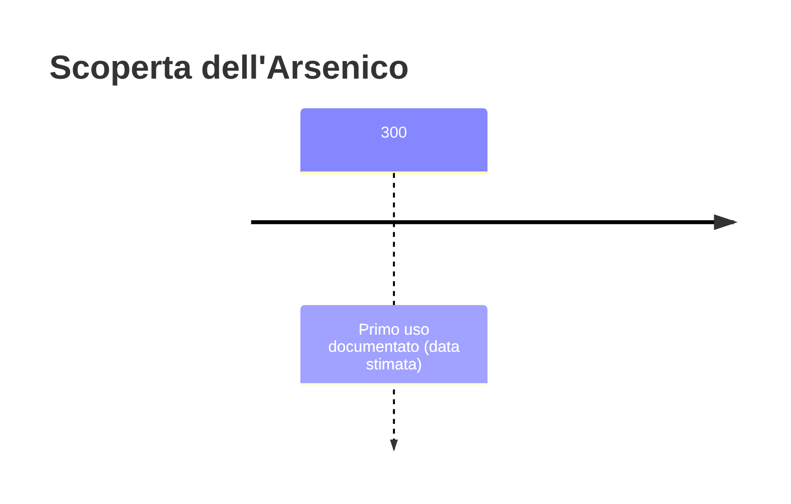
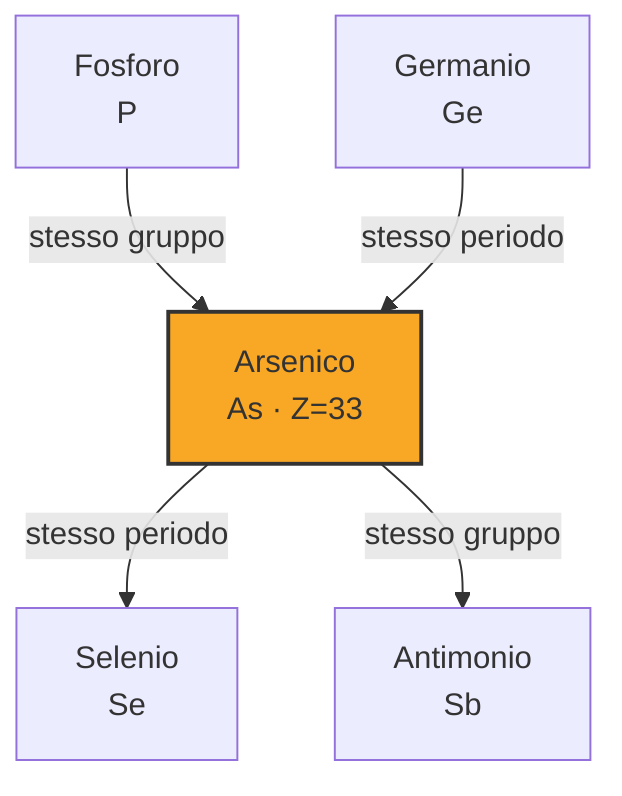

# Arsenico (As)

> [!abstract] 13° elemento scoperto — 300
> 

## Cronologia della scoperta

## Storia della scoperta

## Posizione nella tavola periodica

## Caratteristiche

### Dati fisico-chimici

| Proprietà | Valore |
|---|---|
| Numero atomico | 33 |
| Massa atomica | 74,9215956 u |
| Categoria | Semimetallo |
| Gruppo | 15 |
| Periodo | 4 |
| Blocco | p |
| Configurazione elettronica | [Ar] 3d¹⁰ 4s² 4p³ |
| Punto di fusione | dato non disponibile |
| Punto di ebollizione | dato non disponibile |
| Densità | 5,727 g/cm³ |
| Stati di ossidazione | — |

## Struttura atomica

![[atomo-Arsenico.svg]]

## Usi e presenza in natura

## Nella cronologia

← Precedente: [[Platino]] (600 a.C.)
→ Successivo: [[Bismuto]] (1500)

Epoca: [[Antichità]]

## Fonti

