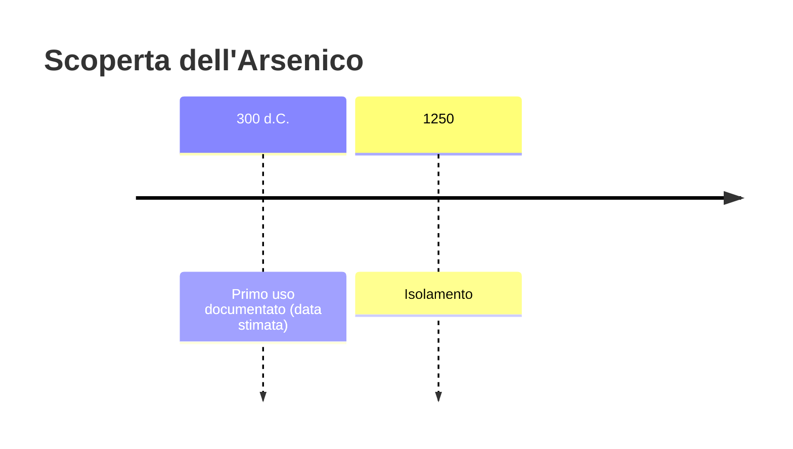
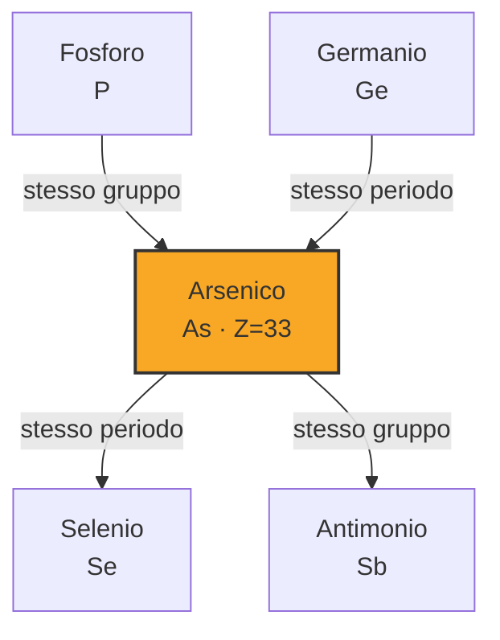
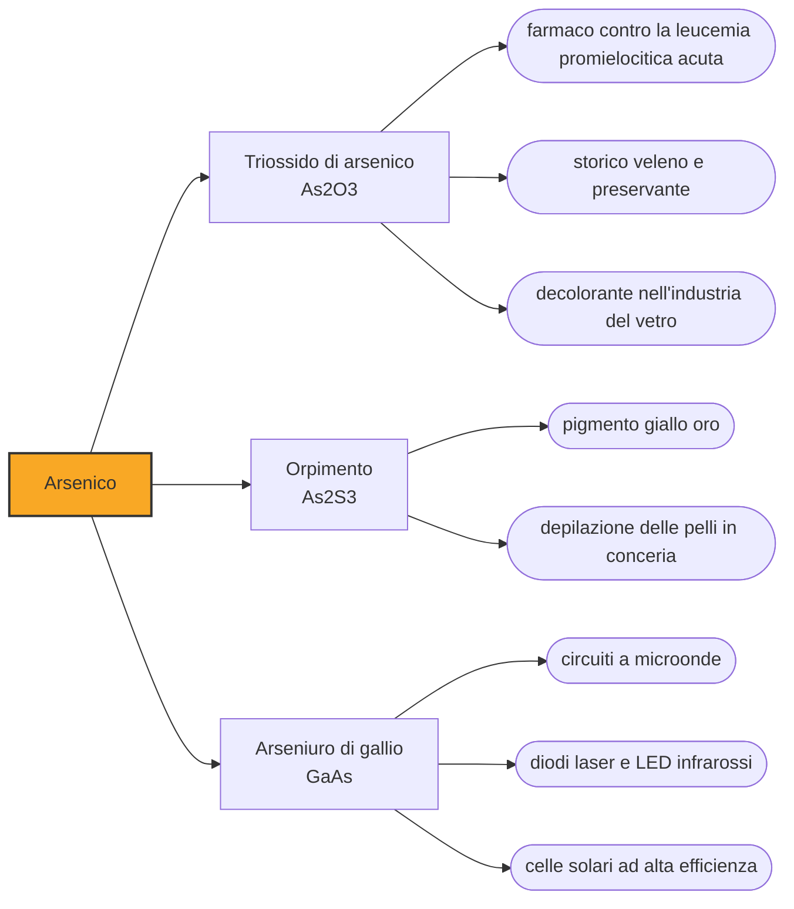

# Arsenico (As)

> [!abstract] 13° elemento scoperto — 300 d.C.
> L'arsenico è entrato nella storia umana tre volte: come indurente involontario del primo bronzo, come pigmento giallo e rosso di straordinaria bellezza, e come il veleno per antonomasia. Solo la terza carriera è quella per cui lo ricordiamo.

L'arsenico è un semimetallo grigio e lucente che a pressione ordinaria non fonde affatto: scaldato, sublima direttamente da solido a vapore. Sta al confine fra i metalli e i non metalli, e questa ambiguità si riflette nella sua chimica, che assomiglia in parti uguali a quella del fosforo e a quella di un metallo.

## Cronologia della scoperta

> [!info] Nota sulla cronologia
> La data convenzionale rimanda a Zosimo di Panopoli, alchimista greco-egizio attivo intorno al 300 d.C., che descrive l'arrostimento del realgar e la successiva riduzione ad arsenico grigio. L'isolamento che la tradizione chimica accredita come primo è però quello attribuito ad Alberto Magno intorno al 1250.

## Storia della scoperta

La prima comparsa dell'arsenico nella tecnica umana precede di millenni la sua identificazione, e non è una scelta. Sull'altopiano iranico, già nel V millennio a.C., si producono bronzi arsenicali: leghe di rame e arsenico più dure del rame puro e più facili da colare, perché l'arsenico funziona da disossidante e aumenta la capacità di incrudimento. Non c'era bisogno di aggiungerlo, perché i minerali di rame lo contengono spesso per conto proprio, e gli archeometallurgisti discutono ancora quanto fosse intenzionale. Il bronzo allo stagno arriva dopo e vince perché è più controllabile.

Lavorare quelle leghe era però una condanna. I fumi che si sviluppano fondendo minerali arsenicali danneggiano il sistema nervoso periferico, e fra i sintomi cronici c'è una debolezza delle gambe che porta a zoppicare. Da qui l'ipotesi, ricorrente in letteratura, che la figura del fabbro divino zoppo presente in tante mitologie, da Efesto in giù, sia il ricordo lontano di una malattia professionale. Nessuna prova documentale la sostiene: la neuropatia dei fonditori è reale, il nesso con il mito resta una congettura.

I due minerali che rendono l'arsenico visibile all'antichità sono l'orpimento, solfuro giallo oro, e il realgar, solfuro rosso arancio. Abbondanti entrambi, furono a lungo usati come pigmenti da greci e romani e poi nelle miniature medievali, per colori che nessun'altra sostanza dava con la stessa intensità. Che avvelenassero chi li macinava era un dettaglio che si accettava.

Attorno al 300 d.C. l'alchimista Zosimo di Panopoli, nell'Egitto romano, descrive un procedimento che è già chimica riconoscibile: arrostisce il realgar ottenendo quella che chiama nube di arsenico, cioè triossido, e la riduce ad arsenico grigio. È a questa ricetta che si riferisce la data convenzionale usata qui. Un'operazione analoga viene attribuita a Jabir ibn Hayyan prima dell'815, mentre la tradizione dei manuali accredita ad Alberto Magno, intorno al 1250, il primo isolamento vero e proprio, ottenuto scaldando solfuro di arsenico insieme al sapone.

La fortuna sinistra dell'arsenico dipende dal triossido, una polvere bianca insapore e inodore che si scioglie nei cibi e nelle bevande senza tradirsi, e i cui sintomi acuti, vomito e crampi addominali, sono indistinguibili da quelli di una dissenteria comune. Nell'Europa moderna gli si dà il nome di polvere di successione, ed è insieme il veleno dei re e il re dei veleni, perché è alla portata di chiunque e per secoli non c'è modo di dimostrarne la presenza in un cadavere.

La partita si chiude nel 1836, quando il chimico inglese James Marsh mette a punto un saggio capace di rivelare quantità minime di arsenico nei tessuti, producendo uno specchio metallico su una superficie fredda. È una delle prime prove chimiche accettate in tribunale, e trasforma la tossicologia forense in una disciplina: il veleno perfetto smette di esserlo.

> [!warning] Questione aperta
> La cronologia dell'arsenico è confusa in molte esposizioni divulgative, che oscillano fra il 2500 a.C. e il XIII secolo senza dire di che cosa parlano. Le tre date corrispondono a tre cose diverse. I bronzi arsenicali del V-IV millennio a.C. non presuppongono alcuna conoscenza dell'arsenico come sostanza: il metallo veniva da minerali di rame che lo contenevano già. Zosimo di Panopoli, verso il 300 d.C., descrive un procedimento che dall'arrostimento del realgar porta all'arsenico grigio, ed è la prima ricetta riconoscibile; a Jabir ibn Hayyan si attribuisce un'operazione analoga prima dell'815. L'attribuzione ad Alberto Magno, intorno al 1250, resta quella corrente nei testi di storia della chimica ma è largamente convenzionale, e sconta il fatto che nessuna di queste operazioni era intesa come l'isolamento di un elemento, categoria che ancora non esisteva.

## Posizione nella tavola periodica

## Caratteristiche

Nella pratica l'arsenico si incontra in due stati di ossidazione, più tre e più cinque, ai quali corrispondono l'arsenito e l'arseniato; la letteratura ne elenca parecchi altri, dal meno tre in su, ma sono rarità di laboratorio. La differenza fra i due non è accademica, perché l'arsenico trivalente è nettamente il più tossico dei due: si lega ai gruppi tiolici delle proteine, quelli che contengono zolfo, e blocca gli enzimi del metabolismo energetico cellulare.

Il problema sanitario più grave legato all'arsenico non nasce da un delitto ma dalla geologia. In vaste aree dell'Asia meridionale, in particolare nel delta del Gange e del Brahmaputra, le falde acquifere profonde attraversano sedimenti che liberano arsenico naturale, e i pozzi scavati a partire dagli anni Settanta proprio per sfuggire alle acque superficiali contaminate hanno esposto decine di milioni di persone a un'intossicazione cronica. L'Organizzazione mondiale della sanità l'ha definita il più grande avvelenamento di massa della storia.

### Dati fisico-chimici

| Proprietà | Valore |
|---|---|
| Numero atomico | 33 |
| Massa atomica | 74,9215956 u |
| Categoria | Semimetallo |
| Gruppo | 15 |
| Periodo | 4 |
| Blocco | p |
| Configurazione elettronica | [Ar] 3d¹⁰ 4s² 4p³ |
| Punto di fusione | dato non disponibile |
| Punto di ebollizione | dato non disponibile |
| Densità | 5,727 g/cm³ |
| Stati di ossidazione | -3, -2, -1, 0, +1, +2, +3, +4, +5 |

## Struttura atomica

![[atomo-Arsenico.svg]]

## Usi e presenza in natura

Gli usi legittimi dell'arsenico si sono ridotti drasticamente. Per quasi un secolo l'arseniato di rame cromato è stato il preservante del legno da esterni, oggi vietato nell'edilizia residenziale in gran parte del mondo; gli insetticidi arsenicali come il verde di Parigi sono usciti di scena. Restano l'arseniuro di gallio, semiconduttore di prima qualità per elettronica a microonde e diodi laser, e piccole quantità di arsenico nelle leghe di piombo per pallini e batterie.

Il veleno ha però una seconda carriera farmacologica. Nel 1909 Paul Ehrlich mette a punto il Salvarsan, un composto arsenicale che è il primo farmaco di sintesi efficace contro la sifilide e l'antenato della chemioterapia moderna. E il triossido di arsenico, la polvere degli avvelenatori, è oggi un farmaco registrato contro la leucemia promielocitica acuta, con tassi di remissione molto alti.

## Curiosità

Il nome viene dal persiano zarnikh, giallo, che indicava l'orpimento; passato all'arabo e poi al greco è diventato arsenikon, e i greci lo hanno accostato al loro aggettivo arsenikos, maschile o virile, attribuendo alla sostanza una potenza che il nome originale non implicava affatto. È un caso di etimologia popolare che ha attecchito così bene da arrivare fino a noi.

L'Ottocento ha convissuto con l'arsenico in modo che oggi sembra incomprensibile. Il verde di Scheele e il verde di Parigi, entrambi composti arsenicali, coloravano carte da parati, tessuti e persino confetti, e nelle stanze umide potevano liberare vapori tossici; alcune signore assumevano preparati arsenicali con aceto e gesso per ottenere un colorito pallido di moda. All'arsenico della carta da parati è stata attribuita anche la morte di Napoleone nel 1821, ipotesi mai dimostrata.

## Nella cronologia

← Precedente: [[Platino]] (600 a.C.)
→ Successivo: [[Bismuto]] (1500)

Epoca: [[Antichità]]

## Fonti

- [Arsenic](https://en.wikipedia.org/wiki/Arsenic) — consultata il 07/09/2026
- [Arsenical bronze](https://en.wikipedia.org/wiki/Arsenical_bronze) — consultata il 07/09/2026
- [Oxidation state (tabella degli stati noti per elemento)](https://en.wikipedia.org/wiki/Oxidation_state) — consultata il 07/09/2026
