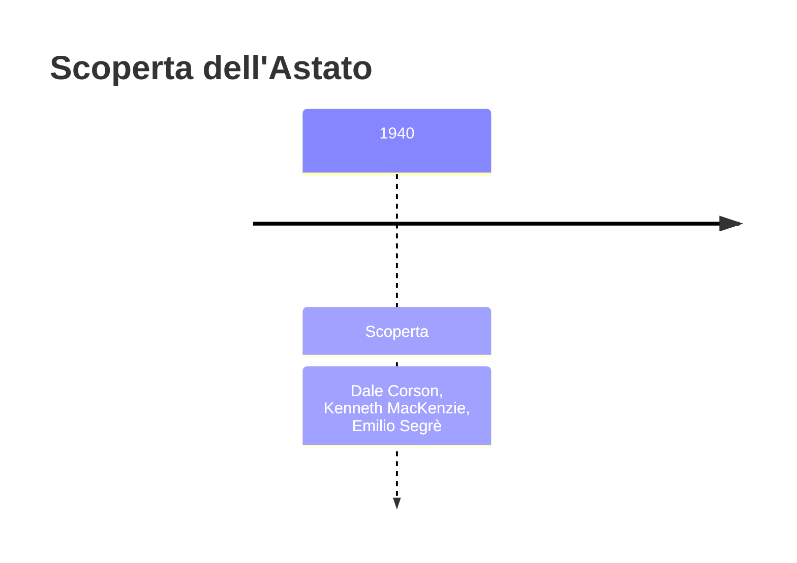
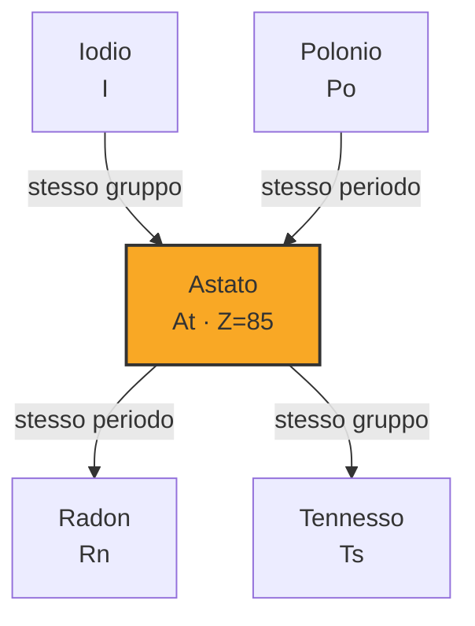

# Astato (At)

> [!abstract] 91° elemento scoperto — 1940
> 

## Cronologia della scoperta

## Storia della scoperta

## Posizione nella tavola periodica

## Caratteristiche

### Dati fisico-chimici

| Proprietà | Valore |
|---|---|
| Numero atomico | 85 |
| Massa atomica | 210,0 u |
| Categoria | Alogeno |
| Gruppo | 17 |
| Periodo | 6 |
| Blocco | p |
| Configurazione elettronica | [Xe] 4f¹⁴ 5d¹⁰ 6s² 6p⁵ |
| Punto di fusione | 301,9 °C |
| Punto di ebollizione | 336,9 °C |
| Densità | 6,35 g/cm³ |
| Stati di ossidazione | — |

## Struttura atomica

![[atomo-Astato.svg]]

## Usi e presenza in natura

## Nella cronologia

← Precedente: [[Francio]] (1939)
→ Successivo: [[Nettunio]] (1940)

Epoca: [[Era nucleare]] · Scopritori: [[Dale Corson]], [[Kenneth MacKenzie]], [[Emilio Segrè]]

## Fonti

