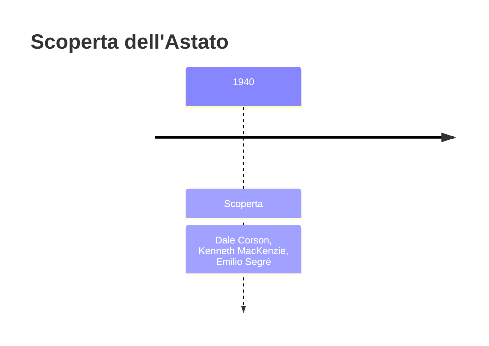
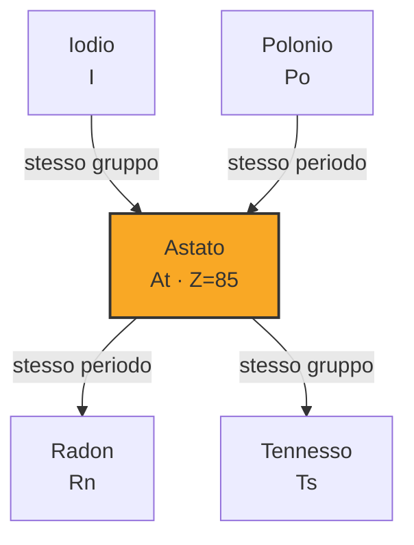
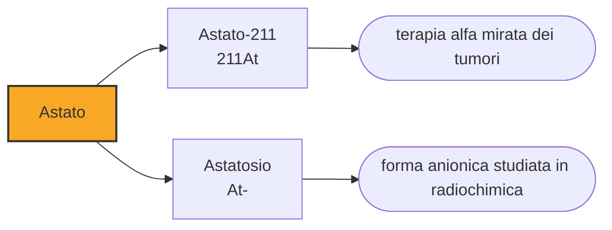

# Astato (At)

> [!abstract] 91° elemento scoperto — 1940
> È l'elemento più raro della crosta terrestre: in ogni istante, sull'intero pianeta, ne esiste meno di un grammo. Nessuno ne ha mai visto un pezzo, e chi ci provasse lo vedrebbe evaporare per il proprio calore.

L'astato è l'alogeno più pesante fra quelli che esistono, e il più instabile: nessuno dei suoi isotopi arriva a un giorno di vita. Sta nella colonna del cloro e dello iodio, ma se ne discosta abbastanza da comportarsi in parte come un metallo, e quasi tutto quello che si sa di lui viene da esperimenti su pochi milioni di atomi.

## Cronologia della scoperta

> [!info] Nota sulla cronologia
> La data è quella della sintesi in laboratorio. La casella 85 aveva raccolto per decenni rivendicazioni poi cadute, che le tavole non registrano.

## Storia della scoperta

La casella 85, sotto lo iodio, era una delle ultime rimaste vuote fra gli elementi naturali, e negli anni Trenta fu rivendicata più volte: alabamio nel 1931, dakin nel 1937, helvetium nel 1940, oltre a osservazioni di righe X che sembravano provarne l'esistenza. Nessuna di queste rivendicazioni resse alla verifica.

A trovarlo davvero furono, nel 1940, Dale Corson, Kenneth MacKenzie ed Emilio Segrè all'Università della California a Berkeley: bombardarono bismuto-209 con particelle alfa nel ciclotrone, e ottennero astato-211. Non lo cercarono in un minerale, lo fabbricarono, ed è il secondo elemento dopo il tecnezio a essere arrivato nella tavola periodica per questa strada — e ancora una volta con Segrè fra gli autori.

Lo chiamarono astato, dal greco astatos, «instabile», che è la sua unica caratteristica davvero definitoria. È uno dei pochi elementi il cui nome descrive non un colore, un luogo o una persona, ma il fatto che non stia fermo abbastanza da essere studiato con calma.

Solo dopo si scoprì che l'astato esiste anche in natura, come anello brevissimo nelle catene di decadimento dell'uranio e del torio: si forma di continuo e scompare in poche ore, e le stime dicono che in ogni istante l'intera crosta terrestre ne contenga meno di un grammo. È il caso limite di un elemento che c'è e non c'è: presente ovunque ci sia uranio, e mai in quantità che qualcuno possa raccogliere.

## Posizione nella tavola periodica

## Caratteristiche

L'isotopo più longevo, l'astato-210, ha un'emivita di poco più di otto ore; quello che si usa in medicina, l'astato-211, di poco più di sette. Non esistono isotopi stabili né a vita lunga: l'elemento 85 è uno dei due, fra i primi ottantatré, che la natura non è riuscita a rendere permanenti.

Un pezzo visibile di astato si vaporizzerebbe all'istante per il calore prodotto dalla propria radioattività: è lo stesso limite del francio, e la ragione per cui di questi due elementi non esistono fotografie. Il colore, la densità e il punto di fusione che compaiono nelle tabelle sono estrapolazioni, non misure.

Chimicamente si comporta come un alogeno a metà: forma lo ione negativo come lo iodio, ma anche cationi, e in soluzione precipita con l'argento come farebbe uno ioduro. È il punto della tavola periodica in cui la colonna degli alogeni comincia a somigliare a quella dei metalli, un passaggio che si vede meglio ancora nel tennesso, l'elemento sotto di lui.

Tutto ciò che si sa dell'astato viene da esperimenti su quantità che si misurano in atomi: si producono in ciclotrone, si trasportano in fretta e si studiano mentre decadono. In queste condizioni non si può pesare né vedere nulla, e le proprietà chimiche si deducono dal modo in cui il materiale si distribuisce fra due solventi o si attacca a una colonna.

### Dati fisico-chimici

| Proprietà | Valore |
|---|---|
| Numero atomico | 85 |
| Massa atomica | 210,0 u |
| Categoria | Alogeno |
| Gruppo | 17 |
| Periodo | 6 |
| Blocco | p |
| Configurazione elettronica | [Xe] 4f¹⁴ 5d¹⁰ 6s² 6p⁵ |
| Punto di fusione | 301,9 °C |
| Punto di ebollizione | 336,9 °C |
| Densità | 6,35 g/cm³ |
| Stati di ossidazione | -1, +1, +3, +5, +7 |

## Struttura atomica

![[atomo-Astato.svg]]

## Usi e presenza in natura

L'unico impiego in vista è medico, e sfrutta proprio ciò che rende l'astato inutilizzabile per tutto il resto. L'astato-211 emette particelle alfa che percorrono al massimo settanta millesimi di millimetro nei tessuti, cioè il diametro di qualche cellula: legato a molecole che riconoscono le cellule tumorali, distrugge quelle a cui si attacca e lascia intatto ciò che sta attorno. È una delle terapie su cui la medicina nucleare sta investendo di più, insieme a quelle con l'attinio-225.

Rispetto allo iodio-131, che è il tracciante e il terapeutico classico della tiroide, l'astato-211 ha il vantaggio di emettere alfa invece di beta: molta più energia rilasciata su una distanza molto più corta. Il limite è la produzione, perché serve un ciclotrone vicino all'ospedale e il materiale dura poche ore.

Fuori dalla ricerca medica l'astato non serve a nulla, e non può servire: non ne esiste abbastanza, non dura, e ogni tentativo di accumularlo si scontra con il fatto che scalda e si distrugge da solo. È probabilmente l'elemento meno utilizzabile dell'intera tavola periodica.

## Curiosità

Le rivendicazioni fallite sulla casella 85 sono un piccolo catalogo di come si sbagliava allora: alabamio, dakin, helvetium, e in un caso righe spettrali attribuite a un elemento che semplicemente non poteva esserci in quel campione. Trovare un elemento che dura ore, in tracce invisibili, era fuori portata per chiunque non avesse un acceleratore.

Emilio Segrè compare due volte in questa storia: nel 1937 con il tecnezio a Palermo, nel 1940 con l'astato a Berkeley, dove si trovava perché le leggi razziali del 1938 gli avevano tolto la cattedra e reso impossibile il rientro in Italia. Restò negli Stati Uniti, lavorò al progetto Manhattan e nel 1959 ricevette il Nobel per la fisica per la scoperta dell'antiprotone.

## Nella cronologia

← Precedente: [[Francio]] (1939)
→ Successivo: [[Nettunio]] (1940)

Epoca: [[Era nucleare]] · Scopritori: [[Dale Corson]], [[Kenneth MacKenzie]], [[Emilio Segrè]]

## Fonti

- [Astatine](https://en.wikipedia.org/wiki/Astatine) — consultata il 09/09/2026
- [Astatine — Royal Society of Chemistry](https://periodic-table.rsc.org/element/85/astatine) — consultata il 09/09/2026
- [Astatine-211](https://en.wikipedia.org/wiki/Astatine-211) — consultata il 09/09/2026

---

> [!warning] Avvertenza
> Questo progetto è stato realizzato con l'assistenza di sistemi di
> intelligenza artificiale. I contenuti sono verificati sulle fonti citate,
> ma **possono contenere errori e imprecisioni**: prima di riutilizzarli,
> controlla la fonte.
