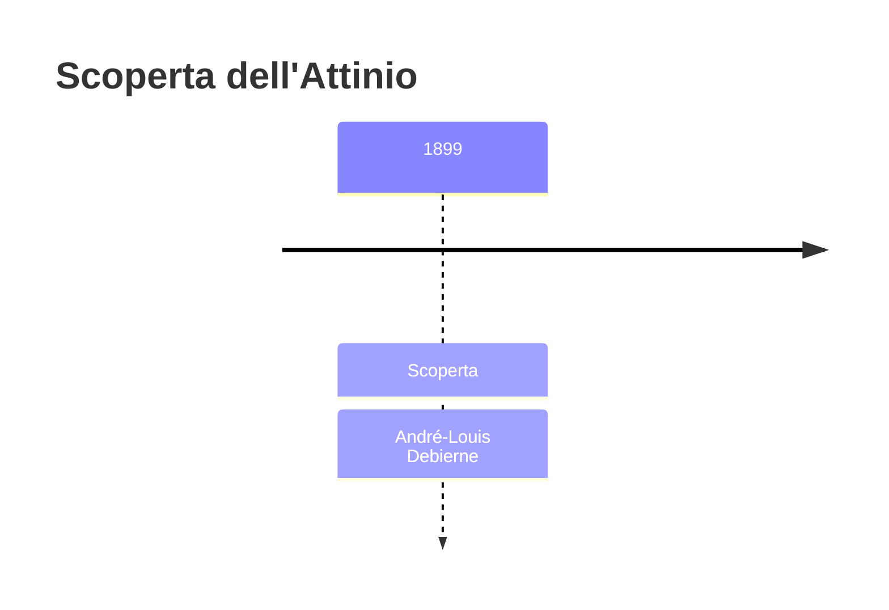
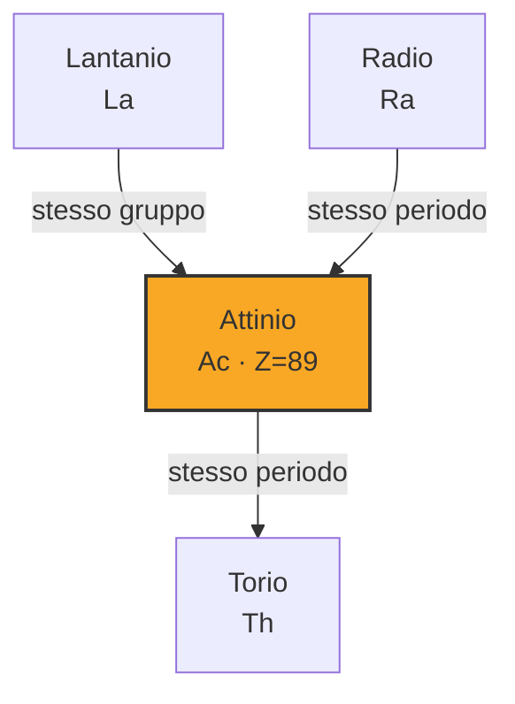

# Attinio (Ac)

> [!abstract] 82° elemento scoperto — 1899
> 

## Cronologia della scoperta

## Storia della scoperta

## Posizione nella tavola periodica

## Caratteristiche

### Dati fisico-chimici

| Proprietà | Valore |
|---|---|
| Numero atomico | 89 |
| Massa atomica | 227,0 u |
| Categoria | Attinide |
| Gruppo | 3 |
| Periodo | 7 |
| Blocco | f |
| Configurazione elettronica | [Rn] 6d¹ 7s² |
| Punto di fusione | 1226,9 °C |
| Punto di ebollizione | 3226,9 °C |
| Densità | 10,0 g/cm³ |
| Stati di ossidazione | — |

## Struttura atomica

![[atomo-Attinio.svg]]

## Usi e presenza in natura

## Nella cronologia

← Precedente: [[Radio]] (1898)
→ Successivo: [[Radon]] (1900)

Epoca: [[Spettroscopia e radioattività]] · Scopritore: [[André-Louis Debierne]]

## Fonti

