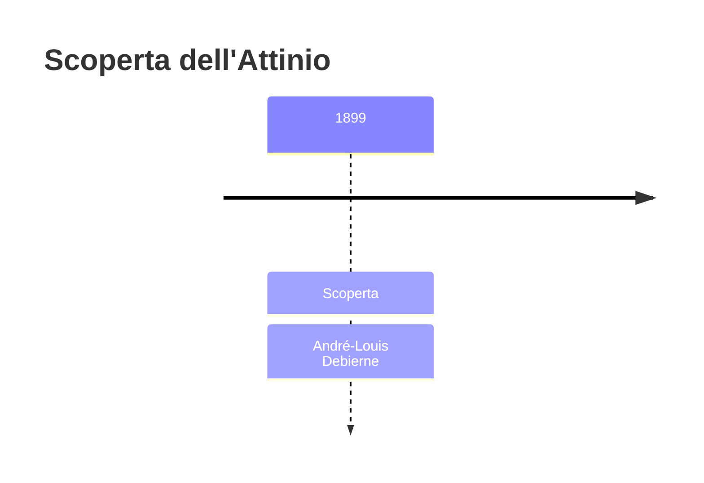
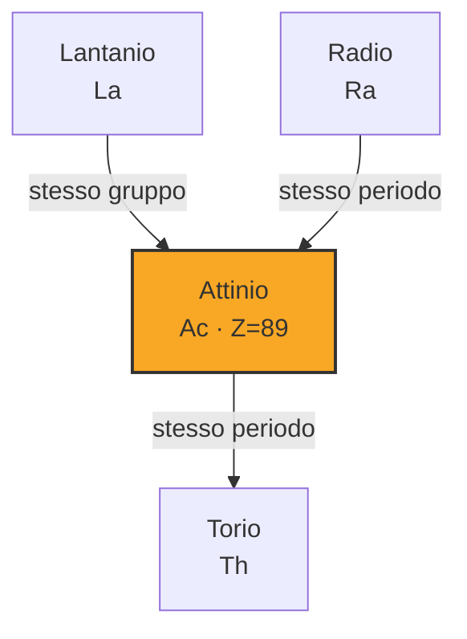
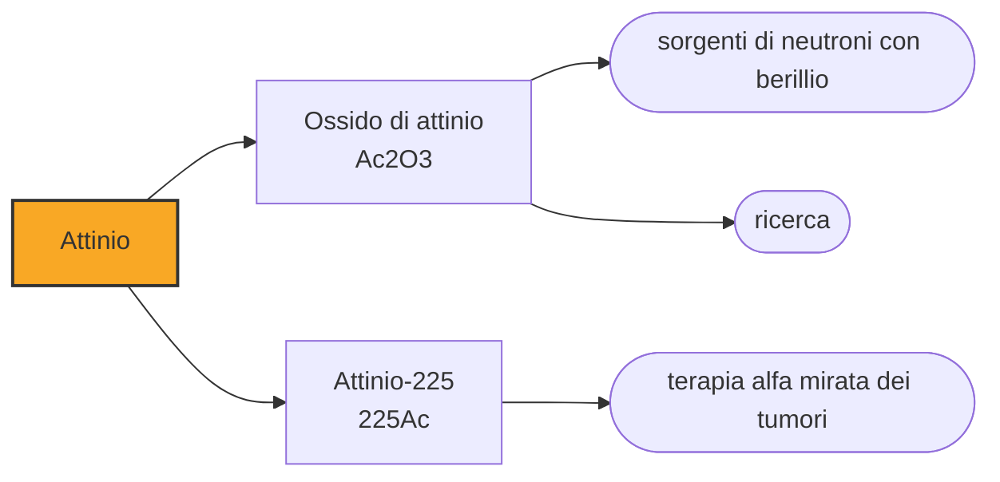

# Attinio (Ac)

> [!abstract] 82° elemento scoperto — 1899
> Nei residui che i Curie avevano già spremuto per estrarne il radio restava ancora qualcosa. A trovarlo fu il loro assistente, e a quel qualcosa la tavola periodica deve il nome di un'intera serie.

L'attinio è il capostipite degli attinidi, la serie che porta il suo nome e che comprende uranio, plutonio e tutti gli elementi artificiali pesanti. È talmente raro che una tonnellata di minerale di uranio ne contiene meno di un milligrammo, e talmente attivo da brillare al buio di una luce azzurra.

## Cronologia della scoperta

> [!info] Nota sulla cronologia
> Debierne lo separò nel 1899 dai residui di pechblenda già sfruttati dai Curie per il radio. Nel 1902 Friedrich Oskar Giesel lo trovò indipendentemente e lo chiamò emanium, descrivendone le proprietà chimiche con più precisione; la priorità fu assegnata a Debierne per anzianità, ma a Giesel si riconosce la prima preparazione radiochimicamente pura.

## Storia della scoperta

Nel 1899 André-Louis Debierne, che lavorava accanto ai Curie nel laboratorio di rue Lhomond, riprese i residui di pechblenda da cui il radio era già stato estratto e li sottopose a nuove separazioni. Quei residui erano già stati spremuti due volte — prima per il polonio, poi per il radio — e restavano comunque attivi: Debierne isolò la frazione che non corrispondeva a nessuno dei due e annunciò un terzo elemento nuovo, che chiamò attinio, dal greco aktis, «raggio».

Nel 1902, in Germania, Friedrich Oskar Giesel isolò indipendentemente una sostanza che si comportava come il lantanio e nel 1904 la chiamò emanium. Le proprietà chimiche che descriveva erano più accurate di quelle di Debierne, ma la priorità fu assegnata al francese per anzianità, e il nome attinio restò. A Giesel va però riconosciuta la prima preparazione radiochimicamente pura dell'elemento.

Il nome ebbe una fortuna che nessuno poteva prevedere. Quando negli anni Quaranta Glenn Seaborg propose di collocare gli elementi pesanti in una seconda serie analoga a quella dei lantanidi, la chiamò serie degli attinidi dal primo dei suoi membri: l'attinio, che era stato trovato per caso nei rifiuti di un'altra estrazione, dà oggi il nome a quattordici elementi.

L'attinio-227 sta in una delle tre catene di decadimento naturali, quella dell'uranio-235, che per questo si chiama serie dell'attinio. Ogni catena produce un gas nobile radioattivo, e quella dell'attinio produceva l'actinon: uno dei tre nomi con cui si chiamavano quelle che si sarebbero poi rivelate le emanazioni di un unico elemento, il radon.

## Posizione nella tavola periodica

## Caratteristiche

L'isotopo naturale principale è l'attinio-227, con un'emivita di 21,8 anni: abbastanza breve da renderlo circa centocinquanta volte più attivo del radio a parità di massa, abbastanza lunga da poterlo maneggiare e studiare. Decade prevalentemente emettendo particelle beta, e i suoi figli emettono alfa.

Al buio l'attinio brilla di una luce azzurra pallida, che non viene dal metallo ma dall'aria: le particelle emesse ionizzano ed eccitano l'azoto circostante, che restituisce l'energia come luce. È lo stesso fenomeno che dà il caratteristico bagliore alle sorgenti radioattive intense, e che nei reattori sott'acqua diventa l'azzurro Čerenkov.

Chimicamente somiglia al lantanio più che a qualunque altro elemento: sta nello stato +3, forma composti incolori, e proprio questa somiglianza rese difficile ai primi ricercatori distinguerlo dalle terre rare che lo accompagnavano nei minerali. È un metallo argenteo che all'aria si ossida rapidamente formando uno strato bianco protettivo.

In natura esiste solo come prodotto intermedio del decadimento dell'uranio e del torio, in quantità infinitesime: una tonnellata di minerale di uranio ne contiene circa 0,2 milligrammi. Quello che si usa oggi si produce irraggiando radio-226 con neutroni in un reattore, ed è disponibile in quantità che si misurano in grammi all'anno nel mondo.

### Dati fisico-chimici

| Proprietà | Valore |
|---|---|
| Numero atomico | 89 |
| Massa atomica | 227,0 u |
| Categoria | Attinide |
| Gruppo | 3 |
| Periodo | 7 |
| Blocco | f |
| Configurazione elettronica | [Rn] 6d¹ 7s² |
| Punto di fusione | 1226,9 °C |
| Punto di ebollizione | 3226,9 °C |
| Densità | 10,0 g/cm³ |
| Stati di ossidazione | +3 |

## Struttura atomica

![[atomo-Attinio.svg]]

## Usi e presenza in natura

L'impiego che oggi ne muove la ricerca è medico: l'attinio-225 è uno degli isotopi più promettenti per la terapia alfa mirata, in cui il radionuclide viene legato a una molecola che si attacca selettivamente alle cellule tumorali. Le particelle alfa percorrono pochi decimi di millimetro, cioè il diametro di qualche cellula: distruggono quella a cui sono attaccate e risparmiano il tessuto sano intorno, e siccome sono pesanti e cariche il danno che fanno al DNA è difficile da riparare. È il motivo per cui questa terapia funziona su tumori che resistono alla radioterapia convenzionale.

L'ossido di attinio pressato con berillio dà una sorgente di neutroni efficiente, sullo stesso principio delle sorgenti al polonio ma con una vita utile molto più lunga; è un impiego di nicchia, limitato dalla disponibilità dell'elemento.

Fuori da questi due casi l'attinio non ha impieghi industriali: è troppo raro, troppo caro e troppo radioattivo perché convenga usarlo dove qualcos'altro può fare lo stesso lavoro. È uno dei pochi elementi della tavola periodica di cui si può dire che serve quasi soltanto alla ricerca.

## Curiosità

La produzione mondiale di attinio-225 si misura in quantità di materiale che a occhio nudo non si vedono, e la domanda della medicina nucleare la supera da anni: è uno dei rari casi in cui a frenare una terapia non è la scienza ma la disponibilità fisica dell'ingrediente. Buona parte di ciò che esiste proviene dal decadimento di vecchie scorte di torio-229 conservate da decenni in pochi laboratori al mondo, e nuovi metodi di produzione con acceleratori sono in sviluppo proprio per superare quel collo di bottiglia.

Debierne restò tutta la vita accanto ai Curie: isolò con Marie il radio metallico nel 1910, diresse il laboratorio dopo la morte di lei, e non rivendicò mai la propria scoperta con particolare energia. Il suo elemento, però, ha dato il nome alla parte della tavola periodica su cui si è giocato il Novecento.

## Nella cronologia

← Precedente: [[Radio]] (1898)
→ Successivo: [[Radon]] (1900)

Epoca: [[Spettroscopia e radioattività]] · Scopritore: [[André-Louis Debierne]]

## Fonti

- [Actinium](https://en.wikipedia.org/wiki/Actinium) — consultata il 09/09/2026
- [Actinium — Royal Society of Chemistry](https://periodic-table.rsc.org/element/89/actinium) — consultata il 09/09/2026
- [Targeted alpha-particle therapy](https://en.wikipedia.org/wiki/Targeted_alpha-particle_therapy) — consultata il 09/09/2026
