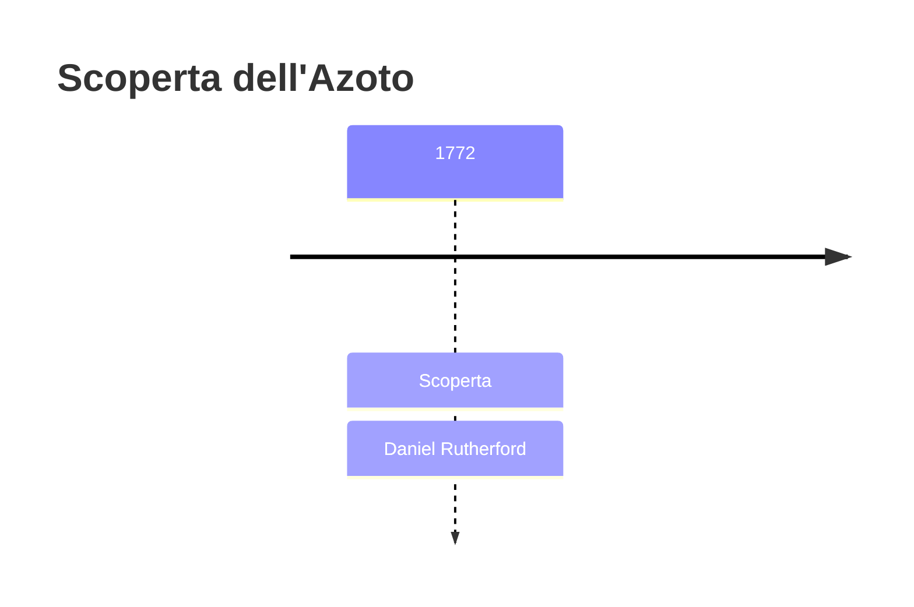
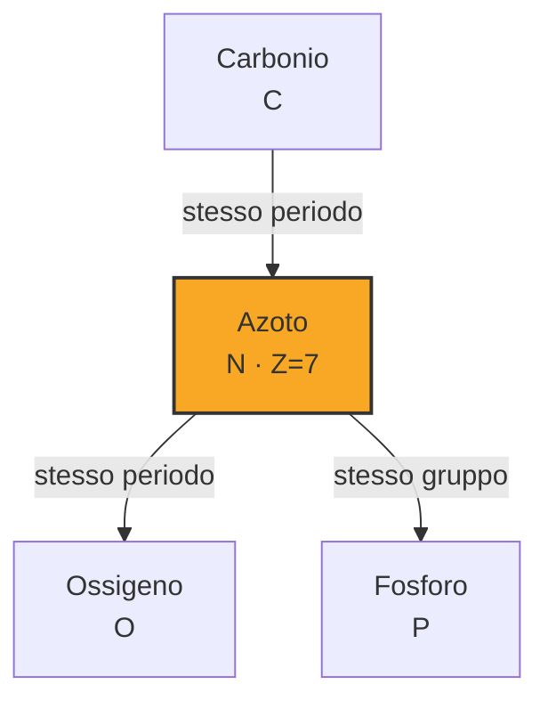
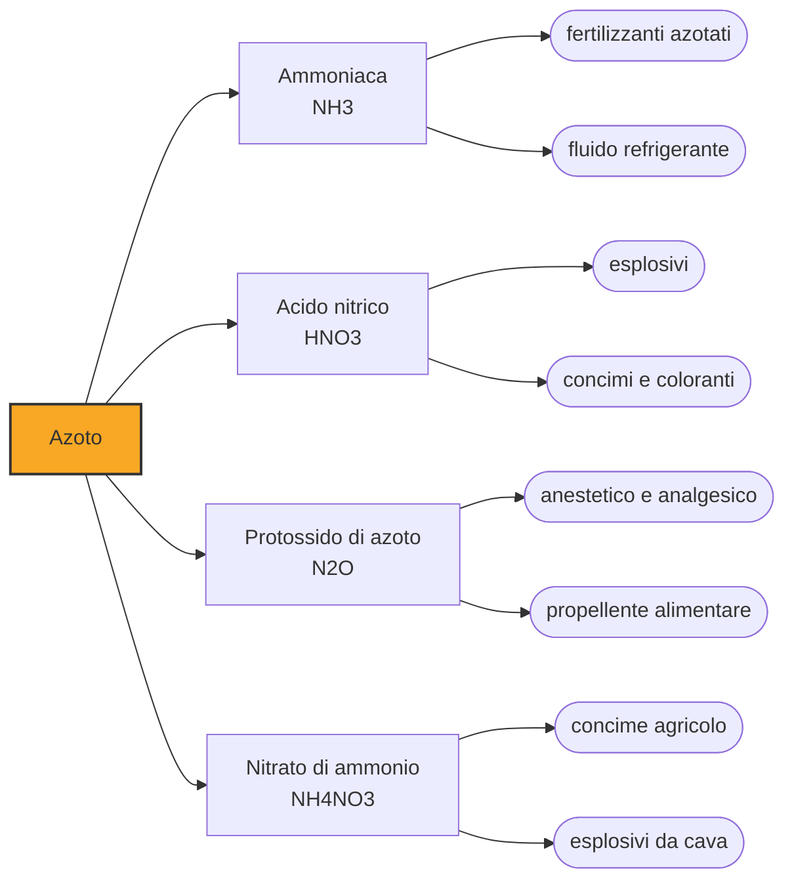

# Azoto (N)

> [!abstract] 26° elemento scoperto — 1772
> Uno studente di medicina chiuse un topo in un vaso di vetro e aspettò. Quello che restava nel vaso quando l'animale era morto costituisce i quattro quinti dell'aria.

L'azoto è il gas di cui l'atmosfera è fatta per il settantotto per cento: la parte dell'aria che non fa nulla. Non brucia, non alimenta la fiamma, non sostiene la respirazione, e proprio per questa inerzia è passato inosservato più a lungo degli altri gas. Eppure è indispensabile alla vita — sta in ogni proteina e in ogni filamento di DNA — e strapparlo all'atmosfera è stato uno dei problemi tecnici più costosi del Novecento.

## Cronologia della scoperta

> [!info] Nota sulla cronologia
> Rutherford isola il gas e ne pubblica la descrizione nella dissertazione di laurea in medicina discussa a Edimburgo nel settembre 1772, sotto la guida di Joseph Black. Nello stesso giro di mesi arrivano allo stesso gas, per vie indipendenti, anche Carl Wilhelm Scheele, Henry Cavendish e Joseph Priestley: a Rutherford va il credito perché è il primo a pubblicarne una caratterizzazione compiuta.

## Storia della scoperta

La storia comincia con un maestro e una domanda mal posta. A Edimburgo Joseph Black aveva dimostrato che esiste un'aria fissa, quella che oggi chiamiamo anidride carbonica, che si libera dal calcare e spegne le candele. Restava un fatto scomodo: se da un'aria in cui una candela si era spenta si toglieva tutta l'aria fissa, la candela continuava a non accendersi. Qualcosa d'altro c'era, e non aveva ancora un nome.

Black assegna il problema a un suo studente, Daniel Rutherford, ventitreenne. Il procedimento è una sottrazione condotta fino in fondo: tiene un topo in una quantità d'aria confinata finché l'animale non muore, poi in quell'aria brucia una candela finché non si spegne, poi vi brucia del fosforo finché non smette di ardere, e infine fa passare il residuo attraverso una soluzione alcalina che assorbe l'aria fissa. Ciò che sopravvive a tutti questi consumi è azoto quasi puro.

Rutherford descrive il gas nella sua tesi di laurea in medicina, discussa nel settembre 1772, e lo chiama aria nociva, o mefitica: il nome viene dalle esalazioni che nell'antichità si credeva uscissero dalla terra e portassero malattia, ed è esatto nel modo più letterale, perché in quell'aria un animale muore. Come tutti i suoi contemporanei interpreta il risultato con il flogisto, e ritiene di avere in mano aria comune saturata di quel principio.

Non era il solo ad averci messo le mani. Nello stesso giro di mesi Scheele ottiene lo stesso gas in Svezia e lo chiama aria viziata, Priestley lo prepara in Inghilterra come aria flogisticata, e Henry Cavendish lo aveva ottenuto ancora prima senza pubblicare nulla, per quella riluttanza alla stampa che gli fece perdere il credito di parecchie scoperte. A Rutherford il primato tocca per una ragione precisa: è il primo a descriverne il comportamento in modo compiuto e a metterlo per iscritto.

L'elemento porta due nomi in Europa perché due scuole ne colsero due qualità opposte. Lavoisier propose azote, dal greco per privo di vita, guardando a ciò che il gas non fa; nel 1790 Jean-Antoine Chaptal propose nitrogène, generatore di nitro, guardando a ciò che il gas produce, cioè il salnitro e l'acido nitrico. L'italiano e il francese hanno tenuto il primo, l'inglese e lo spagnolo il secondo: la stessa sostanza si chiama, a seconda del confine, per la sua sterilità o per la sua fertilità.

## Posizione nella tavola periodica

## Caratteristiche

Tutta la chimica dell'azoto discende da un solo numero. I due atomi della molecola sono tenuti insieme da un triplo legame la cui rottura costa novecentoquarantacinque chilojoule per mole, il più tenace fra tutti i legami fra due atomi uguali: è per questo che l'azoto attraversa i nostri polmoni senza reagire e che si può conservare la frutta in atmosfera di azoto. L'inerzia dell'aria non è assenza di chimica, è una barriera energetica.

Ne segue il paradosso biologico più grande del pianeta: gli organismi vivono immersi in un oceano di azoto e quasi nessuno riesce a usarlo. Le piante non lo prendono dall'aria ma dal suolo, sotto forma di nitrati e ammonio, e a produrli sono pochi batteri specializzati, alcuni liberi e altri ospitati nei noduli delle radici delle leguminose, che dispongono dell'unico enzima capace di spezzare quel triplo legame a temperatura ambiente.

Liberato dalla molecola, l'azoto diventa un camaleonte: nei composti assume tutti gli stati di ossidazione da meno tre a più cinque, dall'ammoniaca all'acido nitrico passando per l'intera famiglia degli ossidi. Molti dei suoi composti sono instabili proprio perché la molecola di azoto è così stabile: gli esplosivi organici liberano energia enorme in un istante perché i loro atomi di azoto si ricongiungono a coppie, e nulla è più comodo che tornare a casa.

### Dati fisico-chimici

| Proprietà | Valore |
|---|---|
| Numero atomico | 7 |
| Massa atomica | 14,007 u |
| Categoria | Non metallo |
| Gruppo | 15 |
| Periodo | 2 |
| Blocco | p |
| Configurazione elettronica | [He] 2s² 2p³ |
| Punto di fusione | -210,0 °C |
| Punto di ebollizione | -195,8 °C |
| Densità | 1,251 g/cm³ |
| Stati di ossidazione | -3, -2, -1, +1, +2, +3, +4, +5 |

## Struttura atomica

![[atomo-Azoto.svg]]

## Usi e presenza in natura

Nel 1909 Fritz Haber riesce a far reagire azoto e idrogeno sotto pressione altissima con un catalizzatore, e Carl Bosch porta il procedimento alla scala industriale. È la sintesi dell'ammoniaca, e non c'è invenzione chimica che abbia cambiato di più la vita di più persone: l'agricoltura smette di dipendere dal letame e dal guano importato, e la produzione di cibo si sgancia dai limiti naturali della fissazione biologica.

La stima più citata è anche la più impressionante: circa la metà degli esseri umani oggi in vita è nutrita grazie all'azoto fissato per via industriale, secondo un calcolo pubblicato nel 2008 e confermato da valutazioni indipendenti successive. Il conto ha un rovescio, perché l'azoto in eccesso finisce nelle falde e nei fiumi e vi innesca fioriture algali che consumano l'ossigeno: le zone morte costiere sono il residuo della stessa reazione che ci sfama.

## Curiosità

A meno centonovantasei gradi l'azoto diventa un liquido incolore che si compra a poco più del prezzo dell'acqua minerale, ed è il freddo portatile della modernità: conserva gameti e vaccini, raffredda i magneti superconduttori, congela i tessuti in chirurgia. La sua sicurezza è insidiosa proprio perché non è tossico: evaporando in un ambiente chiuso sostituisce l'aria senza odore né avvertimento, e chi vi entra perde conoscenza senza sentire di soffocare.

Sott'acqua l'azoto smette di essere inerte. Oltre i trenta metri di profondità la pressione lo scioglie nel sangue e nei tessuti nervosi in quantità sufficiente a produrre la narcosi da gas inerte, uno stato di euforia e di giudizio compromesso che i subacquei chiamano ebbrezza degli abissi. In risalita lo stesso azoto disciolto torna allo stato gassoso e, se la decompressione è troppo rapida, forma bolle nei tessuti: è la malattia dei cassoni.

> [!tip] Approfondimento
> La vicenda completa in [[Azoto — storia estesa]].

## Nella cronologia

← Precedente: [[Fluoro]] (1771)
→ Successivo: [[Bario]] (1772)

Epoca: [[Chimica pneumatica]] · Scopritore: [[Daniel Rutherford]]

## Fonti

- [Nitrogen](https://en.wikipedia.org/wiki/Nitrogen) — consultata il 07/09/2026
- [Daniel Rutherford](https://en.wikipedia.org/wiki/Daniel_Rutherford) — consultata il 07/09/2026
- [J. W. Erisman et al., How a century of ammonia synthesis changed the world, Nature Geoscience 1 (2008), 636-639](https://doi.org/10.1038/ngeo325) — consultata il 07/09/2026
- [How many people does synthetic fertilizer feed?](https://ourworldindata.org/how-many-people-does-synthetic-fertilizer-feed) — consultata il 07/09/2026
- [Nitrogen](https://en.wikipedia.org/wiki/Nitrogen) — consultata il 14/09/2026
- [Daniel Rutherford](https://en.wikipedia.org/wiki/Daniel_Rutherford) — consultata il 14/09/2026
- [Joseph Black](https://en.wikipedia.org/wiki/Joseph_Black) — consultata il 14/09/2026
- [Phlogiston theory](https://en.wikipedia.org/wiki/Phlogiston_theory) — consultata il 14/09/2026
- [Nitrogen fixation](https://en.wikipedia.org/wiki/Nitrogen_fixation) — consultata il 14/09/2026
- [Haber process](https://en.wikipedia.org/wiki/Haber_process) — consultata il 14/09/2026
- [Nitroglycerin](https://en.wikipedia.org/wiki/Nitroglycerin) — consultata il 14/09/2026
- [Amino acid](https://en.wikipedia.org/wiki/Amino_acid) — consultata il 14/09/2026
- [Nucleobase](https://en.wikipedia.org/wiki/Nucleobase) — consultata il 14/09/2026
- [Nitrogenase](https://en.wikipedia.org/wiki/Nitrogenase) — consultata il 14/09/2026
- [Nitrogen cycle](https://en.wikipedia.org/wiki/Nitrogen_cycle) — consultata il 14/09/2026
- [Nitrogen compounds](https://en.wikipedia.org/wiki/Nitrogen_compounds) — consultata il 14/09/2026
- [Isotopes of nitrogen](https://en.wikipedia.org/wiki/Isotopes_of_nitrogen) — consultata il 14/09/2026
- [Solid nitrogen](https://en.wikipedia.org/wiki/Solid_nitrogen) — consultata il 14/09/2026
- [Liquid nitrogen](https://en.wikipedia.org/wiki/Liquid_nitrogen) — consultata il 14/09/2026
- [Nitrogen narcosis](https://en.wikipedia.org/wiki/Nitrogen_narcosis) — consultata il 14/09/2026
- [Decompression sickness](https://en.wikipedia.org/wiki/Decompression_sickness) — consultata il 14/09/2026
- [Nitrous oxide](https://en.wikipedia.org/wiki/Nitrous_oxide) — consultata il 14/09/2026
- [Nitric oxide](https://en.wikipedia.org/wiki/Nitric_oxide) — consultata il 14/09/2026
- [Louis Ignarro](https://en.wikipedia.org/wiki/Louis_Ignarro) — consultata il 14/09/2026
- [Nitric acid](https://en.wikipedia.org/wiki/Nitric_acid) — consultata il 14/09/2026
- [Ammonium nitrate](https://en.wikipedia.org/wiki/Ammonium_nitrate) — consultata il 14/09/2026
- [2020 Beirut explosion](https://en.wikipedia.org/wiki/2020_Beirut_explosion) — consultata il 14/09/2026
- [Texas City disaster](https://en.wikipedia.org/wiki/Texas_City_disaster) — consultata il 14/09/2026
- [Eutrophication](https://en.wikipedia.org/wiki/Eutrophication) — consultata il 14/09/2026
- [Dead zone (ecology)](https://en.wikipedia.org/wiki/Dead_zone_%28ecology%29) — consultata il 14/09/2026
- [Planetary boundaries](https://en.wikipedia.org/wiki/Planetary_boundaries) — consultata il 14/09/2026
- [Nitrification](https://en.wikipedia.org/wiki/Nitrification) — consultata il 14/09/2026
- [Denitrification](https://en.wikipedia.org/wiki/Denitrification) — consultata il 14/09/2026
- [Rhizobium](https://en.wikipedia.org/wiki/Rhizobium) — consultata il 14/09/2026
- [Legume](https://en.wikipedia.org/wiki/Legume) — consultata il 14/09/2026
- [Trichodesmium](https://en.wikipedia.org/wiki/Trichodesmium) — consultata il 14/09/2026
- [Air separation](https://en.wikipedia.org/wiki/Air_separation) — consultata il 14/09/2026
- [Ostwald process](https://en.wikipedia.org/wiki/Ostwald_process) — consultata il 14/09/2026

---

> [!warning] Avvertenza
> Questo progetto è stato realizzato con l'assistenza di sistemi di
> intelligenza artificiale. I contenuti sono verificati sulle fonti citate,
> ma **possono contenere errori e imprecisioni**: prima di riutilizzarli,
> controlla la fonte.
