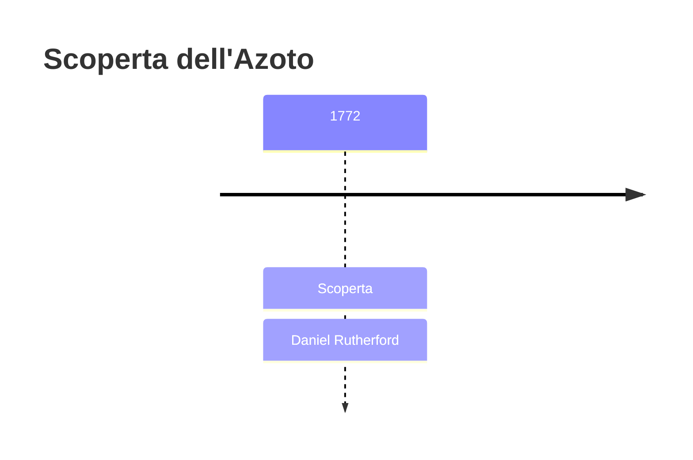
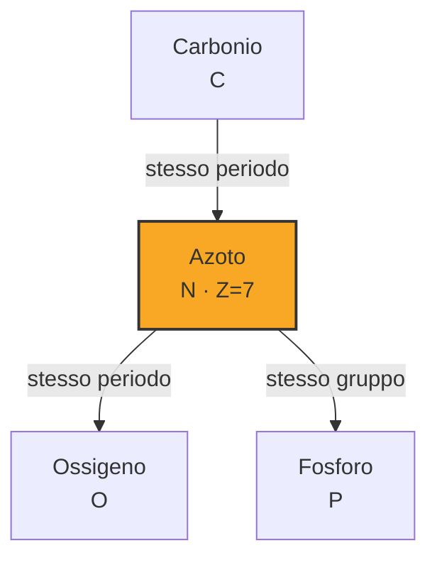

# Azoto (N)

> [!abstract] 26° elemento scoperto — 1772
> 

## Cronologia della scoperta

## Storia della scoperta

## Posizione nella tavola periodica

## Caratteristiche

### Dati fisico-chimici

| Proprietà | Valore |
|---|---|
| Numero atomico | 7 |
| Massa atomica | 14,007 u |
| Categoria | Non metallo |
| Gruppo | 15 |
| Periodo | 2 |
| Blocco | p |
| Configurazione elettronica | [He] 2s² 2p³ |
| Punto di fusione | -210,0 °C |
| Punto di ebollizione | -195,8 °C |
| Densità | 1,251 g/cm³ |
| Stati di ossidazione | — |

## Struttura atomica

![[atomo-Azoto.svg]]

## Usi e presenza in natura

## Nella cronologia

← Precedente: [[Fluoro]] (1771)
→ Successivo: [[Bario]] (1772)

Epoca: [[Chimica pneumatica]] · Scopritore: [[Daniel Rutherford]]

## Fonti

