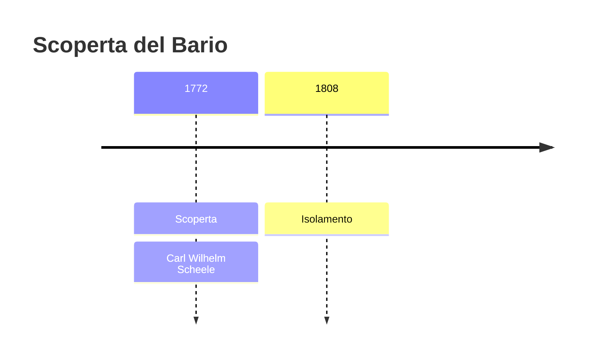
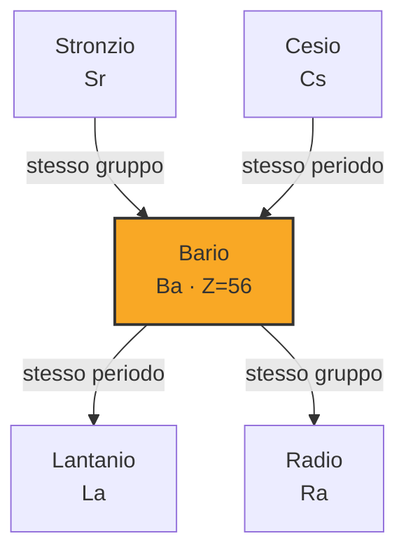
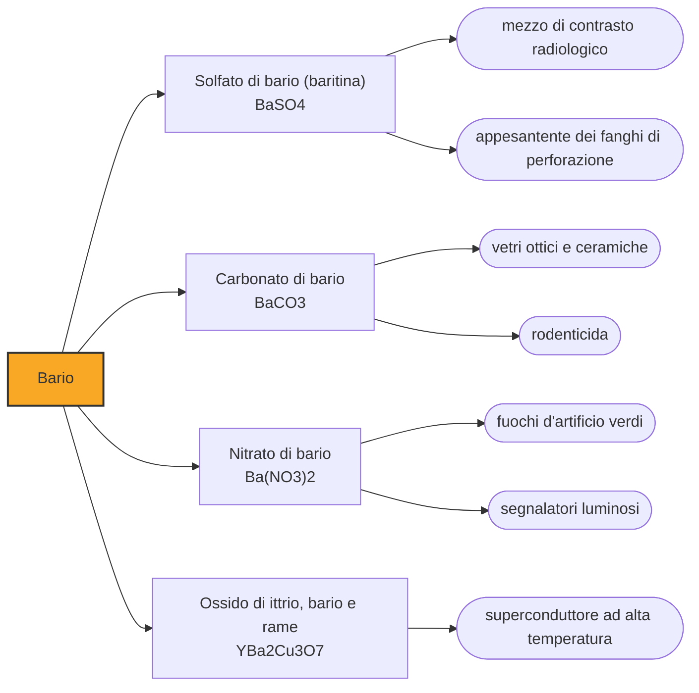

# Bario (Ba)

> [!abstract] 27° elemento scoperto — 1772
> Nel 1602 un ciabattino bolognese trovò dei sassi che, scaldati, brillavano al buio. Ci vollero due secoli per capire che dentro c'era un metallo mai visto.

Il bario è un metallo alcalino terroso talmente reattivo da non esistere libero in natura e talmente pesante da portarne il nome, che viene dal greco barys. È un elemento che il pubblico incontra quasi sempre in un'unica occasione, sdraiato su un lettino radiologico con un bicchiere di sospensione biancastra in mano, e la ragione per cui quel bicchiere non è letale è una delle lezioni di chimica più eleganti che si possano raccontare.

## Cronologia della scoperta

> [!info] Nota sulla cronologia
> La cronologia adotta il 1772, anno in cui Scheele riconosce nella baritina una terra nuova, e non il 1808 dell'isolamento di Davy. È la regola generale seguita qui, ed è la ragione per cui il bario compare fra gli elementi della chimica pneumatica invece che fra quelli dell'elettrolisi.

## Storia della scoperta

La storia comincia con una pietra che fa una cosa impossibile. Nel 1602 Vincenzo Casciarolo, ciabattino e alchimista dilettante, raccoglie sul monte Paderno presso Bologna dei ciottoli pesanti e li calcina sperando di cavarne oro; ottiene invece un materiale che, dopo essere stato esposto alla luce, continua a brillare nel buio per ore. La chiamarono pietra di Bologna o lapis solaris, e fu la sensazione scientifica del secolo: intorno al 1612 un gesuita annota di averne visto la luminescenza dimostrata da Galileo in persona.

Era il primo materiale fosforescente artificiale della storia, e nessuno poteva capire perché funzionasse. Oggi sappiamo che la calcinazione trasforma il solfato di bario del minerale in solfuro di bario, e che il bagliore persistente dipende da tracce di rame presenti per caso nella baritina di quella collina, mentre il ferro lo spegne: la stessa pietra raccolta altrove non brilla. La luminescenza dei quadranti, dei cartelli di emergenza e degli schermi discende da questa curiosità bolognese.

Il minerale intanto restava un enigma per i chimici, perché somigliava alla calce ma si comportava diversamente. Nel 1772 Carl Wilhelm Scheele lo analizza e stabilisce che contiene una terra nuova, distinta dalla calce viva, che verrà chiamata barite; Johan Gottlieb Gahn ripete l'analisi due anni dopo e conferma. Scheele arriva fino al confine e non oltre: stabilisce che l'elemento c'è, ma quella terra non si lascia ridurre da nessun fuoco, e per estrarne il metallo non esiste ancora lo strumento adatto.

A sbloccare la situazione è uno strumento che nel 1772 non esisteva. Con la pila di Volta in mano, Humphry Davy sottopone i sali fusi a corrente elettrica e nel 1808 strappa il bario metallico alla sua terra, dopo aver fatto la stessa cosa con sodio, potassio, calcio, magnesio e stronzio nel giro di due anni. Dal 1772 al 1808 la chimica aveva atteso non per mancanza di idee ma per mancanza di energia: nessuna fiamma è abbastanza forte, una corrente sì.

## Posizione nella tavola periodica

## Caratteristiche

Il bario ha due elettroni esterni che cede con estrema facilità e non ne cede mai un numero diverso: nei suoi composti si presenta sempre e soltanto allo stato più due. Il metallo si ossida all'istante all'aria, reagisce vigorosamente con l'acqua liberando idrogeno e va conservato sotto olio, il che ne fa un materiale da laboratorio scomodo e spiega perché lo si incontri quasi esclusivamente sotto forma di sali.

I sali solubili di bario sono violentemente tossici perché lo ione bario ha dimensioni simili a quelle dello ione potassio e ne blocca i canali nelle membrane cellulari: ne seguono debolezza muscolare, crampi, aritmie e, a dosi sufficienti, la paralisi del cuore. Il cloruro di bario è stato a lungo un veleno da romanzo giallo e un rodenticida, e resta una delle intossicazioni da metallo più rapide che la tossicologia conosca.

Eppure c'è un composto di bario che si beve. Il solfato di bario è così poco solubile in acqua che praticamente nessuno ione bario si libera nell'organismo: attraversa il tubo digerente e ne esce com'è entrato. È il caso da manuale in cui la tossicità non appartiene all'elemento ma alla sua disponibilità chimica, e la distanza fra un veleno fulminante e un mezzo diagnostico sta tutta nella costante di solubilità.

### Dati fisico-chimici

| Proprietà | Valore |
|---|---|
| Numero atomico | 56 |
| Massa atomica | 137,3277 u |
| Categoria | Metallo alcalino terroso |
| Gruppo | 2 |
| Periodo | 6 |
| Blocco | s |
| Configurazione elettronica | [Xe] 6s² |
| Punto di fusione | 726,9 °C |
| Punto di ebollizione | 1844,9 °C |
| Densità | 3,51 g/cm³ |
| Stati di ossidazione | +2 |

## Struttura atomica

![[atomo-Bario.svg]]

## Usi e presenza in natura

Su questa insolubilità si regge il pasto baritato. Il bario è pesante e assorbe i raggi X molto più dei tessuti molli, così una sospensione di solfato bevuta o somministrata per clistere disegna sulla lastra il profilo interno dell'esofago, dello stomaco e dell'intestino, che altrimenti sarebbero invisibili. È un esame di radiologia tradizionale in parte soppiantato dall'endoscopia e dalla tomografia, ma ancora in uso per lo studio della deglutizione e del transito.

Il consumo maggiore di baritina non è però in ospedale ma nei pozzi petroliferi, dove il minerale macinato viene aggiunto ai fanghi di perforazione. Serve la sua densità: il fango appesantito esercita sul fondo del pozzo una pressione sufficiente a contrastare quella del giacimento e a impedire l'eruzione incontrollata. Altri impieghi minori sfruttano il colore verde che i sali di bario danno alla fiamma: è il verde dei fuochi d'artificio.

## Curiosità

Nel 1987 il bario si trovò al centro della fisica mondiale. L'ossido di ittrio, bario e rame fu il primo superconduttore a funzionare sopra i settantasette kelvin, cioè a una temperatura raggiungibile con il semplice azoto liquido invece che con l'elio costosissimo: da laboratorio d'élite la superconduttività divenne un esperimento da corso universitario, e la scoperta del filone valse il Nobel nel giro di un anno.

La fosforescenza persistente che la pietra di Bologna inaugurò ha impiegato quattro secoli a essere capita fino in fondo. Già nel Seicento il chimico Wilhelm Homberg si accorse per caso che la pietra brillava soltanto se macinata in un mortaio di bronzo e non in uno di ferro, senza poter sapere perché: era il rame del bronzo a fare la differenza, e la spiegazione completa è arrivata soltanto in tempi recenti.

## Nella cronologia

← Precedente: [[Azoto]] (1772)
→ Successivo: [[Cloro]] (1774)

Epoca: [[Chimica pneumatica]] · Scopritore: [[Carl Wilhelm Scheele]]

## Fonti

- [Barium](https://en.wikipedia.org/wiki/Barium) — consultata il 07/09/2026
- [Solving the riddle of the glowing stones (Chemistry World)](https://www.chemistryworld.com/opinion/solving-the-riddle-of-the-glowing-stones/1017596.article) — consultata il 07/09/2026
- [Carl Wilhelm Scheele — the Uppsala chemist who discovered oxygen and chlorine](https://www.uu.se/en/about-uu/history/prominent-people/carl-scheele) — consultata il 07/09/2026
- [Humphry Davy](https://en.wikipedia.org/wiki/Humphry_Davy) — consultata il 07/09/2026
