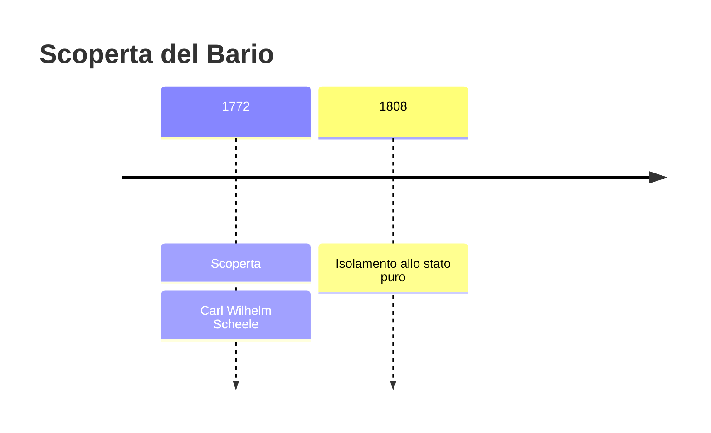
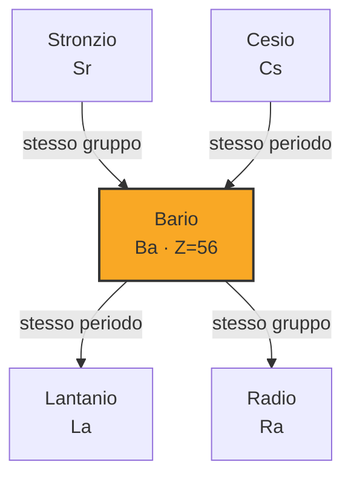

# Bario (Ba)

> [!abstract] 27° elemento scoperto — 1772
> 

## Cronologia della scoperta

## Storia della scoperta

## Posizione nella tavola periodica

## Caratteristiche

### Dati fisico-chimici

| Proprietà | Valore |
|---|---|
| Numero atomico | 56 |
| Massa atomica | 137,3277 u |
| Categoria | Metallo alcalino terroso |
| Gruppo | 2 |
| Periodo | 6 |
| Blocco | s |
| Configurazione elettronica | [Xe] 6s² |
| Punto di fusione | 726,9 °C |
| Punto di ebollizione | 1844,9 °C |
| Densità | 3,51 g/cm³ |
| Stati di ossidazione | — |

## Struttura atomica

![[atomo-Bario.svg]]

## Usi e presenza in natura

## Nella cronologia

← Precedente: [[Azoto]] (1772)
→ Successivo: [[Cloro]] (1774)

Epoca: [[Chimica pneumatica]] · Scopritore: [[Carl Wilhelm Scheele]]

## Fonti

