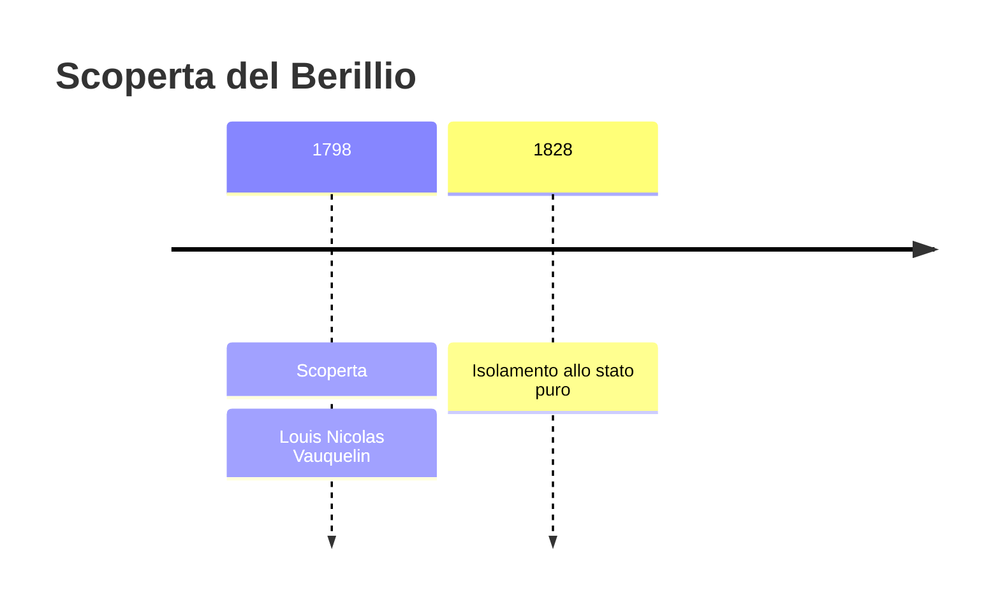
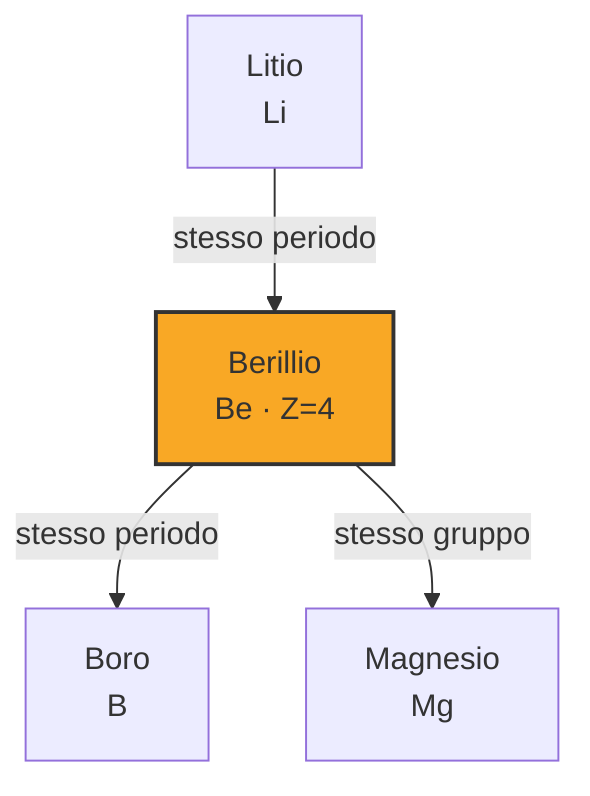

# Berillio (Be)

> [!abstract] 39° elemento scoperto — 1798
> 

## Cronologia della scoperta

## Storia della scoperta

## Posizione nella tavola periodica

## Caratteristiche

### Dati fisico-chimici

| Proprietà | Valore |
|---|---|
| Numero atomico | 4 |
| Massa atomica | 9,01218315 u |
| Categoria | Metallo alcalino terroso |
| Gruppo | 2 |
| Periodo | 2 |
| Blocco | s |
| Configurazione elettronica | [He] 2s² |
| Punto di fusione | 1286,9 °C |
| Punto di ebollizione | 2468,9 °C |
| Densità | 1,85 g/cm³ |
| Stati di ossidazione | — |

## Struttura atomica

![[atomo-Berillio.svg]]

## Usi e presenza in natura

## Nella cronologia

← Precedente: [[Cromo]] (1797)
→ Successivo: [[Vanadio]] (1801)

Epoca: [[Chimica pneumatica]] · Scopritore: [[Louis Nicolas Vauquelin]]

## Fonti

