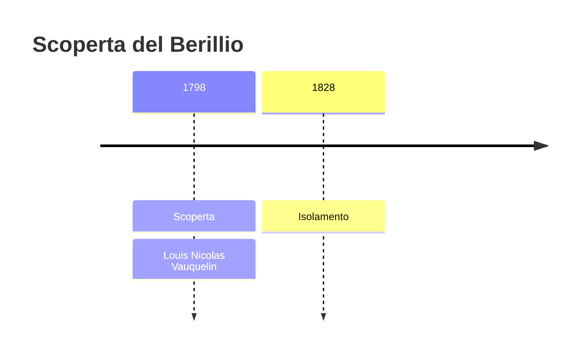
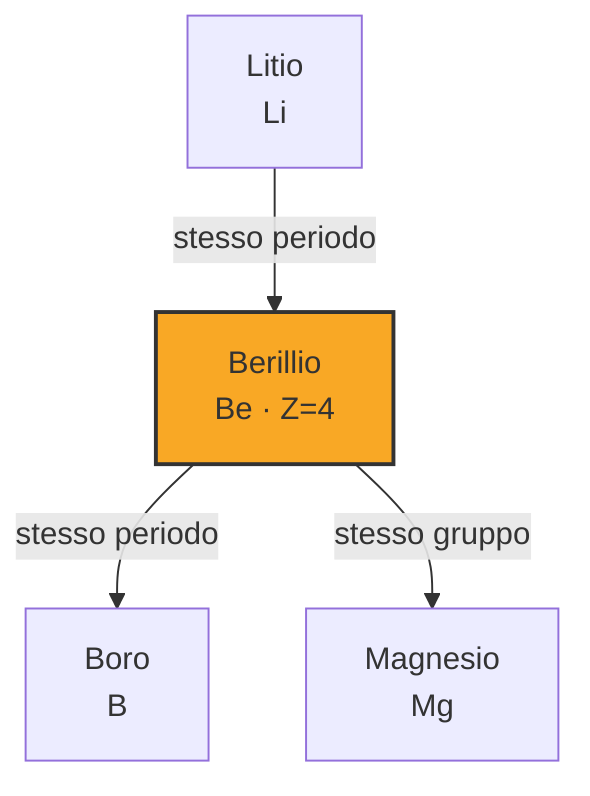
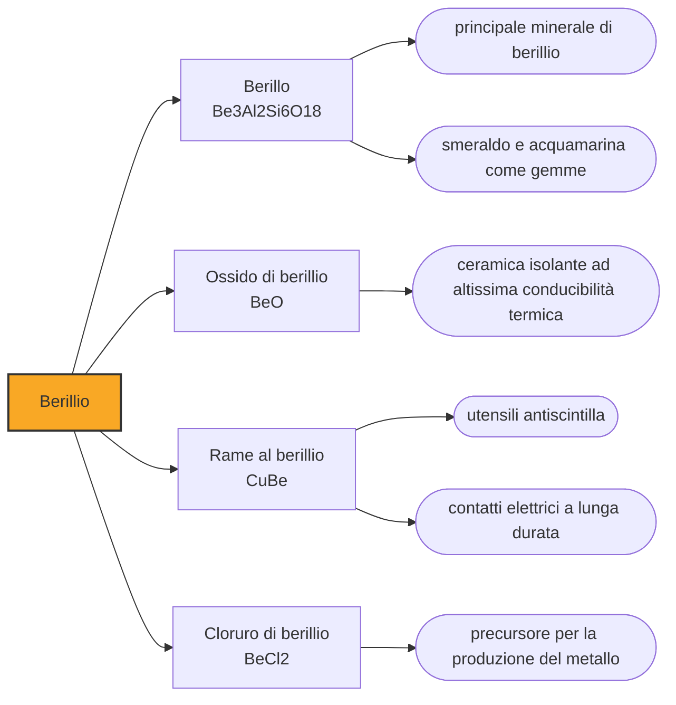

# Berillio (Be)

> [!abstract] 39° elemento scoperto — 1798
> Un mineralogista notò che lo smeraldo e una pietra comune avevano cristalli identici. Chiese a un chimico di verificare, e dalla verifica uscì un elemento nuovo.

Il berillio è il quarto elemento della tavola periodica, un metallo grigio chiaro, leggerissimo e rigido come nessun altro, che l'industria adora e teme in egual misura. È più rigido dell'acciaio pur pesando un quarto di esso, lascia passare i raggi X come se non ci fosse, e la sua polvere provoca una malattia polmonare cronica. Poche sostanze riassumono così bene l'idea che una proprietà utile e una pericolosa possano essere la stessa proprietà.

## Cronologia della scoperta

> [!info] Nota sulla cronologia
> Vauquelin individua nel 1798 una terra nuova nel berillo e nello smeraldo, su sollecitazione del mineralogista René Just Haüy, che aveva osservato l'identità cristallografica dei due minerali. Il metallo è isolato nel 1828, indipendentemente e quasi in contemporanea, da Friedrich Wöhler e Antoine Bussy, per riduzione del cloruro di berillio con il potassio. Campioni di berillio puro non furono disponibili prima del 1957.

## Storia della scoperta

La storia comincia da una domanda di geometria, non di chimica. René Just Haüy, il mineralogista che stava fondando la cristallografia, misura gli angoli dei cristalli di smeraldo e quelli del berillo, una pietra assai meno pregiata, e trova che sono identici: stessa forma, stessa struttura, colore diverso. Se la forma dei cristalli dipende da come sono fatte le sostanze, come sosteneva Haüy, allora quei due minerali devono essere lo stesso minerale. Serviva un chimico per verificarlo.

L'incarico va all'analista più fidato di Parigi. Nel 1798 Louis Nicolas Vauquelin — reduce da un anno in cui aveva già estratto un elemento nuovo dalla crocoite siberiana — smonta entrambi i minerali e conferma Haüy: la composizione è la stessa, e il colore dello smeraldo viene da tracce di impurezze. Ma trova anche dell'altro. Dentro tutti e due c'è una terra che non è allumina, non è calce e non corrisponde a nessuna delle terre catalogate.

I sali della terra nuova avevano una caratteristica che oggi nessun chimico verificherebbe: erano dolci. Sulla base di quel sapore, gli editori della rivista che pubblicò il lavoro proposero di chiamarla glucine, poi glucinium, dal greco per dolce. Il nome ebbe fortuna in Francia, dove resistette per generazioni, e la dolcezza si rivelò un pessimo criterio: i composti di berillio sono tossici, e quel sapore era la firma di sali che nessuno dovrebbe assaggiare.

Fra la terra e il metallo passano trent'anni. Nel 1828 Friedrich Wöhler in Germania e Antoine Bussy in Francia, indipendentemente e quasi nello stesso momento, riducono il cloruro di berillio con il potassio e ottengono per la prima volta il metallo: una polvere grigia, non ancora un pezzo solido. Wöhler propone il nome berillio, dal minerale, ed è quello che alla lunga si impone, ma la doppia denominazione sopravvive fino al 1949, quando la IUPAC decide.

> [!warning] Questione aperta
> Per oltre un secolo l'elemento ebbe due nomi. Gli editori degli Annales de chimie proposero glucine, poi glucinium, per il sapore dolce di alcuni suoi sali; il nome berillio si deve a Wöhler, che lo isolò e lo trasse dal minerale d'origine. La Francia continuò a usare glucinium mentre la Germania usava Beryllium, con la duplice conseguenza di un simbolo chimico incerto fra Gl e Be. La disputa fu chiusa solo nel 1949, quando la IUPAC adottò berillio come nome standard.

## Posizione nella tavola periodica

## Caratteristiche

Il berillio è il materiale strutturale più rigido che si conosca in rapporto al peso. Il suo modulo elastico supera di circa un terzo quello dell'acciaio, mentre la sua densità è poco meno del doppio di quella dell'acqua: una struttura di berillio si flette molto meno di una struttura d'acciaio della stessa massa. Trasmette il suono a quasi tredici chilometri al secondo, più velocemente di qualunque altro metallo, ed è insieme molto fragile, cioè si rompe invece di piegarsi.

La trasparenza ai raggi X è pura aritmetica atomica. I raggi X vengono assorbiti tanto più quanto più sono pesanti gli atomi che incontrano, e il berillio ha soltanto quattro protoni: è il metallo più leggero che si possa maneggiare come solido. Una finestra di berillio lascia uscire i raggi X trattenendo il vuoto, motivo per cui sta all'uscita di ogni tubo radiogeno e in gran parte dei rivelatori di particelle.

Il rovescio è una tossicità di tipo particolare. Il berillio inalato in polvere fine non avvelena come un metallo pesante, ma innesca in una minoranza di persone una risposta immunitaria persistente contro il metallo stesso, che produce una fibrosi polmonare cronica chiamata berilliosi. La dose che basta è minuscola, la malattia può comparire anni dopo l'esposizione e chi non è predisposto non si ammala affatto. Le lavorazioni si fanno in aspirazione totale.

### Dati fisico-chimici

| Proprietà | Valore |
|---|---|
| Numero atomico | 4 |
| Massa atomica | 9,01218315 u |
| Categoria | Metallo alcalino terroso |
| Gruppo | 2 |
| Periodo | 2 |
| Blocco | s |
| Configurazione elettronica | [He] 2s² |
| Punto di fusione | 1286,9 °C |
| Punto di ebollizione | 2468,9 °C |
| Densità | 1,85 g/cm³ |
| Stati di ossidazione | 0, +1, +2 |

## Struttura atomica

![[atomo-Berillio.svg]]

## Usi e presenza in natura

L'uso che consuma più berillio non è il metallo puro ma una lega: basta il due per cento di berillio nel rame per ottenere un materiale sei volte più resistente del rame e ancora ottimo conduttore, elastico e soprattutto incapace di produrre scintille. Con il rame al berillio si fabbricano le chiavi e i martelli che si usano nelle raffinerie e nei depositi di gas, dove una singola scintilla sarebbe l'ultima, e i contatti elettrici che devono reggere milioni di cicli.

In campo nucleare il berillio fa due mestieri opposti e complementari: rallenta i neutroni e li rimanda indietro, comportandosi da moderatore e da riflettore attorno al combustibile. Colpito da particelle alfa emette neutroni, ed è con questa reazione che i neutroni furono scoperti nel 1932. Nella fisica delle alte energie è il materiale dei tubi in cui viaggiano i fasci, perché le particelle lo attraversano perdendo pochissimo.

## Curiosità

Gli specchi del telescopio spaziale James Webb sono di berillio placcato d'oro, e lavorano a circa duecentoventi gradi sotto zero. La ragione della scelta non è il peso, o non solo: a quelle temperature quasi tutti i materiali continuano a contrarsi al variare del freddo, mentre il berillio, sotto una certa soglia, praticamente smette. Uno specchio che non cambia forma quando la temperatura oscilla di qualche grado può restare allineato senza correzioni continue, e a un milione e mezzo di chilometri da casa nessuno può andare a regolarlo.

Il berillio ha un buco nella propria storia cosmica. Gli elementi leggeri nacquero nei primi minuti dopo il Big Bang, ma la catena si fermò all'elio perché il nucleo di berillio-8 che si sarebbe dovuto formare si disfa in una frazione infinitesima di secondo. Il poco berillio esistente non viene dalle stelle, che lo distruggono più in fretta di quanto lo producano, ma dai raggi cosmici che frantumano nuclei più pesanti nello spazio interstellare. È un elemento fatto per demolizione.

## Nella cronologia

← Precedente: [[Cromo]] (1797)
→ Successivo: [[Vanadio]] (1801)

Epoca: [[Chimica pneumatica]] · Scopritore: [[Louis Nicolas Vauquelin]]

## Fonti

- [Beryllium](https://en.wikipedia.org/wiki/Beryllium) — consultata il 07/09/2026
- [Louis Nicolas Vauquelin](https://en.wikipedia.org/wiki/Louis_Nicolas_Vauquelin) — consultata il 07/09/2026
- [Webb's Mirrors](https://science.nasa.gov/mission/webb/webbs-mirrors/) — consultata il 07/09/2026
- [Timeline of chemical element discoveries](https://en.wikipedia.org/wiki/Timeline_of_chemical_element_discoveries) — consultata il 07/09/2026

---

> [!warning] Avvertenza
> Questo progetto è stato realizzato con l'assistenza di sistemi di
> intelligenza artificiale. I contenuti sono verificati sulle fonti citate,
> ma **possono contenere errori e imprecisioni**: prima di riutilizzarli,
> controlla la fonte.
