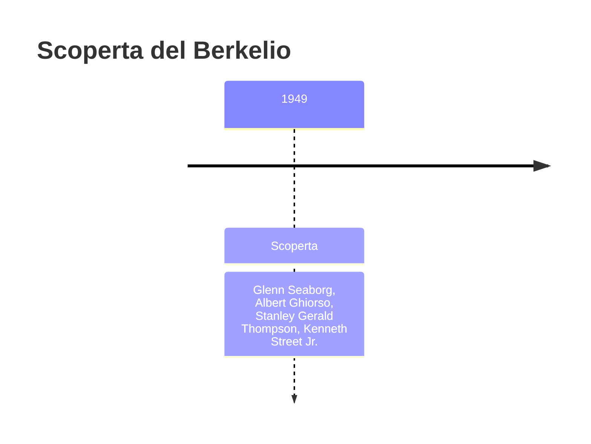
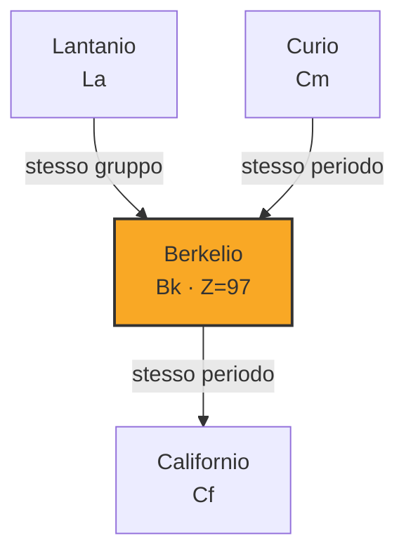
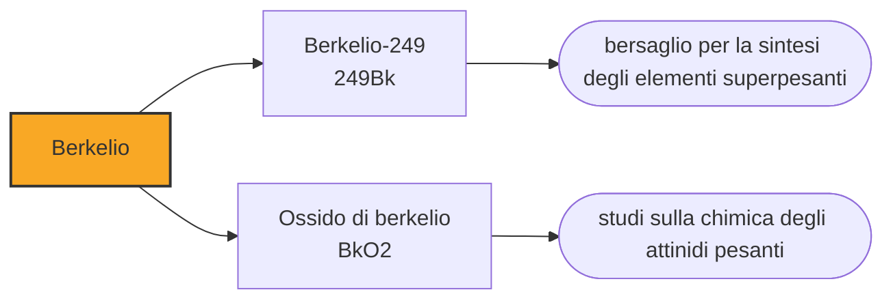

# Berkelio (Bk)

> [!abstract] 97° elemento scoperto — 1949
> Ne è stato prodotto poco più di un grammo in sessant'anni, e serve quasi solo a fabbricare qualcos'altro: il bersaglio con cui, nel 2010, è stato creato l'elemento 117.

Il berkelio è uno degli elementi più rari e più cari che esistano: si misura in milligrammi, costa dell'ordine di duecento dollari al microgrammo, e la produzione mondiale dal 1967 a oggi supera di poco il grammo. Non ha usi al di fuori della ricerca, ma senza di lui due caselle della tavola periodica sarebbero ancora vuote.

## Cronologia della scoperta

> [!info] Nota sulla cronologia
> Sintetizzato nel dicembre 1949 bombardando americio-241 con particelle alfa: il risultato furono poche migliaia di atomi. Il nome segue l'analogia con il terbio, che occupa la stessa posizione fra i lantanidi e porta a sua volta il nome del luogo della scoperta.

## Storia della scoperta

Nel dicembre del 1949, a Berkeley, Glenn Seaborg, Albert Ghiorso, Stanley Thompson e Kenneth Street Jr. bombardarono con particelle alfa un bersaglio di americio-241 nel ciclotrone da sessanta pollici. L'irraggiamento durò sei ore, e il risultato fu qualche migliaio di atomi dell'elemento 97: abbastanza da identificarlo chimicamente, non abbastanza da vederlo.

Il nome seguì la regola dell'analogia che il gruppo stava usando: sotto il terbio, che porta il nome del villaggio svedese di Ytterby, andava un elemento battezzato con il luogo della propria scoperta. Ne uscì berkelio, dalla città di Berkeley, «in un modo simile a quello usato per il suo omologo chimico, il terbio», come scrissero gli autori.

In tre anni il gruppo di Berkeley aveva prodotto quattro elementi nuovi — americio, curio, berkelio e, poche settimane dopo, californio — e ogni volta le quantità erano più piccole e i tempi più stretti. Era il momento in cui la chimica ha smesso di lavorare su sostanze e ha cominciato a lavorare su popolazioni di atomi contati uno per uno.

## Posizione nella tavola periodica

## Caratteristiche

L'isotopo utile è il berkelio-249, che decade in californio-249 con un'emivita di 330 giorni emettendo particelle beta molto deboli. Undici mesi sono pochissimi per un materiale che va prodotto, purificato, spedito e usato: ogni esperimento che lo impiega è una corsa contro l'orologio, e il conto alla rovescia comincia il giorno in cui esce dal reattore.

Chimicamente sta nello stato +3 come gli altri attinidi della sua parte di serie, ma raggiunge anche il +4, in analogia con il terbio: è una delle conferme che la serie degli attinidi ripete, elemento per elemento, il comportamento dei lantanidi. Il metallo è argenteo, tenero e si ossida rapidamente all'aria calda.

Si produce irraggiando per mesi bersagli di curio e americio nei reattori ad altissimo flusso di neutroni: nel mondo ce ne sono due o tre capaci di farlo, primo fra tutti quello di Oak Ridge, in Tennessee. Ogni campagna dura centinaia di giorni, perché l'elemento si costruisce catturando un neutrone alla volta risalendo la tavola periodica, e produce qualche decina di milligrammi che vanno poi separati chimicamente da tutto il resto: dal curio residuo, dal californio che si è già formato, dai prodotti di fissione.

Il prezzo di riferimento è dell'ordine di centottantacinque dollari al microgrammo, cioè quasi duecento milioni di dollari al grammo. Non è però un prezzo di mercato: il berkelio non si compra, si assegna, e il criterio è l'importanza dell'esperimento che lo richiede.

### Dati fisico-chimici

| Proprietà | Valore |
|---|---|
| Numero atomico | 97 |
| Massa atomica | 247,0 u |
| Categoria | Attinide |
| Gruppo | 3 |
| Periodo | 7 |
| Blocco | f |
| Configurazione elettronica | [Rn] 5f⁹ 7s² |
| Punto di fusione | 985,9 °C |
| Punto di ebollizione | 2626,9 °C |
| Densità | 14,78 g/cm³ |
| Stati di ossidazione | +3, +4 |

## Struttura atomica

![[atomo-Berkelio.svg]]

## Usi e presenza in natura

L'impiego che ne giustifica la produzione è fare da bersaglio per gli elementi superpesanti. Nel 2009 a Oak Ridge furono preparati ventidue milligrammi di berkelio-249 con duecentocinquanta giorni di irraggiamento e altri novanta di purificazione; il materiale fu spedito in Russia, a Dubna, dove venne bombardato per centocinquanta giorni con ioni di calcio-48 fino a produrre i primi atomi di tennesso, l'elemento 117.

Quella spedizione è uno degli esempi più chiari di che cosa significhi lavorare con questi materiali: il berkelio perde metà della propria massa ogni undici mesi, quindi fra la fine della purificazione e la fine dell'esperimento la quantità disponibile cala di continuo. L'intera collaborazione — americana e russa, nel pieno di rapporti diplomatici non semplici — era organizzata attorno a quel decadimento.

Il resto del berkelio prodotto serve alla chimica di base: capire come si comportano gli attinidi pesanti, misurarne raggi ionici, potenziali di ossidazione e proprietà spettroscopiche, e verificare fino a che punto l'analogia con i lantanidi regge davvero. Sono esperimenti fatti su quantità che nessuna bilancia ordinaria potrebbe pesare, in cui un singolo campione viene usato, recuperato e riusato per anni finché il decadimento non lo consuma.

Non esiste e non esisterà un uso pratico del berkelio: è troppo raro, troppo caro e troppo effimero perché qualcuno possa costruirci sopra qualcosa. È uno degli elementi che stanno nella tavola periodica esclusivamente perché qualcuno ha voluto sapere se ci potevano stare, e che servono a fare gli elementi successivi.

## Curiosità

Berkeley è l'unica città al mondo ad avere due elementi che ne portano il nome: il berkelio, dalla città, e il californio, dallo stato e dall'università. A cui si aggiungono il laurenzio, dal fondatore del laboratorio, e il seaborgio, dal capo del gruppo: quattro caselle della tavola periodica per un solo campus.

Il tennesso, l'elemento 117, esiste perché un reattore del Tennessee ha prodotto il berkelio e un acceleratore russo lo ha bombardato: il suo nome ricorda la regione che ha fornito il bersaglio, non quella che ha fatto la sintesi. È il riconoscimento di quale delle due metà del lavoro fosse la più difficile da procurarsi.

## Nella cronologia

← Precedente: [[Promezio]] (1945)
→ Successivo: [[Californio]] (1950)

Epoca: [[Era nucleare]] · Scopritori: [[Glenn Seaborg]], [[Albert Ghiorso]], [[Stanley Gerald Thompson]], [[Kenneth Street Jr.]]

## Fonti

- [Berkelium](https://en.wikipedia.org/wiki/Berkelium) — consultata il 09/09/2026
- [Berkelium — Royal Society of Chemistry](https://periodic-table.rsc.org/element/97/berkelium) — consultata il 09/09/2026
- [Tennessine](https://en.wikipedia.org/wiki/Tennessine) — consultata il 09/09/2026
