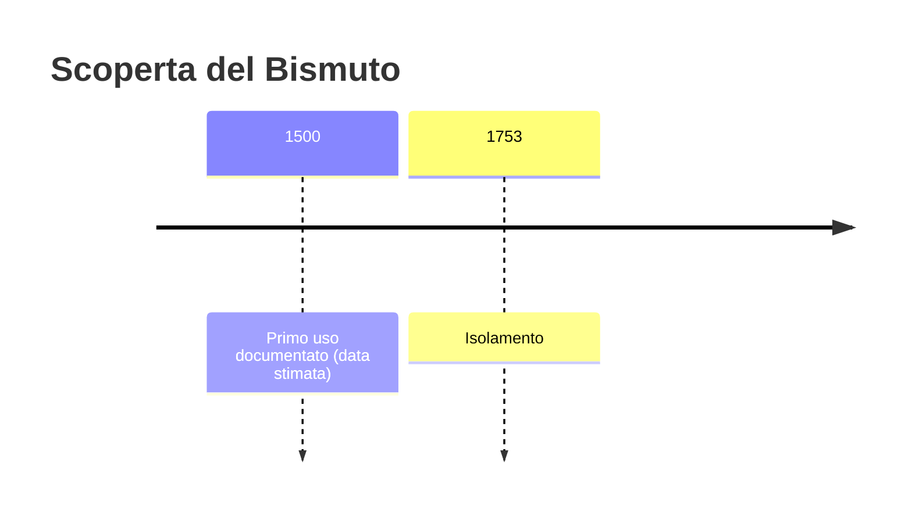
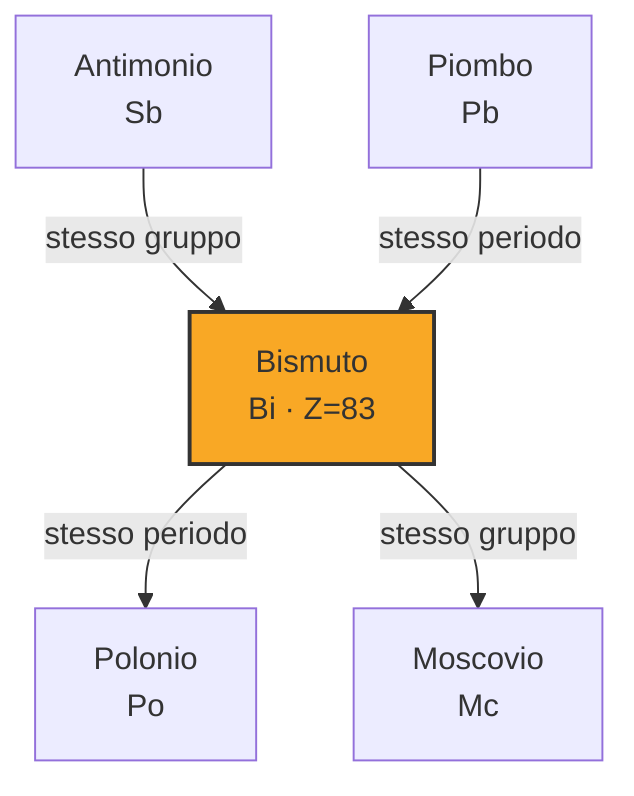
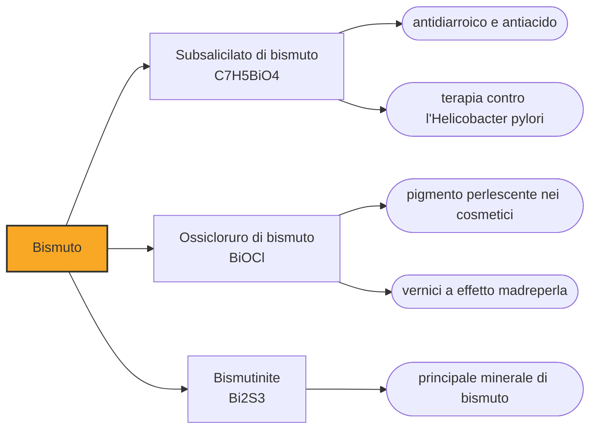

# Bismuto (Bi)

> [!abstract] 14° elemento scoperto — 1500
> Per secoli il bismuto è stato scambiato per piombo, per stagno, per antimonio. È l'ultimo elemento stabile della tavola periodica, tranne che non lo è: nel 2003 si è scoperto che decade anche lui, con un'emivita un miliardo di volte l'età dell'universo.

Il bismuto è un metallo pesante dal riflesso appena rosato, fragile, che fonde a una temperatura bassissima per un metallo. Sta nella tavola periodica subito dopo il piombo, e la sua storia è quella di un elemento che nessuno ha mai avuto motivo di distinguere dai vicini, perché a occhio e alla lavorazione somigliava troppo a loro.

## Cronologia della scoperta

> [!info] Nota sulla cronologia
> Data convenzionale degli alchimisti europei: intorno al 1500 il bismuto è materiale corrente nelle miniere e nelle tipografie sassoni, ma è considerato una varietà di piombo o di stagno. La distinzione come metallo autonomo è di Georgius Agricola nel 1546; la dimostrazione sperimentale che non è né piombo né stagno arriva da Claude François Geoffroy nel 1753.

## Storia della scoperta

Il bismuto è fra i primi metalli che l'umanità ha maneggiato, e insieme fra gli ultimi a ricevere un nome proprio. Il problema è che sta in mezzo: fonde poco sopra i duecentosettanta gradi come lo stagno, è pesante e tenero come il piombo, e cristallizza fragile come l'antimonio. Chiunque lo trovasse lo classificava come una varietà di uno dei tre, e nei minerali si presenta spesso insieme a loro, il che rendeva l'equivoco quasi obbligato.

Le tracce del suo impiego precedono di molto la sua identificazione, e arrivano da luoghi lontanissimi fra loro. Nel sito inca di Machu Picchu è stata trovata una lama di bronzo che contiene bismuto in lega, e nell'Europa centrale del tardo Medioevo il metallo è già materiale corrente per i caratteri da stampa e per le leghe basso-fondenti. In nessuno di questi casi chi lo usava sapeva di usare un elemento a sé.

Il primo a metterlo per iscritto come metallo distinto è Georgius Agricola, il grande trattatista della mineralogia sassone, in un'opera del 1546: lo colloca in una famiglia insieme a piombo e stagno, il che è già un passo avanti rispetto a considerarlo lo stesso materiale. I minatori dell'epoca lo chiamavano tectum argenti, cioè argento in formazione: erano convinti che, lasciato nella terra ancora un po', sarebbe maturato in argento vero.

La prova sperimentale arriva con due secoli di ritardo. Dal 1738 Johann Heinrich Pott ne studia le proprietà a Berlino, e nel 1753 il francese Claude François Geoffroy dimostra in modo accettato dalla comunità che il bismuto non è né piombo né stagno ma un metallo autonomo; Carl Wilhelm Scheele e Torbern Bergman ne completano il quadro poco dopo. Il bismuto entra così nella chimica per sottrazione, cioè dimostrando ciò che non è: un percorso opposto a quello di quasi tutti gli altri elementi.

> [!warning] Questione aperta
> Il bismuto non ha una data di scoperta perché non ha avuto una scoperta. È stato usato per secoli, ma sempre sotto il nome di qualcos'altro: piombo, stagno, antimonio, di volta in volta. La data del 1500 adottata qui è una convenzione che indica quando il materiale è già ben presente nella pratica mineraria e tipografica dell'Europa centrale, non un riconoscimento. Georgius Agricola, nel 1546, è il primo a trattarlo esplicitamente come un metallo distinto della famiglia di piombo e stagno; ma bisogna aspettare gli studi di Johann Heinrich Pott dal 1738 e soprattutto Claude François Geoffroy nel 1753 perché la separazione dal piombo sia dimostrata sperimentalmente e accettata. Fra la data convenzionale e il riconoscimento corrono più di due secoli e mezzo.

## Posizione nella tavola periodica

## Caratteristiche

Il bismuto ha una stranezza che condivide quasi solo con l'acqua: solidificando si dilata invece di contrarsi, di circa il tre per cento. È una proprietà che sembra da curiosità e che è stata invece decisiva in tipografia, perché una lega che si espande raffreddando riempie perfettamente lo stampo e riproduce ogni dettaglio del carattere, compensando il ritiro degli altri componenti.

Gli altri primati del bismuto sono tutti in negativo, e insieme lo definiscono. È il metallo più diamagnetico che si conosca, cioè quello che un campo magnetico respinge con più forza: una scaglia di bismuto sospesa fra due magneti resta in aria da sola. Ha inoltre la conducibilità termica più bassa di tutti i metalli con l'unica eccezione del mercurio, e una conducibilità elettrica scarsa. È, in breve, il meno metallico dei metalli.

Fino al 2003 il bismuto-209 era considerato l'isotopo stabile più pesante esistente in natura, e con lui il bismuto era l'ultimo elemento stabile della tavola. Quell'anno un gruppo guidato da Pierre de Marcillac, all'Istituto di astrofisica spaziale di Orsay, riuscì a rivelarne il decadimento alfa con un rivelatore criogenico: centoventotto eventi in cinque giorni. L'emivita risultante è di circa venti miliardi di miliardi di anni, oltre un miliardo di volte l'età dell'universo, il che significa che dal punto di vista pratico il bismuto resta stabile quanto qualunque altra cosa.

### Dati fisico-chimici

| Proprietà | Valore |
|---|---|
| Numero atomico | 83 |
| Massa atomica | 208,980401 u |
| Categoria | Metallo post-transizione |
| Gruppo | 15 |
| Periodo | 6 |
| Blocco | p |
| Configurazione elettronica | [Xe] 4f¹⁴ 5d¹⁰ 6s² 6p³ |
| Punto di fusione | 271,6 °C |
| Punto di ebollizione | 1563,9 °C |
| Densità | 9,78 g/cm³ |
| Stati di ossidazione | -3, -2, -1, +1, +2, +3, +4, +5 |

## Struttura atomica

![[atomo-Bismuto.svg]]

## Usi e presenza in natura

A dispetto della posizione fra piombo e polonio, il bismuto è notevolmente poco tossico, e questo gli ha aperto la farmacologia. Il subsalicilato di bismuto è il principio attivo dei preparati contro diarrea e disturbi gastrici venduti in tutto il mondo, e i composti di bismuto entrano nelle terapie di eradicazione dell'Helicobacter pylori, il batterio responsabile della maggior parte delle ulcere gastriche.

La bassa tossicità gli ha aperto anche il ruolo di sostituto del piombo, man mano che le normative ambientali ne hanno ristretto l'uso: saldature per impianti di acqua potabile, pallini da caccia, contrappesi, schermature radiologiche. Restano poi le leghe basso-fondenti, come il metallo di Wood, che fondono sotto i settanta gradi e servono da fusibile termico negli impianti antincendio a sprinkler: il tappo si scioglie con il calore e l'acqua parte da sola.

## Curiosità

Il bismuto è probabilmente l'elemento più fotogenico della tavola periodica. Fondendolo e lasciandolo raffreddare lentamente si formano cristalli a scaletta, con gli spigoli che crescono più in fretta delle facce e generano una geometria di terrazze concentriche; lo strato sottilissimo di ossido che si forma in superficie produce per interferenza colori accesi che vanno dal giallo al blu. Il basso punto di fusione fa sì che l'esperimento riesca su un fornello di casa.

L'origine del nome resta incerta e le ipotesi si accavallano: dal tedesco weisse Masse, massa bianca, o da wis mat, prato bianco, forse dal nome di una località mineraria. La forma latinizzata bisemutum, da cui deriva il simbolo Bi, è stata coniata solo nel Cinquecento. Anche nel nome, insomma, il bismuto è arrivato tardi e senza certezze.

## Nella cronologia

← Precedente: [[Arsenico]] (300 d.C.)
→ Successivo: [[Fosforo]] (1669)

Epoca: [[Alchimia e primo moderno]]

## Fonti

- [Bismuth](https://en.wikipedia.org/wiki/Bismuth) — consultata il 07/09/2026
- [Bismuth breaks half-life record for alpha decay (Physics World, 2003)](https://physicsworld.com/a/bismuth-breaks-half-life-record-for-alpha-decay/) — consultata il 07/09/2026
- [Bismuth-209](https://en.wikipedia.org/wiki/Bismuth-209) — consultata il 07/09/2026

---

> [!warning] Avvertenza
> Questo progetto è stato realizzato con l'assistenza di sistemi di
> intelligenza artificiale. I contenuti sono verificati sulle fonti citate,
> ma **possono contenere errori e imprecisioni**: prima di riutilizzarli,
> controlla la fonte.
