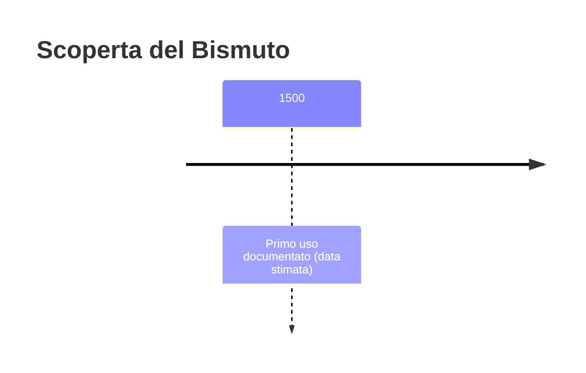
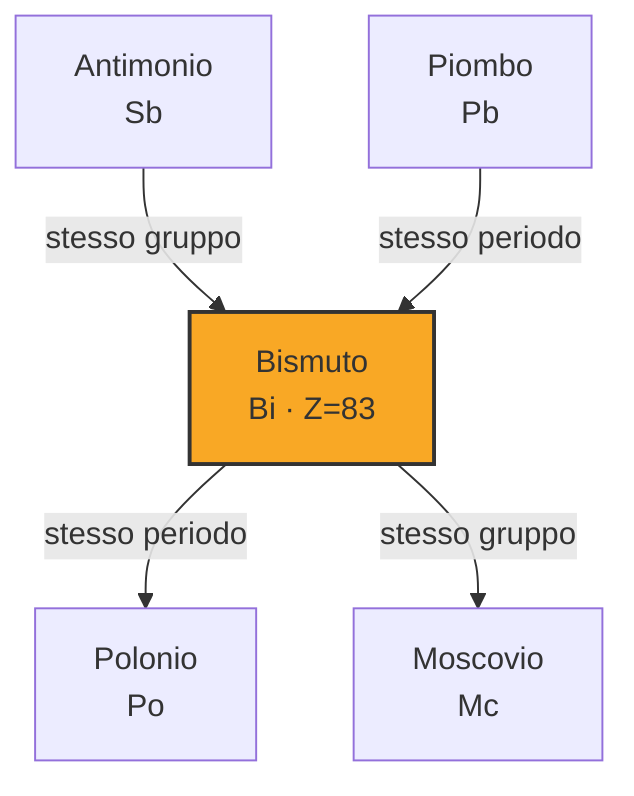

# Bismuto (Bi)

> [!abstract] 14° elemento scoperto — 1500
> 

## Cronologia della scoperta

## Storia della scoperta

## Posizione nella tavola periodica

## Caratteristiche

### Dati fisico-chimici

| Proprietà | Valore |
|---|---|
| Numero atomico | 83 |
| Massa atomica | 208,980401 u |
| Categoria | Metallo post-transizione |
| Gruppo | 15 |
| Periodo | 6 |
| Blocco | p |
| Configurazione elettronica | [Xe] 4f¹⁴ 5d¹⁰ 6s² 6p³ |
| Punto di fusione | 271,6 °C |
| Punto di ebollizione | 1563,9 °C |
| Densità | 9,78 g/cm³ |
| Stati di ossidazione | — |

## Struttura atomica

![[atomo-Bismuto.svg]]

## Usi e presenza in natura

## Nella cronologia

← Precedente: [[Arsenico]] (300)
→ Successivo: [[Fosforo]] (1669)

Epoca: [[Antichità]]

## Fonti

