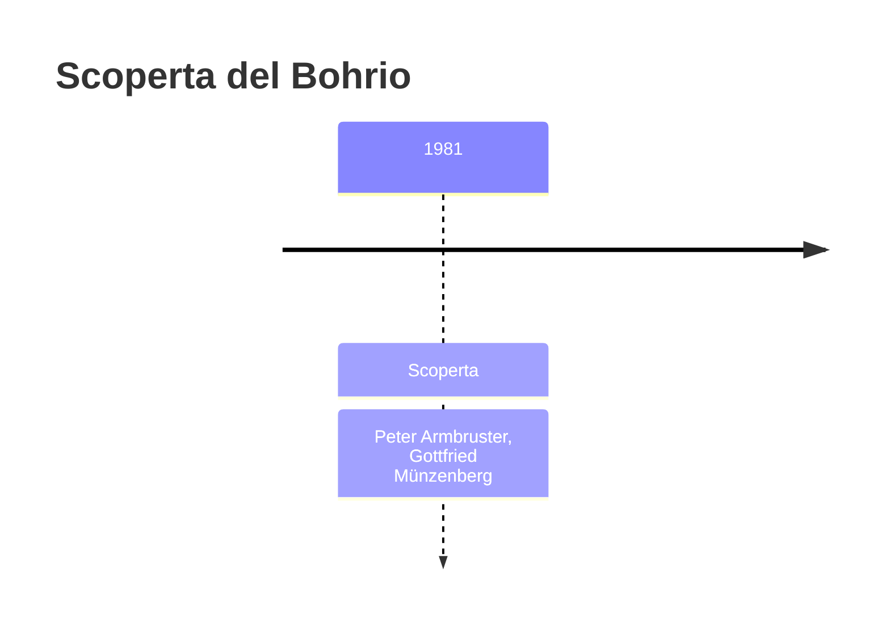
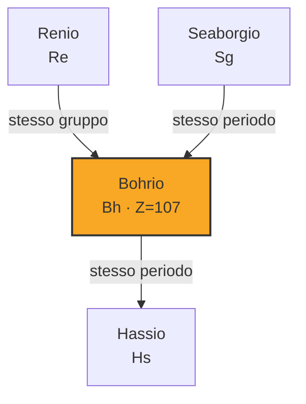

# Bohrio (Bh)

> [!abstract] 107° elemento scoperto — 1981
> 

## Cronologia della scoperta

## Storia della scoperta

## Posizione nella tavola periodica

## Caratteristiche

### Dati fisico-chimici

| Proprietà | Valore |
|---|---|
| Numero atomico | 107 |
| Massa atomica | 270,0 u |
| Categoria | Metallo di transizione |
| Gruppo | 7 |
| Periodo | 7 |
| Blocco | d |
| Configurazione elettronica | *[Rn] 5f¹⁴ 6d⁵ 7s² |
| Punto di fusione | dato non disponibile |
| Punto di ebollizione | dato non disponibile |
| Densità | 37,1 g/cm³ |
| Stati di ossidazione | — |

## Struttura atomica

![[atomo-Bohrio.svg]]

## Usi e presenza in natura

## Nella cronologia

← Precedente: [[Seaborgio]] (1974)
→ Successivo: [[Meitnerio]] (1982)

Epoca: [[Era nucleare]] · Scopritore: [[Peter Armbruster]], [[Gottfried Münzenberg]]

## Fonti

