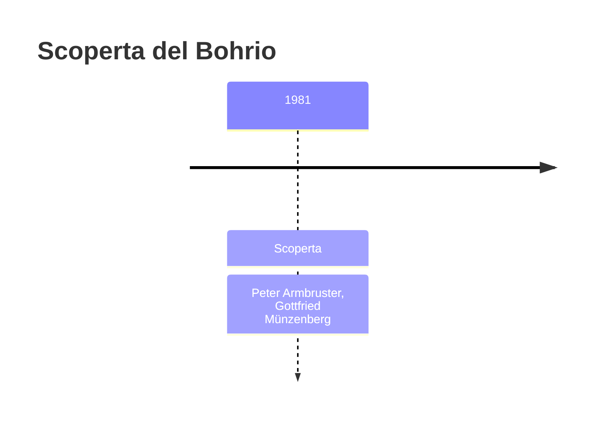
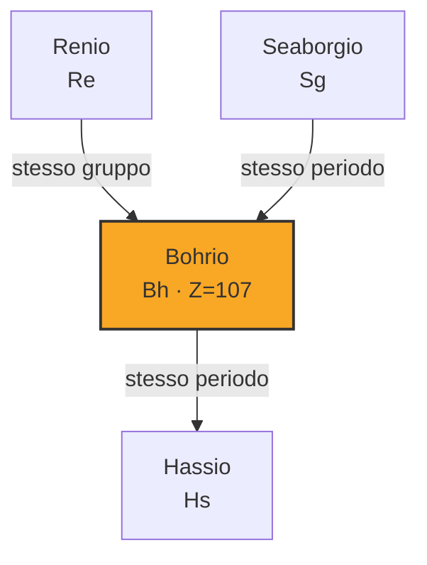
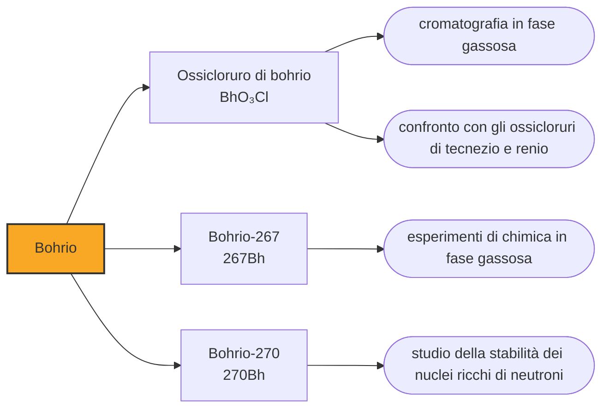

# Bohrio (Bh)

> [!abstract] 107° elemento scoperto — 1981
> Cinque atomi, nel 1981, hanno inaugurato il metodo con cui sono state riempite sei caselle consecutive della tavola periodica. Si chiama fusione fredda, e non ha nulla a che vedere con la fusione fredda di cui si parlò nel 1989.

Il bohrio è il primo elemento fabbricato a Darmstadt, e il primo di una serie di sei caselle consecutive che un solo laboratorio tedesco si è aggiudicato nell'arco di tredici anni. Non fu una questione di fortuna: il gruppo aveva adottato un modo diverso di far scontrare i nuclei, e quel modo funzionava dove il precedente si era fermato.

## Cronologia della scoperta

## Storia della scoperta

Alla fine degli anni Settanta la fabbricazione di elementi nuovi si era arenata. Il metodo in uso consisteva nel lanciare ioni abbastanza energici da superare la repulsione elettrica fra i nuclei, ma quell'energia restava nel nucleo composto che si formava, scaldandolo: il nucleo la smaltiva espellendo quattro o cinque neutroni, e nel frattempo aveva ottime probabilità di spezzarsi. Più si saliva di numero atomico, più la resa crollava.

L'idea che sbloccò la situazione venne dal gruppo di Dubna: usare bersagli di piombo o di bismuto, che hanno gusci nucleari completi e sono quindi particolarmente compatti, e proiettili più pesanti lanciati appena sopra la soglia. Il nucleo che si forma nasce quasi freddo, con un'energia di eccitazione così bassa da potersi liberare espellendo un solo neutrone. Il nucleo sopravvive molto più spesso, e la resa cambia di ordini di grandezza.

Il metodo si chiama fusione fredda, e vale la pena chiarire subito che non c'entra nulla con la vicenda che nel 1989 rese celebre quell'espressione: lì si sosteneva, senza fondamento, di aver ottenuto fusione nucleare in una cella elettrochimica a temperatura ambiente. Qui la parola «fredda» è relativa e tecnica, e descrive quanto poca energia in eccesso porti con sé il nucleo appena formato dentro un acceleratore da miliardi di elettronvolt.

A Darmstadt il gruppo di Peter Armbruster e Gottfried Münzenberg applicò il metodo con uno strumento costruito apposta, il separatore SHIP, che divide i nuclei appena nati dal fascio che non ha reagito e li consegna ai rivelatori. Nel 1981, bombardando bismuto-209 con ioni di cromo-54, ottennero cinque atomi di bohrio-262 e ne seguirono i decadimenti alfa fino a isotopi noti di fermio e californio.

Dubna aveva rivendicato l'elemento già nel 1976, con la stessa reazione, ma basandosi su eventi di fissione spontanea e su emivite che non tornavano con quelle misurate poi a Darmstadt. La commissione internazionale giudicò le prove sovietiche insufficienti e assegnò la scoperta ai tedeschi, riconoscendo però che l'idea del metodo veniva da Dubna. È una distinzione che i tedeschi non hanno mai nascosto.

Il GSI propose nielsbohrium, nome e cognome, per evitare che il solo cognome si confondesse con il boro. La IUPAC obiettò che non esisteva precedente di un elemento intitolato con nome e cognome, e nel 1994 raccomandò bohrium; la sezione danese della IUPAC approvò la forma breve, e nel 1997 divenne definitiva. Il timore della confusione si è rivelato infondato: nella nomenclatura dei composti le due radici restano distinte.

## Posizione nella tavola periodica

## Caratteristiche

Nel 2000, al Paul Scherrer Institute in Svizzera, sei atomi di bohrio-267 sono stati fatti reagire con una miscela di acido cloridrico e ossigeno, producendo un ossicloruro volatile, BhO₃Cl. È il comportamento che ci si aspetta da un elemento del gruppo 7, quello del tecnezio e del renio, e la misura è andata oltre il sì o no: l'energia con cui la molecola aderisce alla superficie della colonna è risultata di 77,8 kilojoule per mole, contro i 78,5 previsti dal calcolo.

Vale la pena fermarsi sul numero: sei atomi. La chimica di questo elemento è nota perché sei singoli atomi, prodotti uno alla volta e trasportati da un flusso di gas, si sono depositati in un punto anziché in un altro di una colonna. Ogni atomo è un dato, e la conclusione è una statistica su una mano di eventi: è il regime in cui lavora tutta la chimica degli elementi superpesanti.

Si conoscono una dozzina di isotopi del bohrio. I più leggeri, quelli ottenuti per fusione fredda, durano meno di un decimo di secondo; i più ricchi di neutroni arrivano a qualche minuto — il bohrio-270 sfiora i due minuti e mezzo — ma non si producono direttamente: si raccolgono come prodotti del decadimento di elementi più pesanti, dal flerovio al tennesso. È il paradosso di questa regione della tavola: per avere un elemento più stabile conviene fabbricarne uno più pesante e aspettare che decada.

### Dati fisico-chimici

| Proprietà | Valore |
|---|---|
| Numero atomico | 107 |
| Massa atomica | 270,0 u |
| Categoria | Metallo di transizione |
| Gruppo | 7 |
| Periodo | 7 |
| Blocco | d |
| Configurazione elettronica | [Rn] 5f¹⁴ 6d⁵ 7s² |
| Punto di fusione | dato non disponibile |
| Punto di ebollizione | dato non disponibile |
| Densità | 37,1 g/cm³ |
| Stati di ossidazione | +7 |

## Struttura atomica

![[atomo-Bohrio.svg]]

## Usi e presenza in natura

Il bohrio non ha usi e non ne avrà: non esiste in natura, se ne producono singoli atomi e nessuno ne ha mai visto una quantità pesabile. Serve alla ricerca che lo riguarda, e a nient'altro.

Il metodo, però, è servito a tutto il resto. La fusione fredda ha riempito sei caselle consecutive, dal 107 al 112, e ha stabilito il modo di lavorare che si usa ancora: bersaglio pesante e stabile, proiettile lanciato appena sopra la soglia, separatore elettromagnetico, catena di decadimenti agganciata a nuclei noti. Il bohrio è il primo elemento su cui questa procedura ha funzionato per intero.

## Curiosità

Niels Bohr aveva costruito nel 1913 il modello atomico che spiega perché gli elementi hanno gusci elettronici, cioè la ragione per cui la tavola periodica ha le righe che ha. Che una casella porti il suo nome è coerente; che sia la casella 107, dove i gusci elettronici sono deformati dalla velocità relativistica degli elettroni, è un'ironia che il modello del 1913 non poteva prevedere.

La spartizione del 1997 ha assegnato al GSI tre nomi consecutivi — bohrio, hassio e meitnerio — a cui si è aggiunto il darmstadtio nel 2003, dopo che per trent'anni Berkeley e Dubna si erano contese ogni casella. Il laboratorio tedesco era arrivato per ultimo, aveva usato un'idea sovietica e uno strumento proprio, e ha finito per ottenere senza contestazioni ciò per cui gli altri due avevano litigato.

## Nella cronologia

← Precedente: [[Seaborgio]] (1974)
→ Successivo: [[Meitnerio]] (1982)

Epoca: [[Era nucleare]] · Scopritori: [[Peter Armbruster]], [[Gottfried Münzenberg]]

## Fonti

- [Bohrium](https://en.wikipedia.org/wiki/Bohrium) — consultata il 10/09/2026
- [Bohrium — Royal Society of Chemistry](https://periodic-table.rsc.org/element/107/bohrium) — consultata il 10/09/2026
- [Cold fusion](https://en.wikipedia.org/wiki/Cold_fusion) — consultata il 10/09/2026
