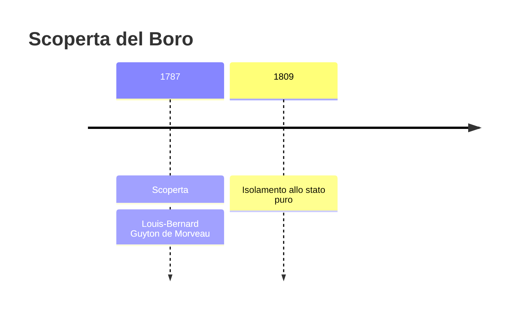
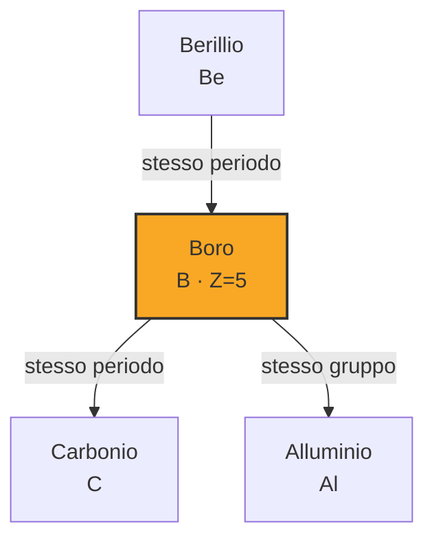

# Boro (B)

> [!abstract] 32° elemento scoperto — 1787
> 

## Cronologia della scoperta

## Storia della scoperta

## Posizione nella tavola periodica

## Caratteristiche

### Dati fisico-chimici

| Proprietà | Valore |
|---|---|
| Numero atomico | 5 |
| Massa atomica | 10,81 u |
| Categoria | Semimetallo |
| Gruppo | 13 |
| Periodo | 2 |
| Blocco | p |
| Configurazione elettronica | [He] 2s² 2p¹ |
| Punto di fusione | 2075,9 °C |
| Punto di ebollizione | 3926,9 °C |
| Densità | 2,08 g/cm³ |
| Stati di ossidazione | — |

## Struttura atomica

![[atomo-Boro.svg]]

## Usi e presenza in natura

## Nella cronologia

← Precedente: [[Tellurio]] (1782)
→ Successivo: [[Zirconio]] (1789)

Epoca: [[Chimica pneumatica]] · Scopritore: [[Louis-Bernard Guyton de Morveau]]

## Fonti

