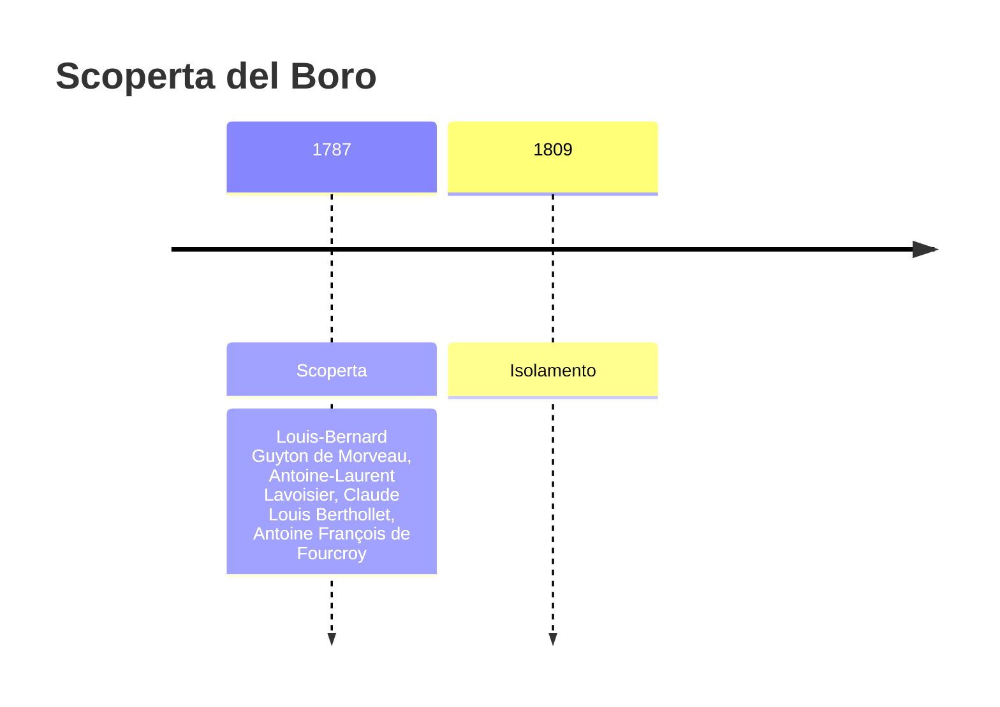
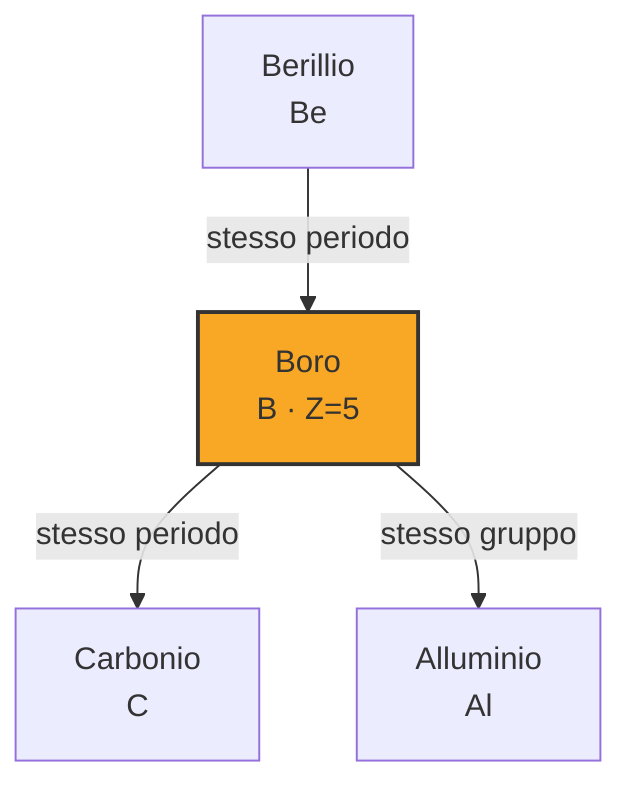
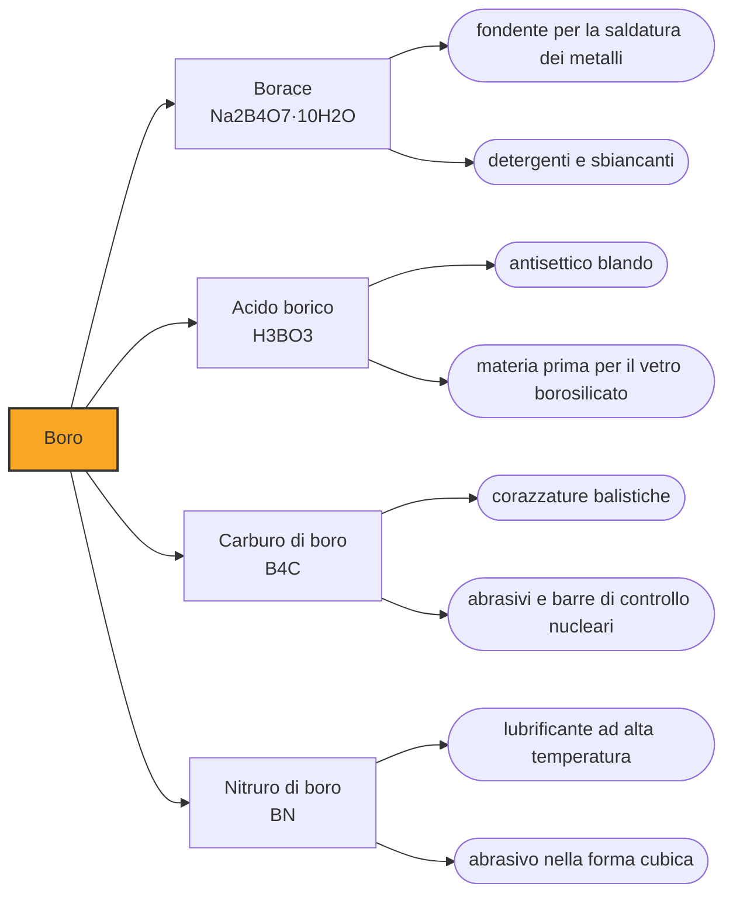

# Boro (B)

> [!abstract] 32° elemento scoperto — 1787
> Nel 1787 quattro chimici francesi diedero un nome a una sostanza che nessuno di loro aveva mai visto. Ci vollero ventun anni perché qualcuno la mettesse in mano a qualcun altro.

Il boro è un semimetallo scuro, durissimo e pessimo conduttore, che sta al quinto posto della tavola periodica e non somiglia a nessuno dei suoi vicini. Da millenni l'umanità ne maneggia il sale più comune, il borace, senza sapere che cosa contenesse; oggi il boro tiene insieme il vetro che non si crepa, i detersivi, i magneti più potenti mai costruiti e il controllo delle reazioni nucleari.

## Cronologia della scoperta

> [!info] Nota sulla cronologia
> La data del 1787 è quella della Méthode de nomenclature chimique, firmata da Guyton de Morveau, Lavoisier, Berthollet e Fourcroy, in cui il costituente ipotetico dell'acido borico riceve un nome. Davy ottiene la sostanza per via elettrochimica e poi riducendo l'acido borico con il potassio nel 1808, pubblicando nel 1809 e battezzandola boracium; nel 1812 corregge il nome in boro dopo averne stabilito la natura non metallica. Nello stesso 1808, a pochi giorni di distanza, Gay-Lussac e Thénard ottengono la stessa sostanza a Parigi riducendo l'acido borico con il ferro.

## Storia della scoperta

Il borace arriva in Europa molto prima del boro, lungo le rotte carovaniere dal Tibet, dove veniva raccolto sulle rive dei laghi salati e venduto agli orafi. Serviva da fondente per la saldatura: cosparso su un giunto, scioglie gli ossidi che impediscono al metallo fuso di aderire. Era una merce preziosa e misteriosa, di cui si conosceva perfettamente l'uso e per nulla la composizione.

Nel 1787 esce a Parigi la Méthode de nomenclature chimique, firmata da Louis-Bernard Guyton de Morveau, Antoine-Laurent Lavoisier, Claude Louis Berthollet e Antoine François de Fourcroy. Non è un trattato di scoperte ma una riforma del linguaggio: propone di sostituire i nomi tradizionali, opachi e pieni di alchimia, con nomi che dichiarino di che cosa è fatta una sostanza. È il testo che trasforma l'olio di vetriolo in acido solforico, e con esso la chimica in una disciplina in cui il nome contiene già la teoria.

Dentro quella riforma c'è una previsione. Lavoisier riteneva che ogni acido fosse ossigeno combinato con un radicale combustibile, e applicando la regola all'acido borico i quattro autori conclusero che dovesse esistere un radicale borico, mai visto e mai isolato. Gli assegnarono un nome e un posto nella tavola delle sostanze semplici. È un episodio raro: il boro entra nella chimica come una casella vuota che la teoria dichiara necessaria, ventun anni prima che qualcuno la riempia.

La casella si riempie nel 1808, e si riempie due volte. A Londra Humphry Davy passa una corrente attraverso una soluzione di borati, ottiene un deposito bruno e poi, per averne di più, riduce l'acido borico con il potassio metallico: chiama la sostanza boracium. A Parigi Joseph Louis Gay-Lussac e Louis Jacques Thénard fanno la stessa cosa con il ferro al posto del potassio e arrivano al risultato pochi giorni prima di lui. I due laboratori erano in guerra fra loro come i rispettivi paesi, e nessuno dei due sapeva dell'altro.

Nessuno dei tre, in realtà, aveva boro puro in mano. La sostanza bruna che si passavano era piena di impurezze, e ottenere boro davvero puro si rivelò così difficile che il primo campione degno di quel nome è attribuito a Ezekiel Weintraub soltanto nel 1909, un secolo dopo. Nel 1812 Davy cambiò idea sul nome: capito che la sostanza non era un metallo, sostituì boracium con boron, per analogia con il carbon, cioè il carbonio, a cui il boro chimicamente assomiglia.

> [!warning] Questione aperta
> Il boro è un caso in cui la data di scoperta registra il battesimo e non l'incontro. Nel 1787 nessuno aveva visto il boro: i quattro autori della riforma della nomenclatura chimica stavano applicando in modo sistematico la teoria di Lavoisier secondo cui ogni acido contiene ossigeno legato a un radicale combustibile, e dedussero che dietro l'acido borico dovesse esserci un radicale borico. Diedero dunque un nome a una previsione teorica, che risultò corretta ventun anni dopo. Le cronologie che datano il boro al 1787 registrano il momento in cui l'elemento entra nel linguaggio della chimica; quelle che lo datano al 1808 registrano il momento in cui entra in una provetta. La priorità del 1808 è a sua volta contesa fra Davy e la coppia Gay-Lussac e Thénard, separati da giorni. A rigore nessuno dei tre gruppi ottenne boro puro: la sostanza che si maneggiava era per buona parte impura, e il primo campione ragionevolmente puro è attribuito a Ezekiel Weintraub nel 1909.

## Posizione nella tavola periodica

## Caratteristiche

Il boro ha un problema aritmetico che ne definisce tutta la chimica: possiede tre elettroni di valenza ma quattro caselle disponibili per ospitarli, e questo deficit lo rende avido di coppie di elettroni altrui. Nei suoi composti quasi sempre allo stato più tre, arriva a costruire legami in cui due elettroni tengono insieme tre atomi invece di due, una soluzione che nel resto della tavola periodica è quasi sconosciuta e che gli permette di formare gabbie e poliedri.

Quelle gabbie rendono il boro elementare straordinariamente duro e refrattario: fonde oltre i duemila gradi e il suo carburo è fra i materiali più duri che si conoscano, secondo soltanto al diamante e al nitruro di boro cubico. È anche un semiconduttore, non un metallo, e la sua resistenza elettrica cala col riscaldamento invece di crescere, comportandosi al contrario di un filo di rame.

La proprietà nucleare del boro è la sua ragione strategica. Uno dei suoi due isotopi naturali, il boro-10, cattura i neutroni lenti con un'efficacia enorme, e lo fa senza diventare a sua volta pericolosamente radioattivo. È il materiale con cui si fabbricano le barre di controllo dei reattori: si abbassano fra il combustibile, assorbono i neutroni che alimentano la reazione a catena e la spengono.

### Dati fisico-chimici

| Proprietà | Valore |
|---|---|
| Numero atomico | 5 |
| Massa atomica | 10,81 u |
| Categoria | Semimetallo |
| Gruppo | 13 |
| Periodo | 2 |
| Blocco | p |
| Configurazione elettronica | [He] 2s² 2p¹ |
| Punto di fusione | 2075,9 °C |
| Punto di ebollizione | 3926,9 °C |
| Densità | 2,08 g/cm³ |
| Stati di ossidazione | -5, -1, 0, +1, +2, +3 |

## Struttura atomica

![[atomo-Boro.svg]]

## Usi e presenza in natura

Quasi metà del boro del mondo finisce in una cosa sola, e non è quella che viene in mente: la fibra di vetro, cioè l'isolante che sta nelle pareti e nei tetti di mezzo pianeta e il rinforzo dei materiali compositi. Seguono le ceramiche tecniche e i fertilizzanti. Solo al quarto posto, con circa un decimo del totale, arriva il vetro borosilicato, quello che non si spacca passando dal forno al lavandino perché si dilata pochissimo col calore: è il vetro della vetreria di laboratorio, delle pirofile e degli specchi dei telescopi. Nei detersivi il perborato ha svolto a lungo il ruolo di sbiancante.

Una quota piccola ma decisiva finisce nei magneti al neodimio-ferro-boro, i più potenti che si sappiano produrre e i motori di ogni auricolare, hard disk, motore elettrico e turbina eolica. In agricoltura il boro è un micronutriente indispensabile alle piante, che senza di esso non costruiscono correttamente le pareti cellulari; la finestra fra la dose necessaria e quella tossica è però fra le più strette di tutta la fertilizzazione.

## Curiosità

Nella Death Valley californiana, fra il 1883 e il 1889, il borace veniva portato fuori dal deserto da carri trainati da venti muli, in convogli che con le bestie superavano i cinquanta metri di lunghezza e coprivano duecentosessanta chilometri di nulla fino alla ferrovia, in dieci giorni di viaggio. Il dettaglio è rimasto nella cultura americana come marchio commerciale e come titolo di una serie televisiva, ed è probabilmente l'unico caso in cui un elemento chimico abbia dato il nome a un western.

La stessa avidità di neutroni che spegne i reattori è stata trasformata in una terapia oncologica. Si somministra al paziente un composto di boro che si accumula selettivamente nelle cellule tumorali, poi si irraggia la zona con neutroni lenti: la cattura avviene solo dove c'è il boro, e le particelle emesse hanno un raggio d'azione di pochi millesimi di millimetro, cioè grosso modo il diametro di una cellula. Il danno resta confinato dove serve.

## Nella cronologia

← Precedente: [[Tellurio]] (1782)
→ Successivo: [[Zirconio]] (1789)

Epoca: [[Chimica pneumatica]] · Scopritori: [[Louis-Bernard Guyton de Morveau]], [[Antoine-Laurent Lavoisier]], [[Claude Louis Berthollet]], [[Antoine François de Fourcroy]]

## Fonti

- [Boron](https://en.wikipedia.org/wiki/Boron) — consultata il 07/09/2026
- [Timeline of chemical element discoveries](https://en.wikipedia.org/wiki/Timeline_of_chemical_element_discoveries) — consultata il 07/09/2026
- [The Méthode de nomenclature chimique (1787): A Document of Transition](https://www.tandfonline.com/doi/full/10.1080/00026980.2017.1418233) — consultata il 07/09/2026
- [Louis-Bernard Guyton de Morveau](https://en.wikipedia.org/wiki/Guyton_de_Morveau) — consultata il 07/09/2026
- [Twenty-mule team](https://en.wikipedia.org/wiki/Twenty-mule_team) — consultata il 07/09/2026
- [Borates in insulation](https://www.borax.com/products/applications/insulation) — consultata il 07/09/2026

---

> [!warning] Avvertenza
> Questo progetto è stato realizzato con l'assistenza di sistemi di
> intelligenza artificiale. I contenuti sono verificati sulle fonti citate,
> ma **possono contenere errori e imprecisioni**: prima di riutilizzarli,
> controlla la fonte.
