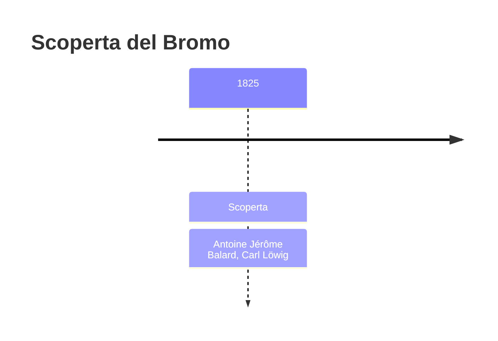
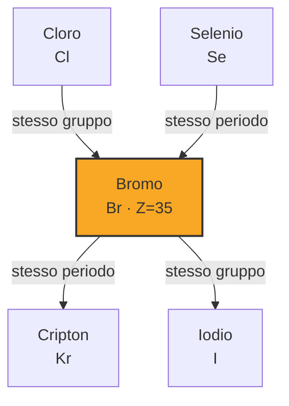
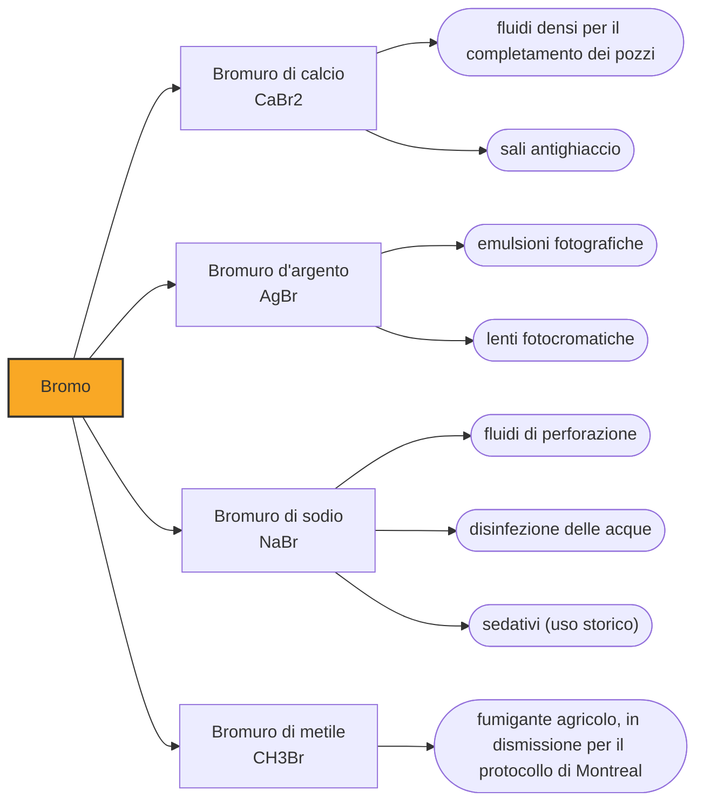

# Bromo (Br)

> [!abstract] 54° elemento scoperto — 1825
> Nell'autunno del 1825 due chimici alle prime armi, in due paesi diversi e da due acque salate diverse, cavarono lo stesso liquido rosso: uno pubblicò l'anno dopo, l'altro due anni dopo.

Il bromo è liquido a temperatura ambiente, cosa che in tutta la tavola riesce a pochissimi. È rosso bruno, pesante, e fuma da solo emettendo un vapore dello stesso colore e dall'odore aggressivo: quell'odore gli è valso il nome, e per una volta l'etimologia non fa sconti.

## Cronologia della scoperta

> [!info] Nota sulla cronologia
> Le tavole assegnano il bromo al solo Balard, benché Löwig fosse arrivato allo stesso risultato nello stesso autunno del 1825. È la regola generale della cronologia seguita qui, che guarda la pubblicazione: Balard stampò nel 1826, Löwig nel 1827.

## Storia della scoperta

La materia prima è quello che una salina butta via. Le acque madri — il liquido denso e amaro che resta quando l'acqua di mare ha già dato tutto il sale che poteva dare — concentrano ciò che il cloruro di sodio si lascia indietro: magnesio, potassio e, in proporzione minuscola, bromuro. Lo stesso vale per le ceneri delle alghe che crescono in quelle acque, bruciate per ricavarne iodio.

Antoine Jérôme Balard, ventitré anni, giovane farmacista a Montpellier, lavorava sulle ceneri delle alghe delle saline locali, la stessa materia prima da cui si ricavava lo iodio. Saturando di cloro una soluzione di quelle ceneri ottenne una sostanza bruno-rossastra: provò a dimostrare che fosse monocloruro di iodio, non ci riuscì, e concluse di avere in mano un elemento nuovo.

Nello stesso autunno Carl Löwig aveva ottenuto la stessa sostanza dall'acqua di una sorgente minerale di Bad Kreuznach, la sua città, con il procedimento identico: saturazione con cloro ed estrazione con etere etilico. Portò quel liquido bruno come saggio del proprio lavoro quando fece domanda per un posto nel laboratorio di Leopold Gmelin a Heidelberg. La pubblicazione tardò, e quando uscì, nel 1827, l'elemento portava già il nome che gli aveva dato Balard.

Balard aveva proposto muride, dal latino muria, «salamoia». Fu su suggerimento del chimico Anglada che il nome cambiò in brôme, dal greco bromos, «puzzo». È una delle poche denominazioni della tavola periodica a descrivere non un colore, non un luogo e non un mito, ma la reazione di chi apre il flacone.

Vauquelin, Thénard e Gay-Lussac verificarono gli esperimenti di Balard, e la memoria uscì negli Annales de chimie et de physique nel 1826. La cronologia riconosciuta assegna a entrambi l'autunno del 1825, ma il credito storico è andato quasi per intero a Balard: è uno dei casi in cui la storia della chimica misura la scoperta non dal momento in cui una sostanza compare in un becher, ma da quello in cui qualcuno la descrive in pubblico.

L'arrivo del bromo ebbe poi un effetto che nessuno dei due aveva previsto. Il suo peso atomico cadeva quasi esattamente a metà fra quello del cloro e quello dello iodio, e le sue proprietà pure: cloro, bromo e iodio diventarono una delle triadi di Johann Wolfgang Döbereiner, fra i primi indizi che gli elementi seguissero un ordine numerico e non un elenco arbitrario.

## Posizione nella tavola periodica

## Caratteristiche

Alle condizioni convenzionali di temperatura e pressione esistono due soli elementi liquidi: il bromo, che fonde a −7,4 °C e bolle a 58,9 °C, e il mercurio. Altri quattro hanno un punto di fusione appena sopra la temperatura ambiente e restano solidi per un soffio — il francio, stimato intorno ai 27 °C e mai ottenuto in quantità visibili, il cesio a 28,5 °C, il gallio a 29,8 °C e il rubidio a 39,3 °C.

La sua tensione di vapore è alta abbastanza che una fiala aperta si svuoti a vista d'occhio: sopra il liquido staziona sempre uno strato di vapore rossastro, ed è quello il vero pericolo. Il bromo attacca mucose e pelle e provoca ustioni chimiche lente a rimarginarsi, quindi si maneggia solo sotto cappa e con guanti adatti.

Chimicamente sta esattamente dove ci si aspetta, fra il cloro e lo iodio: meno aggressivo del primo, più del secondo. Nei composti prevale lo stato −1 del bromuro, ma esistono anche stati positivi fino al +7 del perbromato, che a lungo si tentò invano di preparare, al punto che si arrivò a teorizzare che non potesse esistere: fu ottenuto solo nel 1968.

### Dati fisico-chimici

| Proprietà | Valore |
|---|---|
| Numero atomico | 35 |
| Massa atomica | 79,904 u |
| Categoria | Alogeno |
| Gruppo | 17 |
| Periodo | 4 |
| Blocco | p |
| Configurazione elettronica | [Ar] 3d¹⁰ 4s² 4p⁵ |
| Punto di fusione | -7,4 °C |
| Punto di ebollizione | 58,9 °C |
| Densità | 3,1028 g/cm³ |
| Stati di ossidazione | -1, +1, +2, +3, +4, +5, +7 |

## Struttura atomica

![[atomo-Bromo.svg]]

## Usi e presenza in natura

L'impiego principale del bromo prodotto nel mondo sono i ritardanti di fiamma: molecole bromurate mescolate a plastiche, tessuti e schede elettroniche che, quando il materiale si scalda troppo, si dissociano liberando atomi di bromo che interrompono le reazioni a catena della combustione. Il secondo impiego per volume sono i fluidi salini densi usati per il completamento dei pozzi di petrolio e di gas.

Gli impieghi che il bromo ha perso raccontano un secolo di storia industriale: il dibromoetano serviva a espellere i residui di piombo dai motori a benzina addizionata, il bromuro d'argento era la sostanza sensibile alla luce di ogni pellicola fotografica, e i sali di bromo furono per decenni i sedativi più prescritti al mondo — tanto che in inglese bromide indica ancora oggi una banalità rassicurante.

Oggi il bromo si estrae quasi solo dalle salamoie. Il Mar Morto, che ne contiene un quantitativo stimato in un miliardo di tonnellate, alimenta gli impianti israeliani e giordani; negli Stati Uniti la produzione viene dalle salamoie sotterranee dell'Arkansas, di cui però non si conosce l'entità perché le due aziende che le sfruttano non la dichiarano. Il totale mondiale stimato per il 2025, che per questo motivo esclude gli Stati Uniti, è di 430.000 tonnellate, di cui 200.000 in Israele, 110.000 in Giordania e 90.000 in Cina.

## Curiosità

Justus von Liebig ricevette da una salina un campione di liquido rosso perché lo analizzasse, e lo archiviò come cloruro di iodio senza approfondire: aveva in mano il bromo e non lo riconobbe. Se ne accorse leggendo la memoria di Balard.

*Per tradizione:* Da quella bottiglia, si racconta, Liebig non si separò più, e la tenne in un armadio che chiamava l'armadio degli errori, per ricordarsi di non dare mai più per scontata una risposta.

Il grosso del bromo terrestre sta disciolto in mare, dove la sua massa complessiva è circa un trecentesimo di quella del cloro. È da lì che viene, per vie diverse, tutto il bromo che l'industria estrae: le salamoie sotterranee e i laghi salati non sono che acqua di mare antica, evaporata e concentrata per milioni di anni.

## Nella cronologia

← Precedente: [[Cadmio]] (1817)
→ Successivo: [[Torio]] (1829)

Epoca: [[L'età dell'elettrolisi]] · Scopritori: [[Antoine Jérôme Balard]], [[Carl Löwig]]

## Fonti

- [Bromine](https://en.wikipedia.org/wiki/Bromine) — consultata il 07/09/2026
- [Timeline of chemical element discoveries](https://en.wikipedia.org/wiki/Timeline_of_chemical_element_discoveries) — consultata il 07/09/2026
- [Liquid](https://en.wikipedia.org/wiki/Liquid) — consultata il 07/09/2026
- [Bromine — Mineral Commodity Summaries 2026, U.S. Geological Survey](https://pubs.usgs.gov/periodicals/mcs2026/mcs2026-bromine.pdf) — consultata il 07/09/2026
