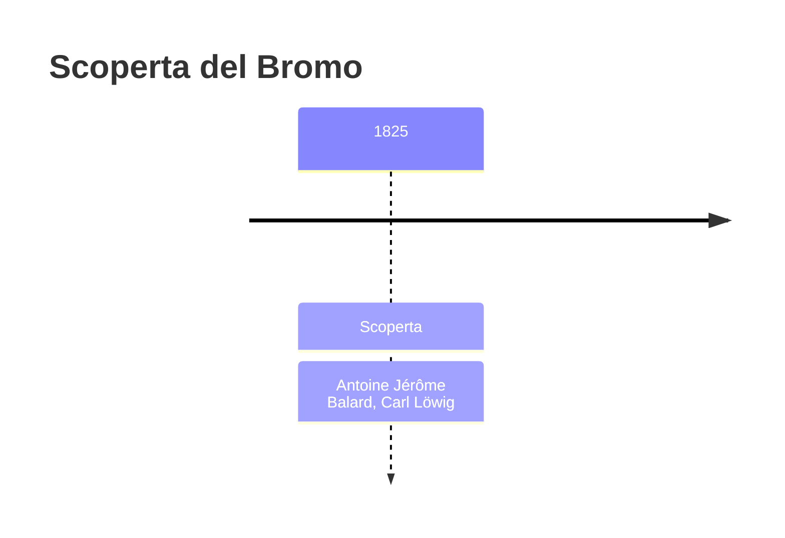
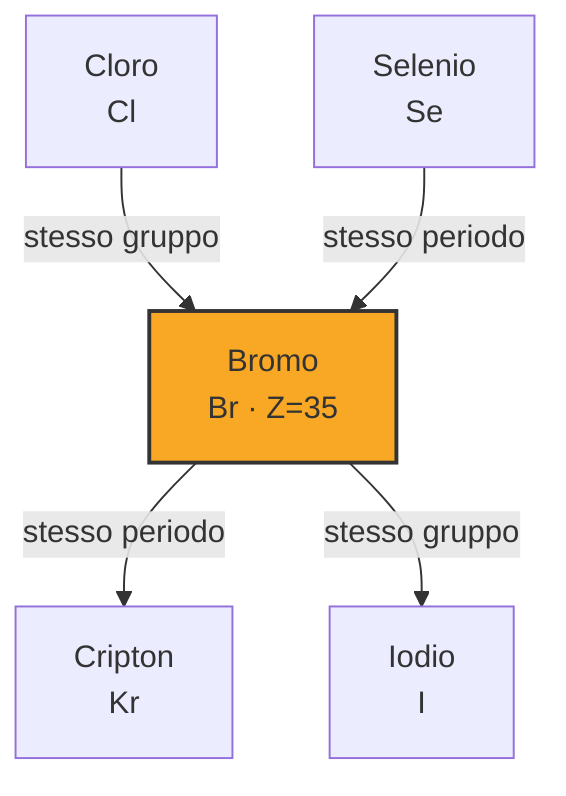

# Bromo (Br)

> [!abstract] 54° elemento scoperto — 1825
> 

## Cronologia della scoperta

## Storia della scoperta

## Posizione nella tavola periodica

## Caratteristiche

### Dati fisico-chimici

| Proprietà | Valore |
|---|---|
| Numero atomico | 35 |
| Massa atomica | 79,904 u |
| Categoria | Alogeno |
| Gruppo | 17 |
| Periodo | 4 |
| Blocco | p |
| Configurazione elettronica | [Ar] 3d¹⁰ 4s² 4p⁵ |
| Punto di fusione | -7,4 °C |
| Punto di ebollizione | 58,9 °C |
| Densità | 3,1028 g/cm³ |
| Stati di ossidazione | — |

## Struttura atomica

![[atomo-Bromo.svg]]

## Usi e presenza in natura

## Nella cronologia

← Precedente: [[Cadmio]] (1817)
→ Successivo: [[Torio]] (1829)

Epoca: [[L'età dell'elettrolisi]] · Scopritore: [[Antoine Jérôme Balard]], [[Carl Löwig]]

## Fonti

