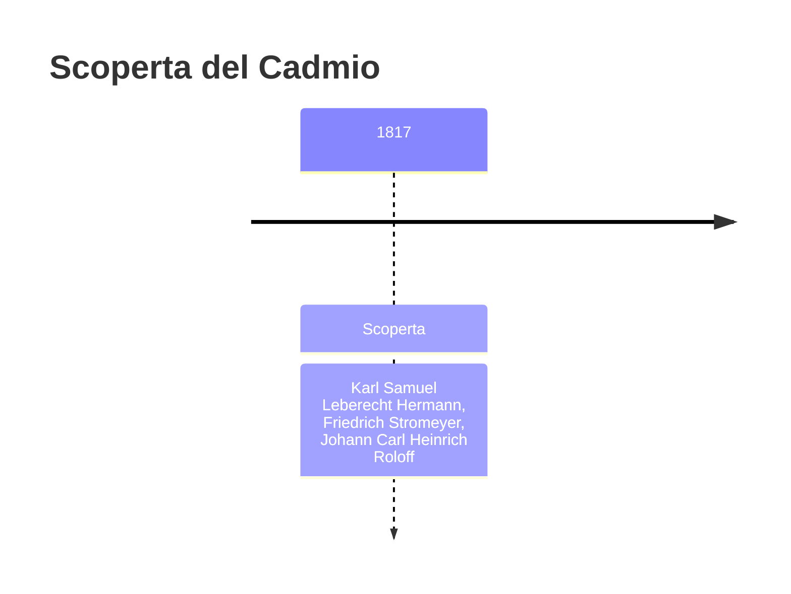
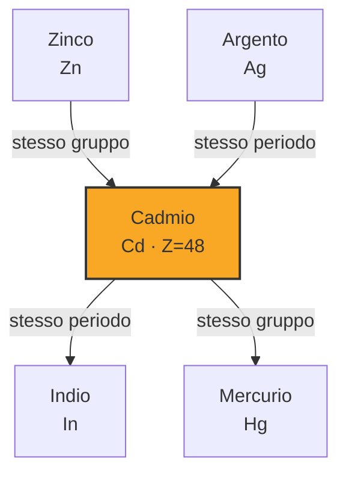

# Cadmio (Cd)

> [!abstract] 53° elemento scoperto — 1817
> 

## Cronologia della scoperta

## Storia della scoperta

## Posizione nella tavola periodica

## Caratteristiche

### Dati fisico-chimici

| Proprietà | Valore |
|---|---|
| Numero atomico | 48 |
| Massa atomica | 112,4144 u |
| Categoria | Metallo di transizione |
| Gruppo | 12 |
| Periodo | 5 |
| Blocco | d |
| Configurazione elettronica | [Kr] 4d¹⁰ 5s² |
| Punto di fusione | 321,1 °C |
| Punto di ebollizione | 766,9 °C |
| Densità | 8,65 g/cm³ |
| Stati di ossidazione | — |

## Struttura atomica

![[atomo-Cadmio.svg]]

## Usi e presenza in natura

## Nella cronologia

← Precedente: [[Selenio]] (1817)
→ Successivo: [[Bromo]] (1825)

Epoca: [[L'età dell'elettrolisi]] · Scopritori: [[Karl Samuel Leberecht Hermann]], [[Friedrich Stromeyer]], [[Johann Carl Heinrich Roloff]]

## Fonti

