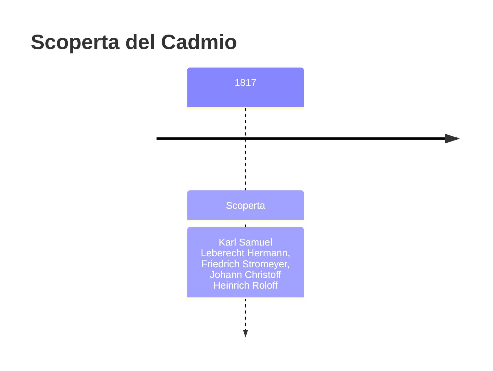
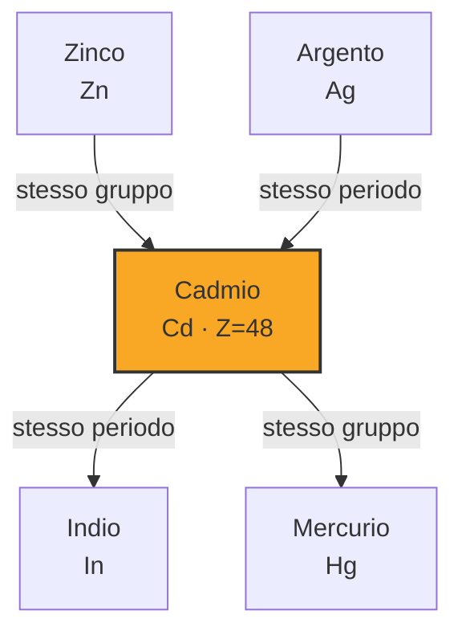
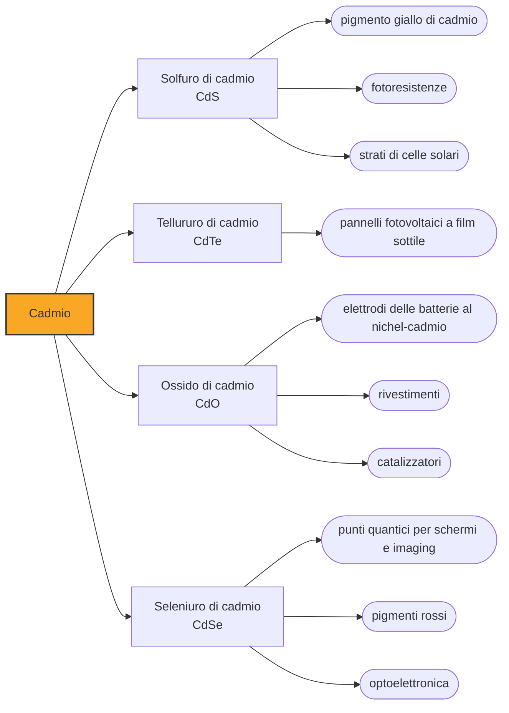

# Cadmio (Cd)

> [!abstract] 53° elemento scoperto — 1817
> Un'ispezione in farmacia, una calamina che cambiava colore scaldandosi e il sospetto di arsenico: nel 1817 tre chimici tedeschi arrivarono quasi insieme allo stesso metallo sconosciuto.

Il cadmio è un metallo bianco-argenteo dal riflesso azzurrino, tenero come lo stagno, che per più di un secolo è stato apprezzato per due qualità: protegge l'acciaio dalla ruggine e dà ai pittori gialli e rossi che nessun altro pigmento reggeva alla luce. Poi si è capito quanto è tossico.

## Cronologia della scoperta

> [!info] Nota sulla cronologia
> Scoperta multipla e quasi simultanea: Roloff sospettò arsenico in una partita di ossido di zinco, Hermann la rianalizzò e vi trovò un metallo ignoto, Stromeyer arrivò allo stesso metallo per una via indipendente e lo isolò dandogli il nome che è rimasto.

## Storia della scoperta

La materia prima non era un minerale esotico ma un prodotto da banco di farmacia. L'ossido di zinco si vendeva come rimedio per la pelle e come polvere per ferite, e si otteneva tostando la calamina, termine che all'epoca copriva indistintamente carbonati e silicati di zinco. Nelle farmacie tedesche degli anni Dieci dell'Ottocento ne circolavano partite di qualità molto diseguale, e ispezionarle era compito delle autorità sanitarie.

Nel 1817 il medico distrettuale Johann Christoff Heinrich Roloff, ispezionando le farmacie dei dintorni di Magdeburgo, trovò partite di ossido di zinco che alle sue prove preliminari sembravano contenere arsenico: dava con l'idrogeno solforato un precipitato giallo, la reazione tipica dell'arsenico. Il lotto risaliva alla fabbrica chimica di Karl Samuel Leberecht Hermann, che per difendere la reputazione della propria azienda si mise ad analizzarlo a fondo. Di arsenico non ce n'era: il precipitato veniva da un metallo che nessuno aveva mai descritto.

Nello stesso anno, a centocinquanta chilometri di distanza, Friedrich Stromeyer, professore a Gottinga e ispettore delle farmacie del regno di Hannover, seguiva una pista indipendente: alcuni fornitori vendevano carbonato di zinco spacciandolo per ossido, e Stromeyer notò che certi campioni impuri ingiallivano scaldandosi mentre la calamina pura non lo faceva. Insistette su quell'anomalia finché, tostando e riducendo il solfuro, ottenne il metallo.

Cadmia era il nome latino della calamina, che a sua volta risale a Cadmo, il fondatore mitico di Tebe, nei cui dintorni quel minerale si estraeva: Stromeyer chiamò così il nuovo metallo, e quello è rimasto il nome dell'elemento.

Hermann pubblicò le proprie osservazioni nel 1818 sugli Annalen der Physik, e nessuno dei tre poté rivendicare da solo la scoperta. I loro carteggi si intrecciano al punto che il dibattito su chi sia arrivato per primo al metallo puro non si è mai chiuso.

Il metallo restò a lungo raro e caro, e la sua prima carriera fu artistica: negli anni Quaranta dell'Ottocento si capì che il solfuro di cadmio dava un giallo intenso e stabile alla luce, e i gialli e gli arancioni di cadmio entrarono nelle tavolozze dei pittori. Per un secolo la Germania rimase il solo produttore importante del metallo.

## Posizione nella tavola periodica

## Caratteristiche

Il cadmio è tenero, malleabile e duttile: si riga con l'unghia e si lamina in fogli sottili. Fonde a 321 °C e bolle a 767 °C, temperature nettamente più basse di quelle dei metalli di transizione veri e propri, e proprio questa volatilità è il suo lato pericoloso, perché scaldato produce fumi che sono la forma più insidiosa in cui lo si possa incontrare.

Sta nel gruppo 12 sotto lo zinco e gli somiglia molto: stesso stato di ossidazione dominante, il +2, raggi ionici vicini, stessa tendenza a formare complessi. È per questa somiglianza che il cadmio prende il posto dello zinco nel reticolo della blenda, il principale minerale di zinco; ed è per la stessa somiglianza che nell'organismo si infila al posto dello zinco nelle proteine che dovrebbero contenerlo, mandandole fuori uso.

Il corpo umano non ha alcun uso per il cadmio e non ha modo efficace di liberarsene: si accumula nei reni e nelle ossa e vi resta per decenni. L'Agenzia internazionale per la ricerca sul cancro lo classifica come cancerogeno certo per l'uomo, e per chi non lavora nel settore la principale fonte di esposizione è il fumo di sigaretta, che porta i fumatori a concentrazioni nel sangue quattro o cinque volte più alte.

### Dati fisico-chimici

| Proprietà | Valore |
|---|---|
| Numero atomico | 48 |
| Massa atomica | 112,4144 u |
| Categoria | Metallo di transizione |
| Gruppo | 12 |
| Periodo | 5 |
| Blocco | d |
| Configurazione elettronica | [Kr] 4d¹⁰ 5s² |
| Punto di fusione | 321,1 °C |
| Punto di ebollizione | 766,9 °C |
| Densità | 8,65 g/cm³ |
| Stati di ossidazione | -2, 0, +1, +2 |

## Struttura atomica

![[atomo-Cadmio.svg]]

## Usi e presenza in natura

Il grosso del cadmio prodotto è andato a lungo nelle batterie ricaricabili al nichel-cadmio, robuste e longeve, oggi soppiantate dal litio nel mercato di consumo ma ancora usate in ambito industriale, dove contano affidabilità e durata più che la densità di energia. Seguivano i pigmenti — solfuro per il giallo, solfoseleniuro per l'arancione e il rosso — le leghe basso-fondenti e i rivestimenti anticorrosione.

Gli impieghi in crescita sono invece elettronici: il tellururo di cadmio è il materiale dei pannelli solari a film sottile più diffusi dopo il silicio cristallino, il seleniuro di cadmio serve all'optoelettronica e ai punti quantici che accendono i colori di certi schermi, e il tellururo di cadmio e zinco fa da rivelatore per raggi X e gamma nelle apparecchiature di imaging.

Non esistono giacimenti di solo cadmio: si ricava per intero dalla raffinazione dello zinco, con una produzione mondiale intorno alle 23.000 tonnellate nel 2025. In Europa la direttiva RoHS ne limita da vent'anni la presenza nelle apparecchiature elettroniche, mentre nei reattori nucleari le barre di controllo lo sfruttano per la sua capacità di assorbire neutroni.

## Curiosità

Nel 1907 l'unità di lunghezza della spettroscopia, l'ångström, fu definita per convenzione internazionale a partire da una riga rossa dello spettro del cadmio, alla quale si attribuivano esattamente 6438,4696 unità: per decenni misurare la luce ha voluto dire confrontarla con questo metallo.

Il conto della tossicità del cadmio è stato pagato soprattutto in Giappone. Nel bacino del fiume Jinzū gli scarichi di una miniera di zinco contaminarono per decenni le risaie, e il cadmio accumulato nel riso provocò, a partire dal primo Novecento, una malattia ossea e renale devastante: la chiamarono itai-itai, «ahi ahi», dal grido di dolore delle malate, per lo più donne anziane.

## Nella cronologia

← Precedente: [[Selenio]] (1817)
→ Successivo: [[Bromo]] (1825)

Epoca: [[L'età dell'elettrolisi]] · Scopritori: [[Karl Samuel Leberecht Hermann]], [[Friedrich Stromeyer]], [[Johann Christoff Heinrich Roloff]]

## Fonti

- [Cadmium](https://en.wikipedia.org/wiki/Cadmium) — consultata il 07/09/2026
- [Karl Samuel Leberecht Hermann](https://en.wikipedia.org/wiki/Karl_Samuel_Leberecht_Hermann) — consultata il 07/09/2026
- [Itai-itai disease](https://en.wikipedia.org/wiki/Itai-itai_disease) — consultata il 07/09/2026
- [Cadmium — Mineral Commodity Summaries 2026, U.S. Geological Survey](https://pubs.usgs.gov/periodicals/mcs2026/mcs2026-cadmium.pdf) — consultata il 07/09/2026

---

> [!warning] Avvertenza
> Questo progetto è stato realizzato con l'assistenza di sistemi di
> intelligenza artificiale. I contenuti sono verificati sulle fonti citate,
> ma **possono contenere errori e imprecisioni**: prima di riutilizzarli,
> controlla la fonte.
