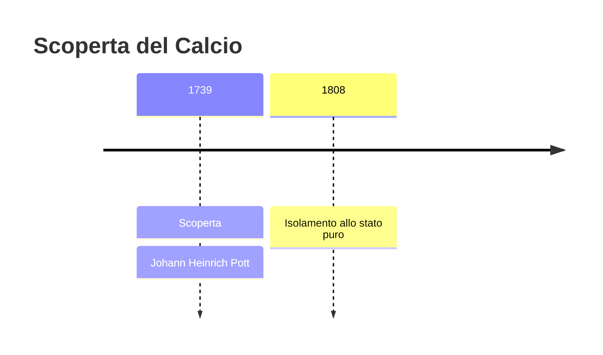
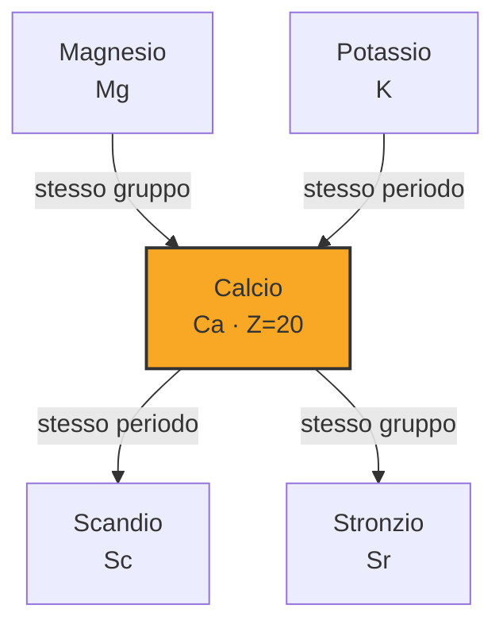
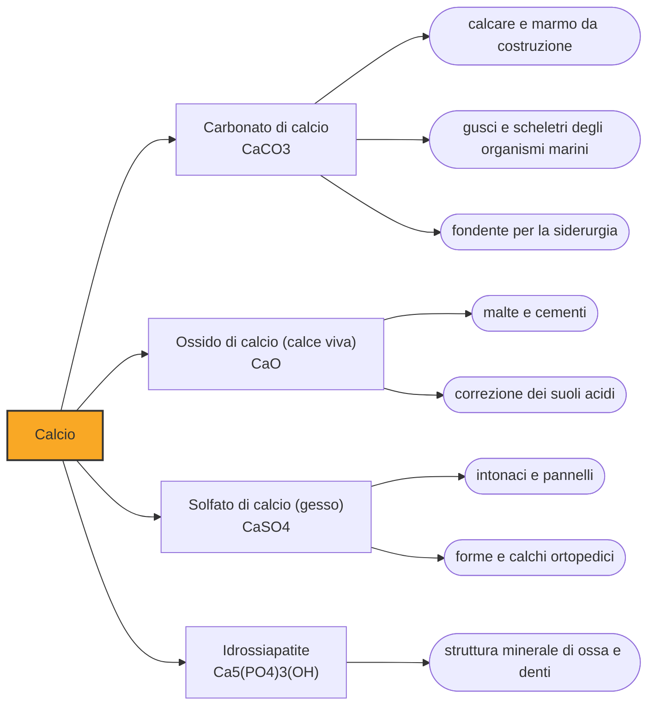

# Calcio (Ca)

> [!abstract] 19° elemento scoperto — 1739
> Ci costruiamo le ossa, ci abbiamo costruito il Colosseo e ci facciamo contrarre i muscoli. Eppure nessuno aveva mai visto il calcio prima del 1808.

Il calcio è un metallo argenteo e tenero, tanto reattivo che in natura non si trova mai libero: sta sempre combinato, ed è in quella forma che ci circonda da sempre. È il quinto elemento più abbondante della crosta terrestre e il minerale più diffuso nel nostro corpo, il che spiega il paradosso della sua storia — un elemento onnipresente e invisibile fino a due secoli fa.

## Cronologia della scoperta

## Storia della scoperta

La storia del calcio comincia da un forno. Scaldando il calcare oltre gli ottocento gradi se ne caccia via l'anidride carbonica e resta la calce viva, una sostanza avida d'acqua che, rimescolata con sabbia, fa presa e indurisce. È una delle invenzioni decisive dell'antichità: senza malta di calce non esistono le cupole romane, e la parola stessa calcio viene dal latino calx, che significa appunto calce.

Nel Settecento la calce appartiene alla categoria delle terre: sostanze polverose, refrattarie, che nessun fuoco riesce a scomporre e che perciò venivano considerate elementari. Era una conclusione ragionevole per gli strumenti del tempo, e sbagliata: le terre non resistevano perché fossero semplici, ma perché il legame fra il metallo e l'ossigeno era troppo forte per la sola forza del calore.

Nel 1739 il chimico berlinese Johann Heinrich Pott pubblica un lavoro in cui la terra calcarea è riconosciuta come una terra a sé, non riconducibile alle altre. Va detto con precisione che cosa fece e che cosa no: separò e caratterizzò una sostanza, non un metallo, e non sostenne mai che nella calce se ne nascondesse uno. È la data da cui il calcio comincia a esistere come qualcosa di distinto, ancora senza sapere che cosa sia.

I due passi successivi arrivano dal resto d'Europa. Nel 1755 lo scozzese Joseph Black dimostra che il calcare, cuocendo, perde peso perché libera un'aria fissa, cioè anidride carbonica: la prima volta che un gas viene pesato dentro una reazione. Poco dopo Lavoisier inserisce la calce fra le terre salificabili e avanza l'ipotesi decisiva, che siano ossidi di metalli non ancora isolati.

A dare ragione a Lavoisier è Humphry Davy nel 1808, con lo strumento che aveva già usato per sodio e potassio: la corrente elettrica, capace di spezzare legami che il fuoco non scalfiva. Con la calce la faccenda è più ostica, e Davy la risolve lavorando su una miscela con ossido di mercurio e raccogliendo il prodotto su un catodo di mercurio; ne esce un amalgama, da cui il mercurio viene poi distillato via. Dopo sessantanove anni la terra di Pott consegna finalmente il suo metallo.

> [!warning] Questione aperta
> Attribuire a Pott la scoperta del calcio richiede una precisazione. Nel 1739 Pott riconosce la terra calcarea come una delle terre elementari, distinta dalle altre: è un passo reale, ma riguarda la calce, non il metallo, e Pott non sostenne mai che dentro la calce ci fosse un metallo. L'ipotesi che le terre fossero ossidi di metalli sconosciuti è di Lavoisier, mezzo secolo dopo, e la prova è di Humphry Davy nel 1808. Molte cronologie, questa compresa, datano la scoperta al lavoro sulle terre perché è lì che il calcio comincia a esistere come sostanza distinta; altre la datano al 1808, quando qualcuno lo tiene finalmente in mano. Entrambe le date dicono qualcosa di vero e nessuna delle due da sola racconta la vicenda.

## Posizione nella tavola periodica

## Caratteristiche

Il calcio metallico è argenteo appena tagliato e ingrigisce in pochi istanti, perché all'aria si ricopre di ossido e nitruro. In acqua reagisce liberando idrogeno, meno violentemente del sodio ma abbastanza da renderlo inservibile come metallo strutturale. Nei composti si presenta quasi senza eccezioni allo stato più due, cedendo entrambi gli elettroni esterni: una chimica prevedibile, senza i colori e le sorprese dei metalli di transizione.

Nel corpo umano il calcio è il minerale più abbondante, circa un chilo in un adulto, e per il novantanove per cento sta nelle ossa e nei denti sotto forma di idrossiapatite, un fosfato di calcio cristallino. Lo scheletro però non è solo un'impalcatura: funziona anche da magazzino, e l'organismo vi attinge o vi deposita calcio per tenere costante la quantità che circola nel sangue.

L'uno per cento restante fa il lavoro più delicato. Lo ione calcio è il segnale universale della cellula: la sua concentrazione, tenuta bassissima all'interno, schizza verso l'alto quando un canale si apre, e quel picco è ciò che fa contrarre un muscolo, fa partire un impulso nervoso o innesca la coagulazione del sangue. Ogni battito del cuore è un'onda di calcio che entra e viene ripompata fuori.

### Dati fisico-chimici

| Proprietà | Valore |
|---|---|
| Numero atomico | 20 |
| Massa atomica | 40,0784 u |
| Categoria | Metallo alcalino terroso |
| Gruppo | 2 |
| Periodo | 4 |
| Blocco | s |
| Configurazione elettronica | [Ar] 4s² |
| Punto di fusione | 841,9 °C |
| Punto di ebollizione | 1483,9 °C |
| Densità | 1,55 g/cm³ |
| Stati di ossidazione | +1, +2 |

## Struttura atomica

![[atomo-Calcio.svg]]

## Usi e presenza in natura

Il calcio è, per volume, l'elemento su cui è costruito il mondo edificato. Il cemento Portland si ottiene cuocendo calcare e argilla, e da esso viene il calcestruzzo; il gesso, solfato di calcio, fa intonaci, pannelli e forme; il calcare grezzo è pietra da costruzione e fondente indispensabile negli altiforni, dove cattura le impurità del minerale di ferro e le porta via nella scoria.

Il metallo puro, che serve a poco da solo, è invece un ottimo riducente e si usa per estrarre altri metalli dai loro composti e per ripulire gli acciai dall'ossigeno e dallo zolfo residui. In agricoltura la calce corregge i suoli acidi, e nell'industria alimentare i sali di calcio fanno coagulare il tofu e rinforzano farine e bevande.

## Curiosità

Le grotte carsiche sono interamente opera di una reazione reversibile del calcio. L'acqua piovana, resa leggermente acida dall'anidride carbonica, scioglie il calcare e se lo porta via in soluzione; dove la goccia ritorna all'aria il processo si inverte, il carbonato riprecipita e costruisce stalattiti e stalagmiti. La stessa chimica scava la roccia e la ricostruisce, a pochi metri di distanza.

Buona parte del calcare del pianeta è stata fabbricata da esseri viventi. Gusci di molluschi, scheletri di coralli e microscopiche piastrine di alghe unicellulari si depositano sui fondali per milioni di anni e diventano roccia: le bianche scogliere di Dover sono un accumulo di plancton calcareo. Il calcio con cui costruiamo le case è passato, quasi tutto, attraverso qualcosa che era vivo.

## Nella cronologia

← Precedente: [[Silicio]] (1739)
→ Successivo: [[Alluminio]] (1746)

Epoca: [[Alchimia e primo moderno]] · Scopritore: [[Johann Heinrich Pott]]

## Fonti

- [Calcium](https://en.wikipedia.org/wiki/Calcium) — consultata il 07/09/2026
- [Johann Heinrich Pott](https://en.wikipedia.org/wiki/Johann_Heinrich_Pott) — consultata il 07/09/2026
- [Pott, Johann Heinrich (Dictionary of Scientific Biography)](https://www.encyclopedia.com/science/dictionaries-thesauruses-pictures-and-press-releases/pott-johann-heinrich) — consultata il 07/09/2026
- [Timeline of chemical element discoveries](https://en.wikipedia.org/wiki/Timeline_of_chemical_element_discoveries) — consultata il 07/09/2026
