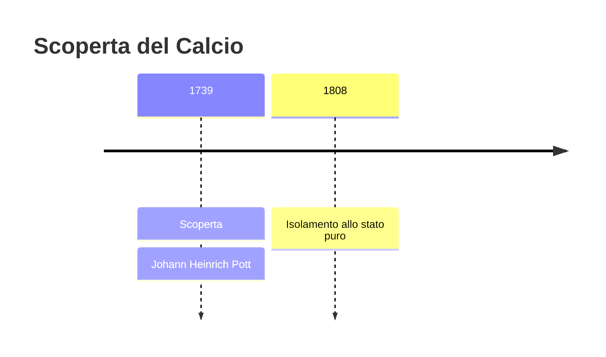
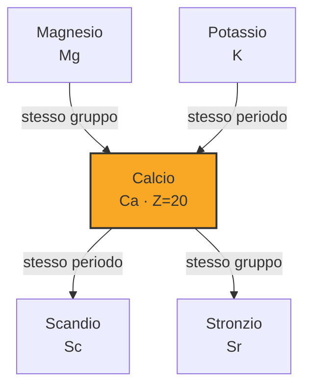

# Calcio (Ca)

> [!abstract] 19° elemento scoperto — 1739
> 

## Cronologia della scoperta

## Storia della scoperta

## Posizione nella tavola periodica

## Caratteristiche

### Dati fisico-chimici

| Proprietà | Valore |
|---|---|
| Numero atomico | 20 |
| Massa atomica | 40,0784 u |
| Categoria | Metallo alcalino terroso |
| Gruppo | 2 |
| Periodo | 4 |
| Blocco | s |
| Configurazione elettronica | [Ar] 4s² |
| Punto di fusione | 841,9 °C |
| Punto di ebollizione | 1483,9 °C |
| Densità | 1,55 g/cm³ |
| Stati di ossidazione | — |

## Struttura atomica

![[atomo-Calcio.svg]]

## Usi e presenza in natura

## Nella cronologia

← Precedente: [[Silicio]] (1739)
→ Successivo: [[Alluminio]] (1746)

Epoca: [[Alchimia e primo moderno]] · Scopritore: [[Johann Heinrich Pott]]

## Fonti

