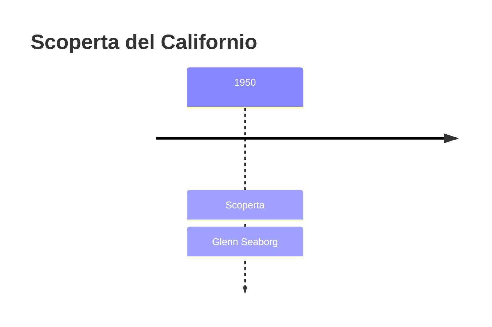
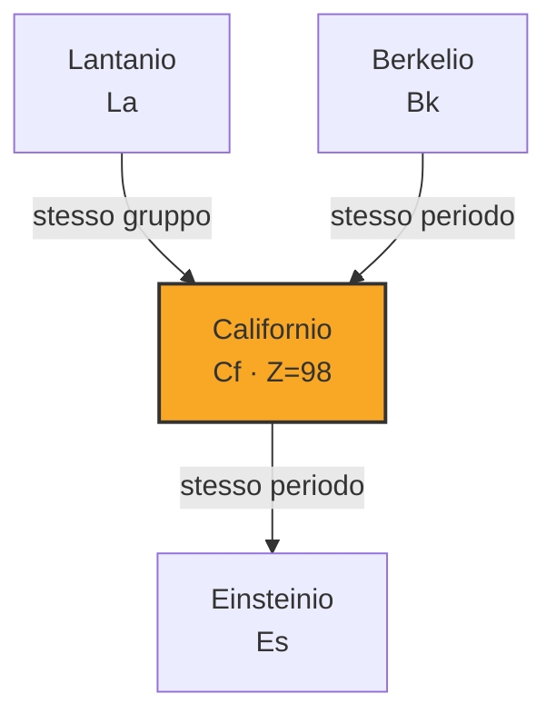

# Californio (Cf)

> [!abstract] 98° elemento scoperto — 1950
> 

## Cronologia della scoperta

## Storia della scoperta

## Posizione nella tavola periodica

## Caratteristiche

### Dati fisico-chimici

| Proprietà | Valore |
|---|---|
| Numero atomico | 98 |
| Massa atomica | 251,0 u |
| Categoria | Attinide |
| Gruppo | 3 |
| Periodo | 7 |
| Blocco | f |
| Configurazione elettronica | [Rn] 5f¹⁰ 7s² |
| Punto di fusione | 899,9 °C |
| Punto di ebollizione | 1469,9 °C |
| Densità | 15,1 g/cm³ |
| Stati di ossidazione | — |

## Struttura atomica

![[atomo-Californio.svg]]

## Usi e presenza in natura

## Nella cronologia

← Precedente: [[Berkelio]] (1949)
→ Successivo: [[Einsteinio]] (1952)

Epoca: [[Era nucleare]] · Scopritore: [[Glenn Seaborg]]

## Fonti

