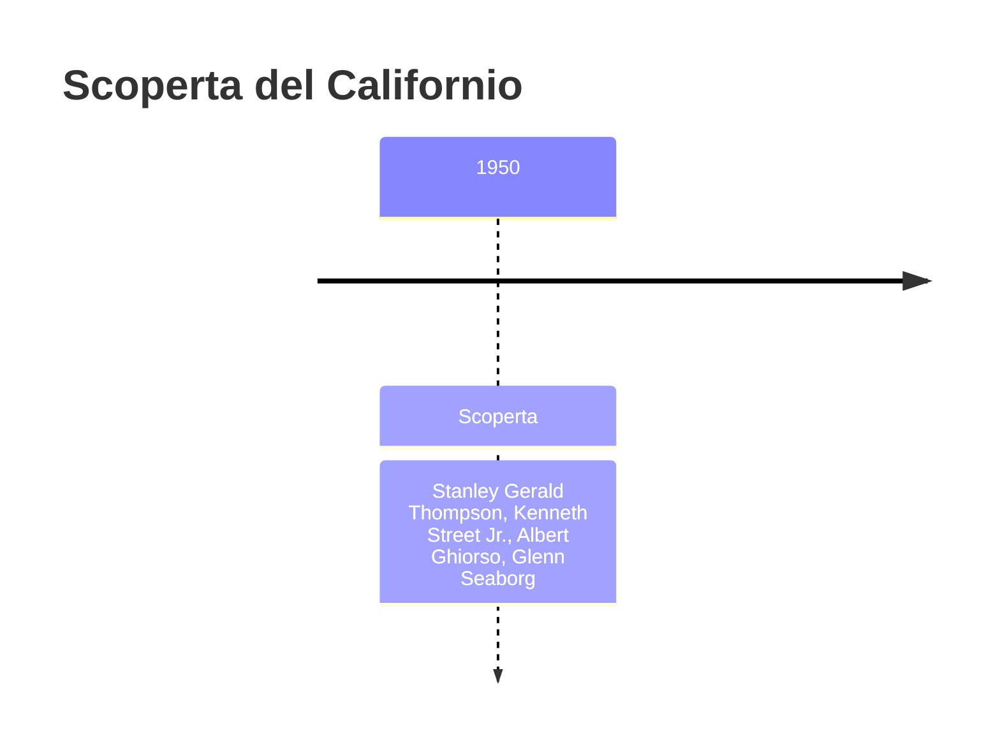
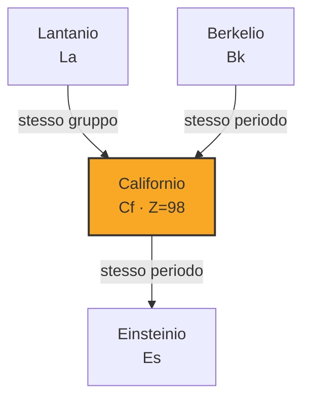
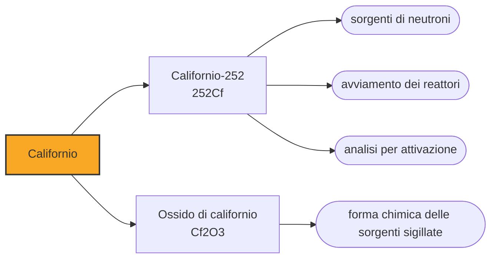

# Californio (Cf)

> [!abstract] 98° elemento scoperto — 1950
> Un microgrammo emette due milioni e trecentomila neutroni al secondo. È la sorgente di neutroni più pratica che esista, e serve ad accendere i reattori nucleari e a scoprire che cosa c'è dentro una roccia o un bagaglio.

Il californio è l'elemento artificiale più utile fra quelli oltre il plutonio: non per la sua chimica, che quasi nessuno usa, ma perché un suo isotopo si spezza da solo emettendo neutroni a getto continuo. È una sorgente di neutroni che sta in un ditale e non ha bisogno di corrente.

## Cronologia della scoperta

## Storia della scoperta

Il 9 febbraio 1950, a Berkeley, Stanley Thompson, Kenneth Street Jr., Albert Ghiorso e Glenn Seaborg bombardarono con particelle alfa un bersaglio di curio-242 grande quanto un microgrammo. Ottennero circa cinquemila atomi dell'elemento 98: il quarto elemento nuovo in sei anni per lo stesso gruppo, e il secondo in due mesi dopo il berkelio.

Con il californio l'analogia con i lantanidi si interruppe: sopra c'era il disprosio, il cui nome significa «difficile da raggiungere», e nessuno voleva un elemento chiamato così. Lo intitolarono allo stato e all'università, e Seaborg commentò con ironia che, non potendo seguire la regola, il massimo che potevano fare era ricordare che anche un secolo prima raggiungere la California era stato difficile.

In sei anni il gruppo di Berkeley aveva prodotto americio, curio, berkelio e californio, e negli anni successivi avrebbe aggiunto einsteinio, fermio, mendelevio e altri. Era una catena industriale: ogni elemento nuovo diventava il bersaglio per fabbricare il successivo, e il limite non era l'idea ma la quantità di materiale che si riusciva a mettere insieme.

## Posizione nella tavola periodica

## Caratteristiche

Il californio-252 è particolare fra tutti gli isotopi disponibili: nel 97 per cento dei casi decade emettendo una particella alfa, ma nel restante tre per cento si spezza da solo in due frammenti, liberando in media quasi quattro neutroni. Un solo microgrammo ne emette 2,3 milioni al secondo, con un'emivita di 2,6 anni.

I neutroni sono difficili da produrre: servono un reattore, un acceleratore o una sorgente mista come quelle al polonio-berillio, che ne dà molti meno. Un pezzetto di californio-252 fa lo stesso lavoro senza alimentazione, senza raffreddamento e senza manutenzione, e sta in una capsula lunga qualche centimetro.

Il metallo è argenteo, tenero e si ossida rapidamente all'aria; nei composti sta prevalentemente nello stato +3. Come tutti gli attinidi pesanti è fortemente radiotossico, e i campioni si maneggiano solo dietro schermature apposite: la radiazione neutronica, a differenza di quella alfa, attraversa il vetro e il metallo, e per fermarla servono acqua, cemento o polietilene, cioè materiali pieni di idrogeno contro cui i neutroni rimbalzano perdendo energia.

Si produce in due soli impianti al mondo, a Oak Ridge negli Stati Uniti e a Dimitrovgrad in Russia, irraggiando bersagli di curio per anni. Le quantità annue si misurano in frazioni di grammo: nel 2003 i due siti ne producevano insieme meno di trecento milligrammi l'anno.

### Dati fisico-chimici

| Proprietà | Valore |
|---|---|
| Numero atomico | 98 |
| Massa atomica | 251,0 u |
| Categoria | Attinide |
| Gruppo | 3 |
| Periodo | 7 |
| Blocco | f |
| Configurazione elettronica | [Rn] 5f¹⁰ 7s² |
| Punto di fusione | 899,9 °C |
| Punto di ebollizione | 1469,9 °C |
| Densità | 15,1 g/cm³ |
| Stati di ossidazione | +2, +3, +4, +5 |

## Struttura atomica

![[atomo-Californio.svg]]

## Usi e presenza in natura

L'uso classico è avviare i reattori nucleari: per far partire la reazione a catena in modo controllato serve un flusso iniziale di neutroni che dia il via alle fissioni, e una sorgente al californio inserita nel nocciolo lo fornisce senza dipendere da nulla. Lo stesso principio vale nei rivelatori che verificano il corretto caricamento del combustibile e nei sistemi che misurano il livello di potenza quando il reattore è ancora spento.

L'analisi per attivazione neutronica è l'altro grande impiego: si irradia un campione con neutroni, i nuclei che contiene diventano per un momento radioattivi, e lo spettro gamma che emettono dice quali elementi ci sono e in che quantità, senza distruggere nulla e spesso senza nemmeno aprire il contenitore. Si usa nella prospezione mineraria e petrolifera, nei controlli sui bagagli e sui container alla ricerca di esplosivi, nella caratterizzazione dei materiali e nell'analisi non distruttiva di reperti archeologici e opere d'arte.

In medicina il californio è stato usato per la brachiterapia a neutroni di alcuni tumori del collo dell'utero e del cervello, nei casi in cui la radioterapia convenzionale non funziona: i neutroni danneggiano le cellule tumorali anche in assenza di ossigeno, dove i raggi X sono poco efficaci.

Negli anni Settanta la commissione americana per l'energia atomica lo vendeva a dieci dollari al microgrammo; oggi il prezzo è molto più alto e la disponibilità resta il vero limite. Come per il berkelio, non esiste un mercato: esiste una lista di richieste e una produzione che non la copre.

## Curiosità

*Per tradizione:* Con il californio, la California entra nella tavola periodica per la seconda volta in due mesi dopo Berkeley, e il gruppo che li aveva prodotti dovette difendersi dall'accusa di aver esagerato con i nomi locali. Un giornale commentò che avrebbero potuto chiamarli anche universitio e ofio, per «Università della California».

Le sorgenti al californio si trovano in luoghi che nessuno assocerebbe alla fisica nucleare: dentro i pozzi petroliferi per misurare la porosità delle rocce, nei cementifici per controllare la composizione della miscela in tempo reale, nelle miniere di carbone per stimare il contenuto di zolfo. Un elemento artificiale prodotto in due impianti al mondo lavora, in silenzio, in mezza industria pesante.

## Nella cronologia

← Precedente: [[Berkelio]] (1949)
→ Successivo: [[Einsteinio]] (1952)

Epoca: [[Era nucleare]] · Scopritori: [[Stanley Gerald Thompson]], [[Kenneth Street Jr.]], [[Albert Ghiorso]], [[Glenn Seaborg]]

## Fonti

- [Californium](https://en.wikipedia.org/wiki/Californium) — consultata il 09/09/2026
- [Californium — Royal Society of Chemistry](https://periodic-table.rsc.org/element/98/californium) — consultata il 09/09/2026
- [Neutron activation analysis](https://en.wikipedia.org/wiki/Neutron_activation_analysis) — consultata il 09/09/2026
