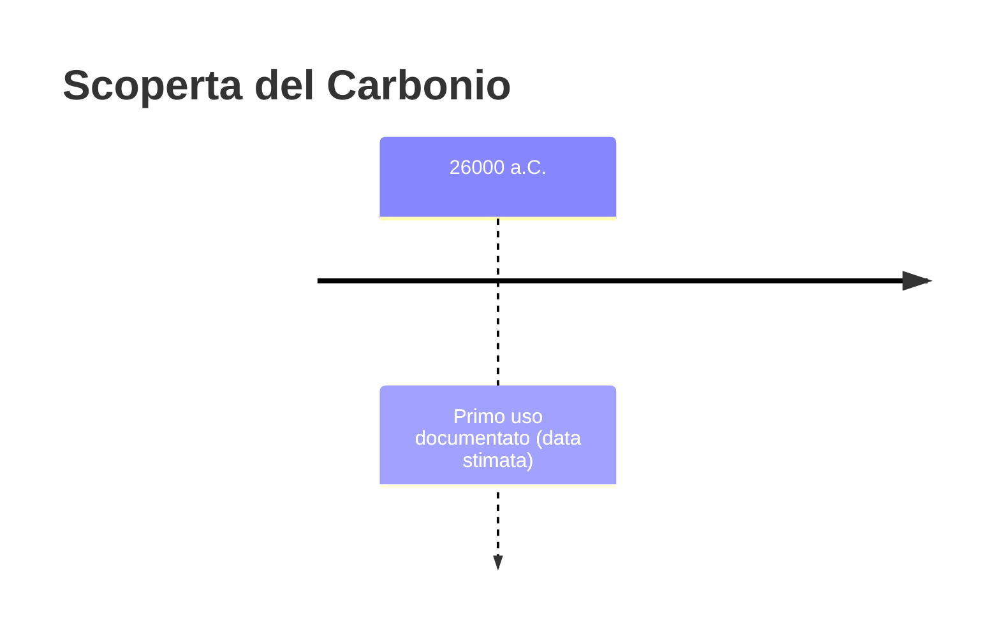
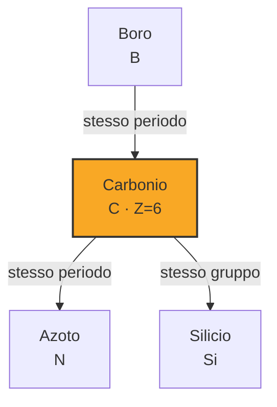

# Carbonio (C)

> [!abstract] 2° elemento scoperto — 26000 a.C.
> 

## Cronologia della scoperta

## Storia della scoperta

## Posizione nella tavola periodica

## Caratteristiche

### Dati fisico-chimici

| Proprietà | Valore |
|---|---|
| Numero atomico | 6 |
| Massa atomica | 12,011 u |
| Categoria | Non metallo |
| Gruppo | 14 |
| Periodo | 2 |
| Blocco | p |
| Configurazione elettronica | [He] 2s² 2p² |
| Punto di fusione | dato non disponibile |
| Punto di ebollizione | dato non disponibile |
| Densità | 1,821 g/cm³ |
| Stati di ossidazione | — |

## Struttura atomica

![[atomo-Carbonio.svg]]

## Usi e presenza in natura

## Nella cronologia

← Precedente: [[Oro]] (40000 a.C.)
→ Successivo: [[Rame]] (9000 a.C.)

Epoca: [[Antichità]]

## Fonti

