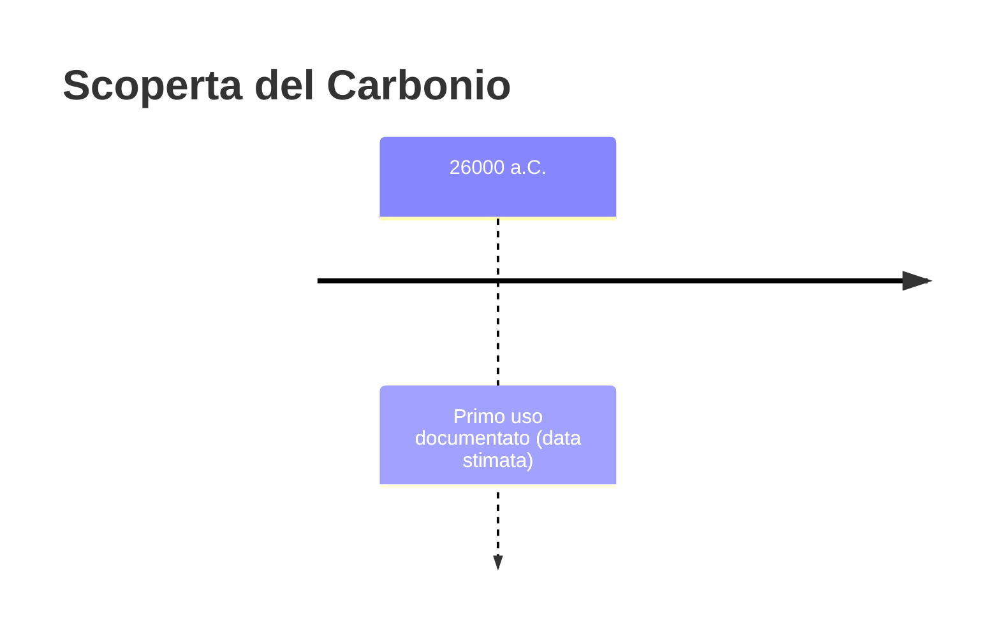
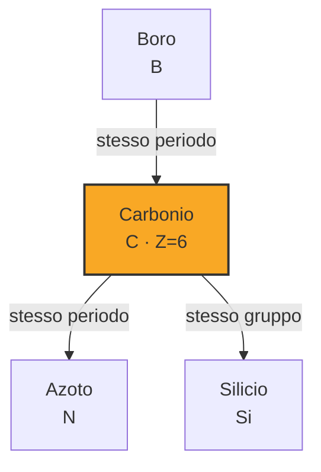
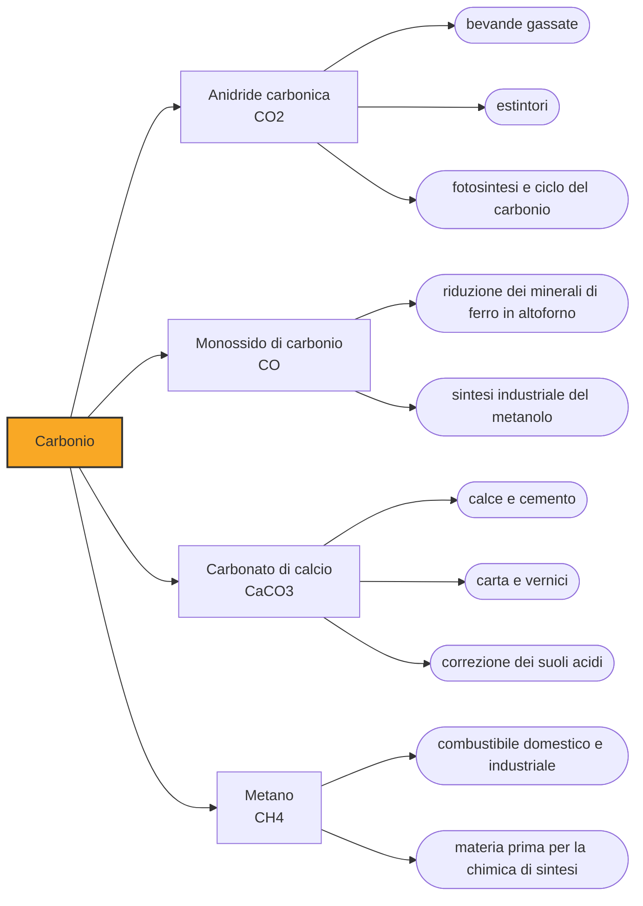

# Carbonio (C)

> [!abstract] 2° elemento scoperto — 26000 a.C.
> Il carbonio è l'elemento che l'umanità ha usato per ventisei millenni senza sapere di usarlo: il carboncino delle pitture rupestri e il diamante sono la stessa sostanza, e per accorgersene ci sono voluti fino al 1796.

Con il carbonio la parola scoperta cambia significato. Non c'è mai stato un momento in cui qualcuno lo ha trovato: c'è stato un momento, molto tardo, in cui si è capito che sostanze apparentemente irriconciliabili — la fuliggine nera e tenera, il diamante trasparente e durissimo — erano fatte dello stesso identico elemento.

## Cronologia della scoperta

> [!info] Nota sulla cronologia
> La data segna la più antica testimonianza d'uso, il carbone delle pitture rupestri, non la comprensione del carbonio come elemento: quella arriva a fine Settecento.

## Storia della scoperta

La data convenzionale di ventiseimila anni fa segna la prima testimonianza d'uso, non la comprensione. È l'epoca delle grandi pitture rupestri del Paleolitico superiore, tracciate con carbone di legna: il pigmento nero più antico e più diffuso della storia umana, ottenuto semplicemente lasciando bruciare del legno senza abbastanza aria. Chi lo usava non aveva alcuna nozione di elemento chimico, e non ne aveva bisogno.

Le altre due forme note fin dall'antichità arrivano da mondi lontanissimi fra loro. Il diamante è documentato in India già nel primo millennio a.C., raccolto nei depositi alluvionali e apprezzato per una durezza che nessun'altra pietra eguagliava. La grafite, tenera e untuosa, viene usata per segnare e per rivestire stampi da fonderia, e per secoli è confusa con il piombo: il nome inglese della mina della matita, lead, conserva ancora oggi quell'errore.

Il primo a mettere sotto esame la questione è Antoine Lavoisier. Nella primavera del 1772, a Parigi, brucia un diamante concentrandogli addosso la luce del sole con una lente gigantesca di ottantaquattro centimetri di diametro, in un recipiente chiuso. Il gas prodotto intorbida l'acqua di calce esattamente come quello del carbone che brucia. Lavoisier osserva la coincidenza, ma non se la sente di trarne la conclusione: si limita a dire che diamante e carbone appartengono entrambi alla classe dei combustibili.

La prova decisiva arriva nel 1796 dall'inglese Smithson Tennant, che riscalda centosessanta milligrammi di diamante in un tubo d'oro chiuso insieme a nitrato di potassio, e misura. Quantità uguali di diamante e di carbone di legna producono, bruciando, quantità uguali di anidride carbonica: se il prodotto è identico, la sostanza di partenza deve esserlo. Il carbonio diventa così il primo elemento di cui si dimostra che può esistere in forme fisicamente opposte, quelle che oggi chiamiamo allotropi.

> [!warning] Questione aperta
> Il carbonio è un caso particolare fra gli elementi noti fin dalla preistoria, perché le sue forme sono state usate per millenni senza che nessuno sospettasse fossero la stessa sostanza. Carbone di legna, grafite e diamante appartenevano a categorie mentali del tutto diverse. Antoine Lavoisier, bruciando un diamante nel 1772, osserva che produce lo stesso gas del carbone ma si ferma prima di concludere che siano la stessa cosa. È Smithson Tennant, nel 1796, a dimostrarlo per via quantitativa: masse uguali di diamante e di carbone danno masse uguali di anidride carbonica. Attribuire quindi la scoperta del carbonio alla preistoria è corretto solo nel senso dell'uso; il riconoscimento dell'elemento ha una data precisa e sta a fine Settecento.

## Posizione nella tavola periodica

## Caratteristiche

La particolarità del carbonio sta in una combinazione che nessun altro elemento possiede allo stesso grado: quattro elettroni disponibili per legarsi, e la capacità di legarsi soprattutto a se stesso, formando catene e anelli lunghi quanto si vuole senza perdere stabilità. Da qui derivano i circa duecento milioni di composti oggi noti, un numero che supera quello di tutti gli altri elementi messi insieme, e da qui deriva l'esistenza stessa della chimica organica come disciplina separata.

Le forme del carbonio puro mostrano quanto conti la disposizione degli atomi rispetto alla loro natura. Nel diamante ogni atomo è legato ad altri quattro in una struttura tridimensionale rigida, ed è la sostanza naturale più dura conosciuta. Nella grafite gli atomi si dispongono in fogli piani sovrapposti che scorrono l'uno sull'altro, ed è tenera al punto da lasciare una traccia su un foglio, oltre a condurre l'elettricità. Stessa materia, proprietà opposte.

Il repertorio si è allargato in tempi recenti. Nel 1985 vengono sintetizzati i fullereni, gabbie sferiche di sessanta atomi, e a seguire i nanotubi; nel 2004 viene isolato il grafene, un singolo foglio di grafite spesso un atomo, il materiale più resistente mai misurato. Chimicamente il carbonio percorre stati di ossidazione da -4 a +4, il che gli consente di comportarsi da ossidante o da riducente a seconda del partner.

### Dati fisico-chimici

| Proprietà | Valore |
|---|---|
| Numero atomico | 6 |
| Massa atomica | 12,011 u |
| Categoria | Non metallo |
| Gruppo | 14 |
| Periodo | 2 |
| Blocco | p |
| Configurazione elettronica | [He] 2s² 2p² |
| Punto di fusione | dato non disponibile |
| Punto di ebollizione | dato non disponibile |
| Densità | 1,821 g/cm³ |
| Stati di ossidazione | -4, -3, -2, -1, 0, +1, +2, +3, +4 |

## Struttura atomica

![[atomo-Carbonio.svg]]

## Usi e presenza in natura

Sul piano delle quantità, l'uso dominante del carbonio resta bruciarlo. Carbone, petrolio e gas naturale sono composti del carbonio, e la loro combustione produce anidride carbonica: è lo stesso gas che Tennant misurava nel suo tubo d'oro, e la sua accumulazione in atmosfera è oggi il principale motore del riscaldamento globale.

Negli usi non energetici il carbonio compare come struttura più che come combustibile. L'acciaio è ferro con qualche decimo di percento di carbonio, ed è quella minima aggiunta a fare la differenza fra un metallo tenero e uno che tiene il filo; le fibre di carbonio danno telai più leggeri e più rigidi dell'acciaio a parità di peso; il nerofumo rinforza la gomma degli pneumatici; il carbone attivo, la cui struttura porosa concentra in un solo grammo una superficie di centinaia di metri quadrati, filtra acqua, aria e veleni ingeriti. Gli elettrodi di grafite alimentano i forni siderurgici e gli anodi delle batterie al litio.

Il diamante ha un uso industriale che eccede di molto quello ornamentale: la sua durezza lo rende l'abrasivo e il tagliente per eccellenza, nelle punte da trapano per roccia, nei dischi per il taglio del cemento e negli utensili di precisione. La maggior parte dei diamanti impiegati in industria è oggi di sintesi.

## Curiosità

Una minima frazione del carbonio terrestre è carbonio-14, isotopo radioattivo che si forma di continuo nell'alta atmosfera e decade con un tempo di dimezzamento di circa 5700 anni. Sul metodo di datazione che ne deriva, messo a punto nel 1949, si regge quasi tutta la cronologia della preistoria recente: comprese, con una certa ironia, le date di quelle pitture rupestri tracciate con il carbone.

> [!tip] Approfondimento
> La vicenda completa in [[Carbonio — storia estesa]].

## Nella cronologia

← Precedente: [[Oro]] (40000 a.C.)
→ Successivo: [[Rame]] (9000 a.C.)

Epoca: [[Antichità]]

## Fonti

- [Carbon](https://en.wikipedia.org/wiki/Carbon) — consultata il 07/09/2026
- [Smithson Tennant](https://en.wikipedia.org/wiki/Smithson_Tennant) — consultata il 07/09/2026
- [Smithson Tennant (Educación Química)](https://www.sciencedirect.com/science/article/pii/S0187893X15000373) — consultata il 07/09/2026
- [Diamond](https://en.wikipedia.org/wiki/Diamond) — consultata il 11/09/2026
- [Graphite](https://en.wikipedia.org/wiki/Graphite) — consultata il 11/09/2026
- [Charcoal](https://en.wikipedia.org/wiki/Charcoal) — consultata il 11/09/2026
- [Carbon black](https://en.wikipedia.org/wiki/Carbon_black) — consultata il 11/09/2026
- [Coal](https://en.wikipedia.org/wiki/Coal) — consultata il 11/09/2026
- [Coke (fuel)](https://en.wikipedia.org/wiki/Coke_%28fuel%29) — consultata il 11/09/2026
- [Pencil](https://en.wikipedia.org/wiki/Pencil) — consultata il 11/09/2026
- [Borrowdale](https://en.wikipedia.org/wiki/Borrowdale) — consultata il 11/09/2026
- [Chauvet Cave](https://en.wikipedia.org/wiki/Chauvet_Cave) — consultata il 11/09/2026
- [Cave painting](https://en.wikipedia.org/wiki/Cave_painting) — consultata il 11/09/2026
- [Golconda diamonds](https://en.wikipedia.org/wiki/Golconda_diamonds) — consultata il 11/09/2026
- [Antoine Lavoisier](https://en.wikipedia.org/wiki/Antoine_Lavoisier) — consultata il 11/09/2026
- [Wöhler synthesis](https://en.wikipedia.org/wiki/Wöhler_synthesis) — consultata il 11/09/2026
- [Vitalism](https://en.wikipedia.org/wiki/Vitalism) — consultata il 11/09/2026
- [August Kekulé](https://en.wikipedia.org/wiki/August_Kekulé) — consultata il 11/09/2026
- [Jacobus Henricus van 't Hoff](https://en.wikipedia.org/wiki/Jacobus_Henricus_van_'t_Hoff) — consultata il 11/09/2026
- [The Chemical History of a Candle](https://en.wikipedia.org/wiki/The_Chemical_History_of_a_Candle) — consultata il 11/09/2026
- [Abraham Darby I](https://en.wikipedia.org/wiki/Abraham_Darby_I) — consultata il 11/09/2026
- [Steam engine](https://en.wikipedia.org/wiki/Steam_engine) — consultata il 11/09/2026
- [Carbon steel](https://en.wikipedia.org/wiki/Carbon_steel) — consultata il 11/09/2026
- [Davy lamp](https://en.wikipedia.org/wiki/Davy_lamp) — consultata il 11/09/2026
- [Incandescent light bulb](https://en.wikipedia.org/wiki/Incandescent_light_bulb) — consultata il 11/09/2026
- [Willard Libby](https://en.wikipedia.org/wiki/Willard_Libby) — consultata il 11/09/2026
- [Radiocarbon dating](https://en.wikipedia.org/wiki/Radiocarbon_dating) — consultata il 11/09/2026
- [Bomb pulse](https://en.wikipedia.org/wiki/Bomb_pulse) — consultata il 11/09/2026
- [Buckminsterfullerene](https://en.wikipedia.org/wiki/Buckminsterfullerene) — consultata il 11/09/2026
- [Carbon nanotube](https://en.wikipedia.org/wiki/Carbon_nanotube) — consultata il 11/09/2026
- [Graphene](https://en.wikipedia.org/wiki/Graphene) — consultata il 11/09/2026
- [Andre Geim](https://en.wikipedia.org/wiki/Andre_Geim) — consultata il 11/09/2026
- [Synthetic diamond](https://en.wikipedia.org/wiki/Synthetic_diamond) — consultata il 11/09/2026
- [Triple-alpha process](https://en.wikipedia.org/wiki/Triple-alpha_process) — consultata il 11/09/2026
- [Fred Hoyle](https://en.wikipedia.org/wiki/Fred_Hoyle) — consultata il 11/09/2026
- [Svante Arrhenius](https://en.wikipedia.org/wiki/Svante_Arrhenius) — consultata il 11/09/2026
- [Keeling Curve](https://en.wikipedia.org/wiki/Keeling_Curve) — consultata il 11/09/2026
- [Carbon dioxide in Earth's atmosphere](https://en.wikipedia.org/wiki/Carbon_dioxide_in_Earth's_atmosphere) — consultata il 11/09/2026
- [Fossil fuel](https://en.wikipedia.org/wiki/Fossil_fuel) — consultata il 11/09/2026
- [Carbon cycle](https://en.wikipedia.org/wiki/Carbon_cycle) — consultata il 11/09/2026
- [Carbon footprint](https://en.wikipedia.org/wiki/Carbon_footprint) — consultata il 11/09/2026
- [Carbon capture and storage](https://en.wikipedia.org/wiki/Carbon_capture_and_storage) — consultata il 11/09/2026
- [Carbon monoxide poisoning](https://en.wikipedia.org/wiki/Carbon_monoxide_poisoning) — consultata il 11/09/2026
- [Chicago Pile-1](https://en.wikipedia.org/wiki/Chicago_Pile-1) — consultata il 11/09/2026
- [De Beers](https://en.wikipedia.org/wiki/De_Beers) — consultata il 11/09/2026
- [Cullinan Diamond](https://en.wikipedia.org/wiki/Cullinan_Diamond) — consultata il 11/09/2026
- [Koh-i-Noor](https://en.wikipedia.org/wiki/Koh-i-Noor) — consultata il 11/09/2026
- [Blood diamond](https://en.wikipedia.org/wiki/Blood_diamond) — consultata il 11/09/2026
- [Kimberley Process Certification Scheme](https://en.wikipedia.org/wiki/Kimberley_Process_Certification_Scheme) — consultata il 11/09/2026

---

> [!warning] Avvertenza
> Questo progetto è stato realizzato con l'assistenza di sistemi di
> intelligenza artificiale. I contenuti sono verificati sulle fonti citate,
> ma **possono contenere errori e imprecisioni**: prima di riutilizzarli,
> controlla la fonte.
