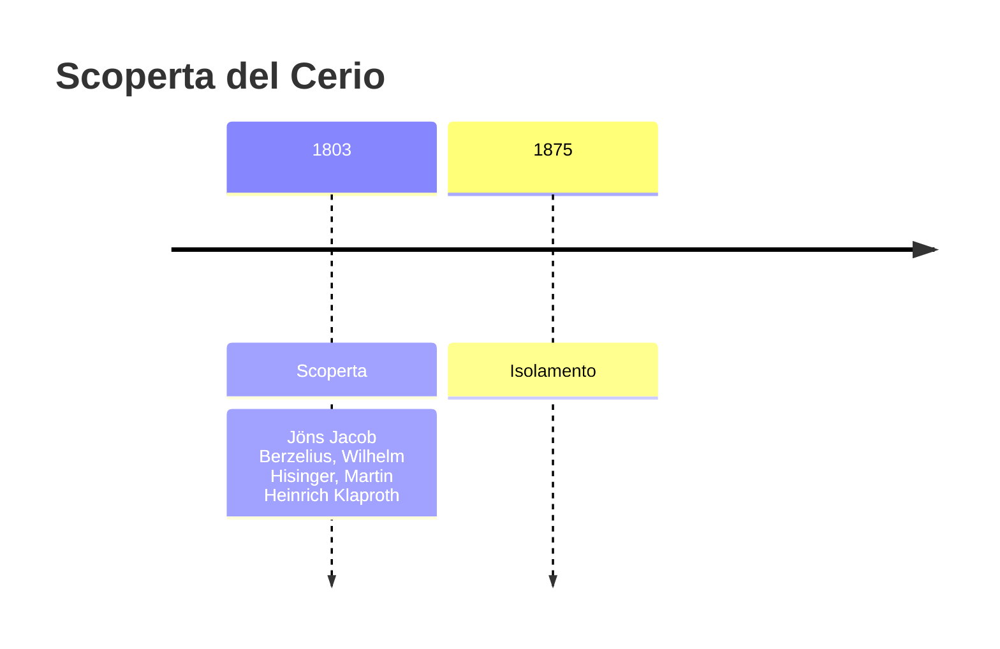
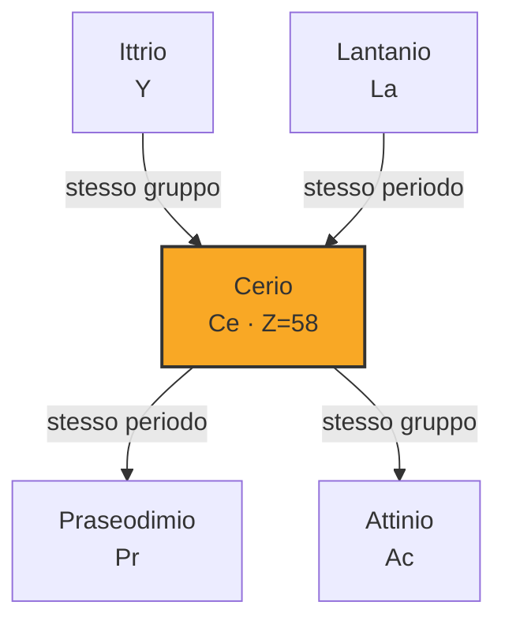
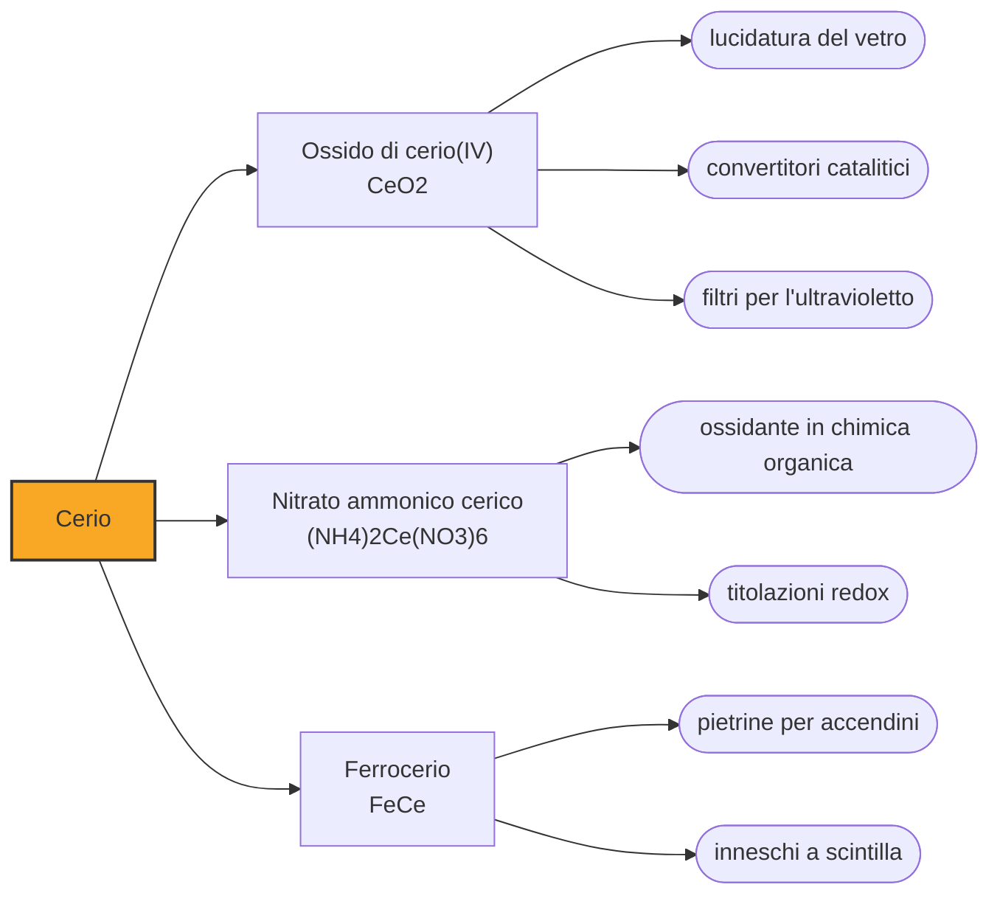

# Cerio (Ce)

> [!abstract] 44° elemento scoperto — 1803
> Nel 1803 tre chimici, in due paesi che non si parlavano, cavarono lo stesso elemento dalla stessa pietra svedese. Gli diedero il nome di un corpo celeste che allora si chiamava pianeta.

Il cerio è il più abbondante dei lantanidi e il venticinquesimo elemento della crosta terrestre: ce n'è quanto rame, più che piombo e più che stagno. È anche il più maneggevole della famiglia, perché è l'unico che in soluzione regge stabilmente lo stato di ossidazione +4, e questa singolarità è ciò che permette di separarlo dai suoi simili.

## Cronologia della scoperta

> [!info] Nota sulla cronologia
> Scoperta indipendente e quasi simultanea: Jöns Jacob Berzelius e Wilhelm Hisinger a Bastnäs, Martin Heinrich Klaproth a Berlino, entrambi nel 1803. La cronologia di riferimento comprimeva gli scopritori in «Klaproth et al.»: qui sono accreditati tutti e tre.

## Storia della scoperta

Nel 1751 Axel Fredrik Cronstedt raccolse in una miniera del Västmanland, in Svezia, un frammento di una pietra pesante e rossastra che nessuno sapeva classificare. Ne mandò un campione a Carl Wilhelm Scheele, che lo analizzò e non vi riconobbe nulla di nuovo. Il verdetto del chimico più abile d'Europa mise la pietra a riposo per mezzo secolo.

Nel 1803 la ripresero in mano Jöns Jacob Berzelius, allora ventiquattrenne, e Wilhelm Hisinger, che di quella miniera era il proprietario e di mineralogia si intendeva abbastanza da lavorarci accanto da pari. Insieme dimostrarono che la pietra conteneva una terra sconosciuta. Nello stesso periodo, a Berlino e senza sapere nulla di loro, Martin Heinrich Klaproth arrivava alla stessa conclusione su un campione dello stesso minerale.

Il nome lo scelse Berzelius, e lo prese da Cerere, che due anni prima Giuseppe Piazzi aveva individuato dall'osservatorio di Palermo e che allora era considerata un pianeta a tutti gli effetti. Cerere a sua volta portava il nome della dea romana delle messi: la catena finisce in un campo di grano, passando per un corpo celeste che nel frattempo è stato retrocesso ad asteroide.

Quella che avevano in mano non era però una sostanza sola. La ceria resistette trentasei anni prima che Carl Gustaf Mosander cominciasse a smontarla, ricavando nel 1839 il lantanio e nel 1841 il didimio, che a sua volta si rivelerà doppio. La pietra di Bastnäs conteneva mezza famiglia delle terre rare, e ciascuna separazione richiese una generazione di chimici.

La difficoltà non era il cerio ma la sua parentela. I lantanidi hanno praticamente la stessa chimica — stesso stato di ossidazione, ioni di raggio quasi uguale — e i reagenti che separano il ferro dal rame su di loro non hanno presa: si dividono solo per cristallizzazioni frazionate ripetute centinaia di volte, con rese che calano a ogni passaggio. È il motivo per cui una sola pietra svedese ha continuato a partorire elementi nuovi per ottant'anni.

Il metallo si fece attendere ancora. Il cerio è troppo elettropositivo perché i forni dell'Ottocento potessero strapparlo al suo ossido, e ci vollero i metodi elettrochimici aperti da Humphry Davy: il primo campione metallico lo ottennero nel 1875 William Francis Hillebrand e Thomas Norton, settantadue anni dopo l'annuncio della scoperta.

## Posizione nella tavola periodica

## Caratteristiche

La definizione di «terra rara» è, per il cerio, un residuo storico: con 68 parti per milione nella crosta terrestre è comune quanto il rame, e si concentra in due minerali che si estraggono in tonnellate, la bastnäsite e la monazite. Rara era la sua purificazione, non la sua presenza.

Come tutti i lantanidi il cerio vive nello stato +3, ma è l'unico ad avere anche una chimica del +4 stabile in acqua. Lo ione cerico è un ossidante forte, di un arancio-giallo carico, e la coppia +4/+3 è talmente affidabile da essere usata come reagente di titolazione. È anche la maniglia per cui il cerio si stacca dagli altri lantanidi, che quello stato non lo reggono.

Il metallo puro è tenero, si taglia con un coltello e si opacizza all'aria in poche ore. Scaldato fra i 65 e gli 80 gradi si incendia da solo, e limato o graffiato produce scintille: sono i trucioli che prendono fuoco per l'attrito, e su questo si regge il suo impiego più diffuso.

### Dati fisico-chimici

| Proprietà | Valore |
|---|---|
| Numero atomico | 58 |
| Massa atomica | 140,1161 u |
| Categoria | Lantanide |
| Gruppo | 3 |
| Periodo | 6 |
| Blocco | f |
| Configurazione elettronica | [Xe] 4f¹ 5d¹ 6s² |
| Punto di fusione | 794,9 °C |
| Punto di ebollizione | 3442,9 °C |
| Densità | 6,77 g/cm³ |
| Stati di ossidazione | +3, +4 |

## Struttura atomica

![[atomo-Cerio.svg]]

## Usi e presenza in natura

Il ferrocerio, lega di ferro e cerio messa a punto da Carl Auer von Welsbach, è la pietrina di ogni accendino: basta la ruota zigrinata a staccarne schegge che si accendono nell'aria. La stessa lega, in forma di mischmetal, contiene poco meno del cinquanta per cento di cerio e serve a disossidare acciai e ghise.

L'ossido di cerio è il materiale con cui si lucidano le lenti e gli schermi di vetro, e sta nei convertitori catalitici delle automobili per una ragione chimica precisa: passando avanti e indietro fra +4 e +3 assorbe e restituisce ossigeno, e tiene la miscela nella finestra in cui il catalizzatore lavora. Colorato di giallo, filtra l'ultravioletto nei vetri.

Il cerio esce dalle stesse miniere di tutte le terre rare, e siccome ce n'è più di quanto il mercato ne chieda finisce spesso come sottoprodotto in eccedenza della corsa al neodimio: chi estrae terre rare per i magneti si trova fra le mani cerio in abbondanza e deve trovargli un impiego.

## Curiosità

Nella reazione di Belousov-Žabotinskij il cerio oscilla fra +4 e +3 e la soluzione cambia colore a intervalli regolari, avanti e indietro, per minuti: la dimostrazione da banco che una reazione chimica può comportarsi come un orologio invece che come una discesa a senso unico.

Durante il progetto Manhattan i composti di cerio furono studiati a Berkeley come materiale per i crogioli in cui fondere uranio e plutonio, e la produzione di cerio ad altissima purezza cominciò ad Ames nella metà del 1944, per fermarsi nell'agosto del 1945.

## Nella cronologia

← Precedente: [[Tantalio]] (1802)
→ Successivo: [[Osmio]] (1803)

Epoca: [[L'età dell'elettrolisi]] · Scopritori: [[Jöns Jacob Berzelius]], [[Wilhelm Hisinger]], [[Martin Heinrich Klaproth]]

## Fonti

- [Cerium](https://en.wikipedia.org/wiki/Cerium) — consultata il 09/09/2026
- [Cerium — Royal Society of Chemistry](https://periodic-table.rsc.org/element/58/cerium) — consultata il 09/09/2026
- [Ceres (dwarf planet)](https://en.wikipedia.org/wiki/Ceres_%28dwarf_planet%29) — consultata il 09/09/2026

---

> [!warning] Avvertenza
> Questo progetto è stato realizzato con l'assistenza di sistemi di
> intelligenza artificiale. I contenuti sono verificati sulle fonti citate,
> ma **possono contenere errori e imprecisioni**: prima di riutilizzarli,
> controlla la fonte.
