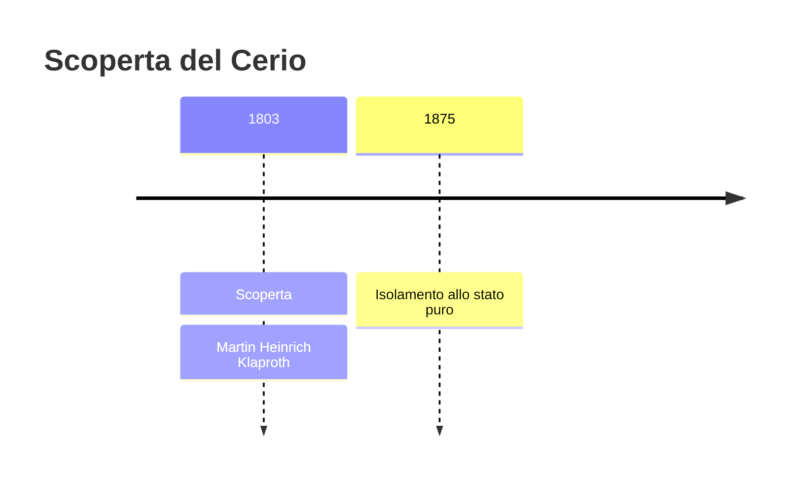
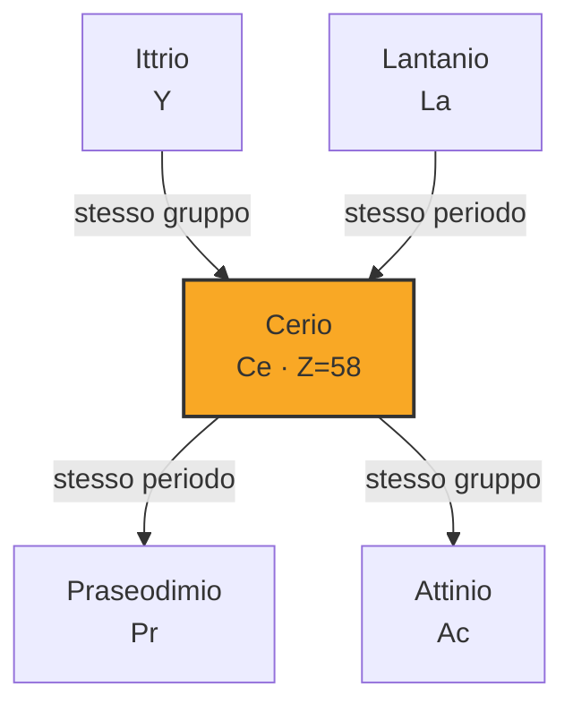

# Cerio (Ce)

> [!abstract] 44° elemento scoperto — 1803
> 

## Cronologia della scoperta

## Storia della scoperta

## Posizione nella tavola periodica

## Caratteristiche

### Dati fisico-chimici

| Proprietà | Valore |
|---|---|
| Numero atomico | 58 |
| Massa atomica | 140,1161 u |
| Categoria | Lantanide |
| Gruppo | 3 |
| Periodo | 6 |
| Blocco | f |
| Configurazione elettronica | [Xe] 4f¹ 5d¹ 6s² |
| Punto di fusione | 794,9 °C |
| Punto di ebollizione | 3442,9 °C |
| Densità | 6,77 g/cm³ |
| Stati di ossidazione | — |

## Struttura atomica

![[atomo-Cerio.svg]]

## Usi e presenza in natura

## Nella cronologia

← Precedente: [[Tantalio]] (1802)
→ Successivo: [[Osmio]] (1803)

Epoca: [[L'età dell'elettrolisi]] · Scopritore: [[Martin Heinrich Klaproth]]

## Fonti

