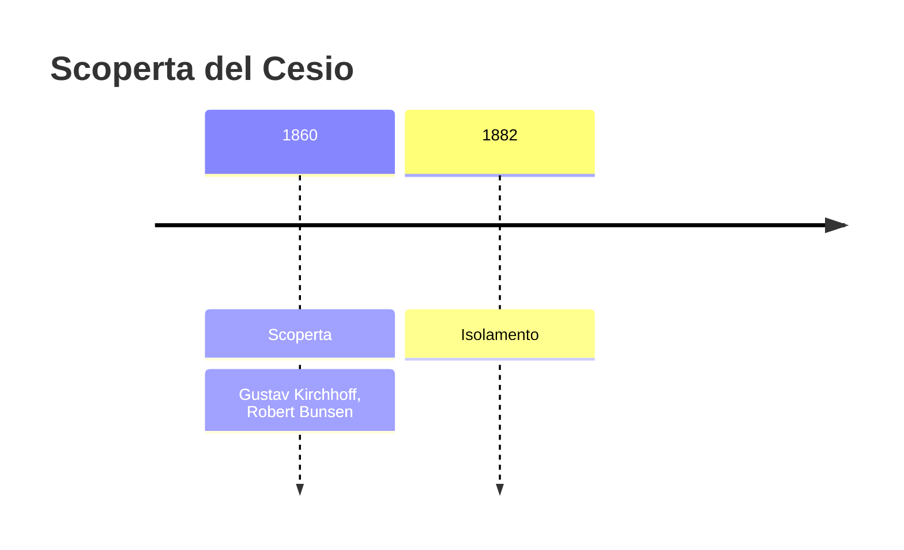
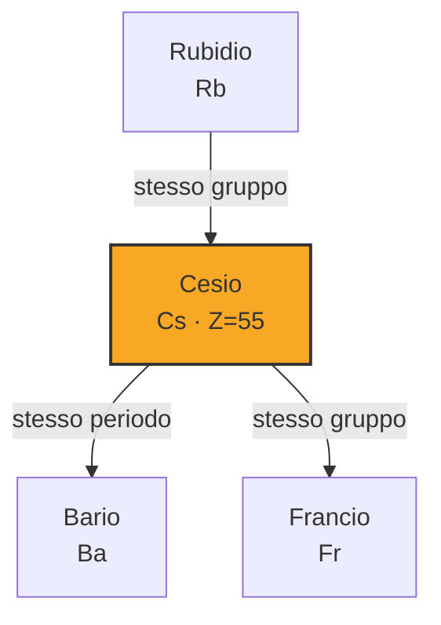

# Cesio (Cs)

> [!abstract] 61° elemento scoperto — 1860
> 

## Cronologia della scoperta

## Storia della scoperta

## Posizione nella tavola periodica

## Caratteristiche

### Dati fisico-chimici

| Proprietà | Valore |
|---|---|
| Numero atomico | 55 |
| Massa atomica | 132,905451966 u |
| Categoria | Metallo alcalino |
| Gruppo | 1 |
| Periodo | 6 |
| Blocco | s |
| Configurazione elettronica | [Xe] 6s¹ |
| Punto di fusione | 28,6 °C |
| Punto di ebollizione | 670,9 °C |
| Densità | 1,93 g/cm³ |
| Stati di ossidazione | — |

## Struttura atomica

![[atomo-Cesio.svg]]

## Usi e presenza in natura

## Nella cronologia

← Precedente: [[Rutenio]] (1844)
→ Successivo: [[Rubidio]] (1861)

Epoca: [[Spettroscopia e radioattività]] · Scopritori: [[Gustav Kirchhoff]], [[Robert Bunsen]]

## Fonti

