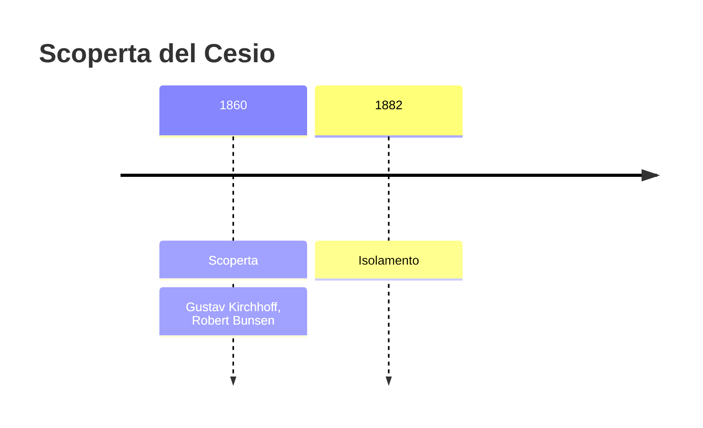
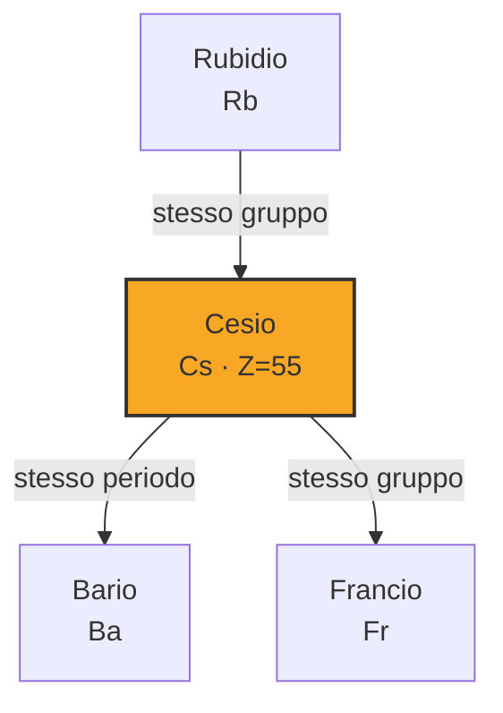
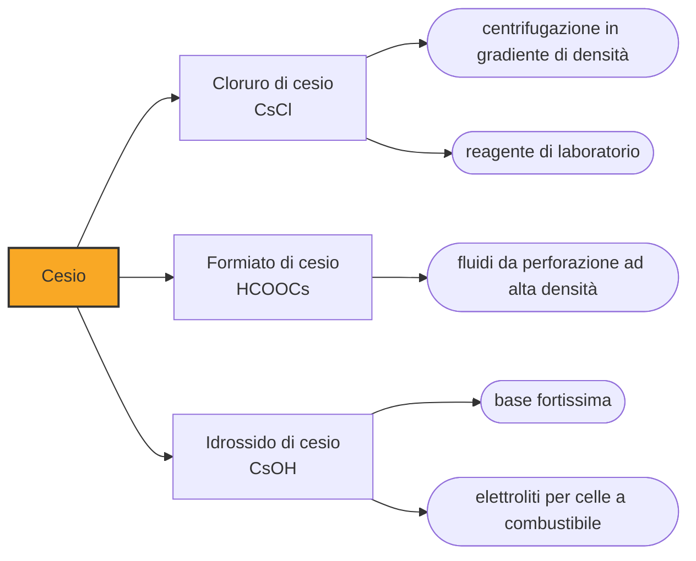

# Cesio (Cs)

> [!abstract] 61° elemento scoperto — 1860
> Per avere qualche grammo di un elemento nuovo, Bunsen e Kirchhoff fecero evaporare quarantaquattromila litri d'acqua minerale. Lo avevano già visto: erano due righe azzurre in uno spettro.

Il cesio è il più reattivo e il più elettropositivo dei metalli: fonde a 28 gradi, cioè si scioglie in mano attraverso il vetro della fiala che lo contiene, e a contatto con l'acqua reagisce con violenza esplosiva anche a temperature basse. Oggi il suo compito principale è misurare il tempo, e lo fa meglio di qualunque altra cosa esista.

## Cronologia della scoperta

## Storia della scoperta

Nel 1859 Robert Bunsen e Gustav Kirchhoff, a Heidelberg, misero insieme un becco a gas dalla fiamma incolore e un prisma, e ottennero uno strumento che nessuno aveva mai avuto: bruciando una sostanza si potevano leggere le righe colorate che emetteva, e quelle righe erano diverse per ogni elemento. Era il primo metodo capace di dire che cosa c'è in un campione senza doverlo separare.

Nel 1860 i due esaminarono l'acqua di una sorgente minerale di Dürkheim e vi trovarono due righe azzurre che non appartenevano a nessuno degli elementi noti. Non avevano isolato niente, non avevano in mano nemmeno un granello di sostanza nuova: avevano solo due righe, e su quelle annunciarono un elemento. Era il primo elemento scoperto per via spettroscopica.

Passare dalle righe alla sostanza fu un lavoro industriale. Per concentrare abbastanza sali da poterci lavorare, Bunsen fece evaporare quarantaquattromila litri di acqua minerale, che diedero 240 chilogrammi di soluzione salina concentrata; da quella ricavò pochi grammi di composti di cesio. Il nome venne dal latino caesius, «azzurro grigio», che era il colore delle due righe.

Il metallo non lo ottennero loro. Il cesio è talmente elettropositivo che l'elettrolisi dei suoi sali comuni restituisce composti invece del metallo, e ci vollero ventidue anni e un'altra idea: nel 1882 lo svedese Carl Setterberg elettrolizzò il cianuro di cesio, evitando i problemi che il cloruro portava con sé, e ottenne il metallo puro.

L'anno dopo, con lo stesso strumento, Bunsen e Kirchhoff trovarono il rubidio, e nei quindici anni successivi la spettroscopia consegnò alla tavola periodica tallio, indio, gallio ed elio. Un elemento non doveva più essere isolato per essere scoperto: bastava che la sua luce non somigliasse a quella di nessun altro.

## Posizione nella tavola periodica

## Caratteristiche

Fra i metalli alcalini il cesio è quello che cede l'elettrone esterno con meno fatica di tutti, ed è per questo il più elettropositivo degli elementi. Si incendia a contatto con l'aria, reagisce con l'acqua in modo esplosivo anche sotto zero, e va conservato in fiale sigillate sotto vuoto o sotto argon: l'olio minerale, che basta per il sodio, con lui non basta.

Fonde a 28,5 gradi, il che lo rende uno dei pochi metalli che si possono vedere liquidi in una giornata calda. Da liquido è dorato, denso, e bagna il vetro; da solido è tenero al punto di deformarsi sotto un'unghia. Del gruppo degli alcalini è anche il più pesante fra quelli stabili.

In natura esiste un solo isotopo stabile, il cesio-133, ed è quello degli orologi atomici. Gli altri sono artificiali, e uno in particolare, il cesio-137, è fra i prodotti di fissione più abbondanti: con trent'anni di emivita e una chimica praticamente identica a quella del potassio, entra nei tessuti viventi al posto suo. È la ragione per cui le contaminazioni radioattive di Černobyl' e di Fukushima si misurano ancora oggi nel suolo, nei funghi e nella selvaggina.

### Dati fisico-chimici

| Proprietà | Valore |
|---|---|
| Numero atomico | 55 |
| Massa atomica | 132,905451966 u |
| Categoria | Metallo alcalino |
| Gruppo | 1 |
| Periodo | 6 |
| Blocco | s |
| Configurazione elettronica | [Xe] 6s¹ |
| Punto di fusione | 28,6 °C |
| Punto di ebollizione | 670,9 °C |
| Densità | 1,93 g/cm³ |
| Stati di ossidazione | +1 |

## Struttura atomica

![[atomo-Cesio.svg]]

## Usi e presenza in natura

Dal 1967 il secondo non è più una frazione del giorno solare ma una proprietà del cesio: è definito come 9.192.631.770 cicli della radiazione emessa nella transizione fra due livelli iperfini dell'atomo di cesio-133. Ogni orologio atomico, ogni satellite di navigazione e ogni rete che ha bisogno di sapere l'ora esatta discende da quella definizione.

L'impiego che ne consuma di più in massa è però un altro: il formiato di cesio è un sale molto denso e solubile con cui si preparano i fluidi da perforazione per i pozzi profondi, dove serve un liquido pesante che regga la pressione senza portare in giro particelle solide che danneggerebbero il giacimento.

Il cesio si estrae dalla pollucite, un minerale delle pegmatiti, e il grosso delle riserve conosciute sta in un solo giacimento, quello di Bernic Lake in Manitoba, che da solo supera i due terzi della base di riserva mondiale. È una concentrazione che nessun altro elemento industriale conosce, e vale la pena ricordarla ogni volta che si parla di materie prime critiche: la scarsità di un elemento è quasi sempre una questione di dove sta, non di quanto ce n'è.

## Curiosità

La stessa facilità con cui cede l'elettrone ha dato al cesio la sua prima carriera tecnica: nelle fotocellule e nei fotomoltiplicatori un catodo al cesio libera elettroni quando la luce lo colpisce, ed è il principio con cui hanno funzionato per decenni gli esposimetri, i sensori di prossimità e le prime televisioni.

Un orologio al cesio sbaglia di meno di un secondo in qualche milione di anni, e questa precisione ha una conseguenza curiosa: gli orologi vanno abbastanza bene da misurare che il tempo scorre più lento in basso che in alto, come prevede la relatività generale. Bastano poche decine di centimetri di dislivello perché la differenza si veda.

## Nella cronologia

← Precedente: [[Rutenio]] (1844)
→ Successivo: [[Rubidio]] (1861)

Epoca: [[Spettroscopia e radioattività]] · Scopritori: [[Gustav Kirchhoff]], [[Robert Bunsen]]

## Fonti

- [Caesium](https://en.wikipedia.org/wiki/Caesium) — consultata il 09/09/2026
- [Caesium — Royal Society of Chemistry](https://periodic-table.rsc.org/element/55/caesium) — consultata il 09/09/2026
- [Second](https://en.wikipedia.org/wiki/Second) — consultata il 09/09/2026
