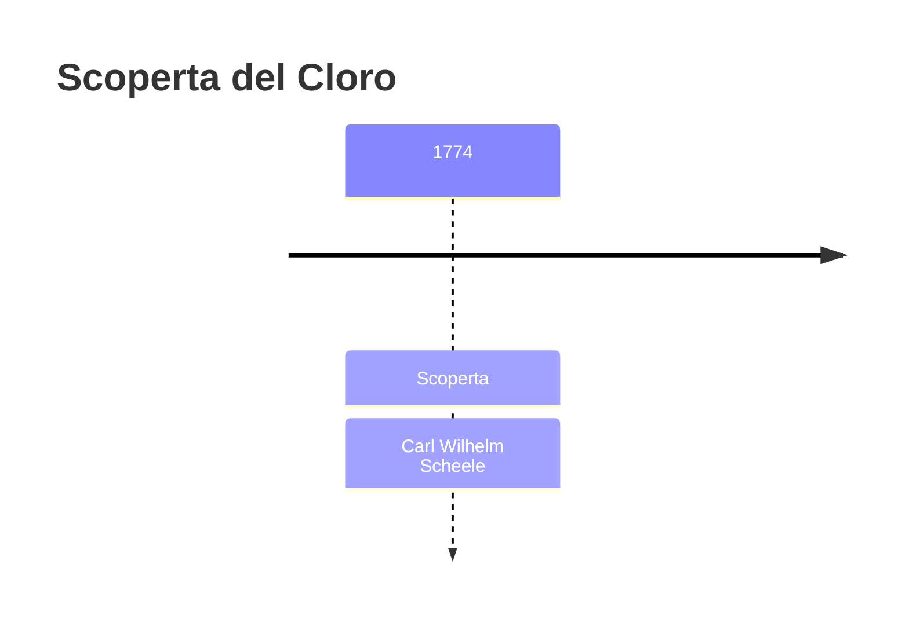
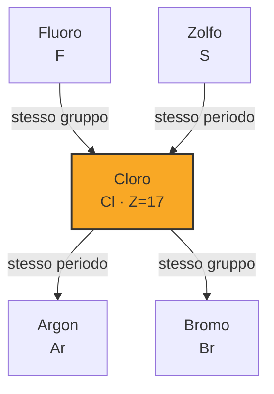
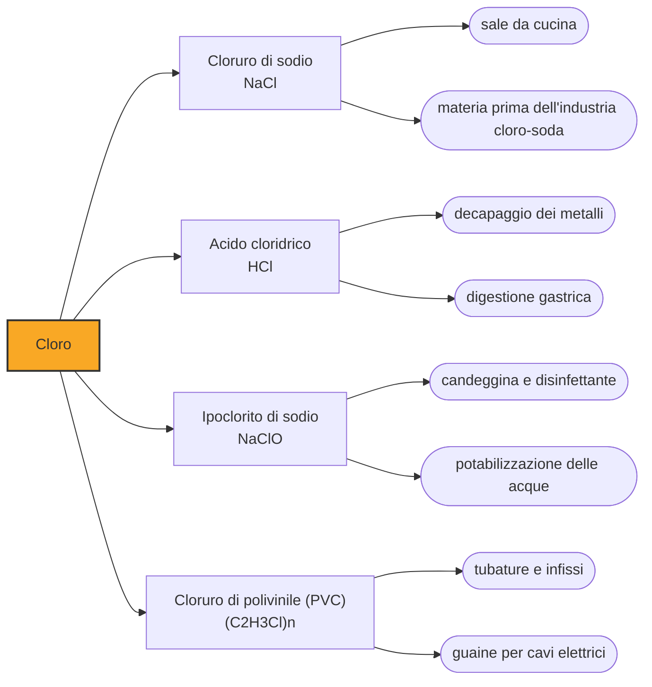

# Cloro (Cl)

> [!abstract] 28° elemento scoperto — 1774
> Scheele lo produsse nel 1774 e passò il resto della vita convinto che fosse un composto. Ci vollero trentasei anni e Humphry Davy per stabilire che non si poteva scomporre in nulla.

Il cloro è un gas giallo-verde, denso e dall'odore soffocante, e ha una doppia biografia difficile da conciliare: è stata la prima arma chimica della storia moderna e insieme una delle tecnologie sanitarie che hanno salvato più vite di qualsiasi altra. La stessa proprietà spiega entrambe le carriere, perché il cloro distrugge la materia organica, e distruggerla può significare uccidere un uomo o uccidere il batterio del tifo in un acquedotto.

## Cronologia della scoperta

## Storia della scoperta

Nel 1774 Carl Wilhelm Scheele fa reagire la pirolusite, il minerale nero di manganese, con l'acido muriatico, cioè l'acido cloridrico. Si sviluppa un gas giallo-verde dall'odore violento che sbianca la carta di tornasole invece di arrossarla come farebbe un acido, corrode i metalli e scolora i tessuti e i fiori. Scheele annota tutte queste proprietà con la consueta precisione, e sbaglia soltanto nell'unico punto in cui non poteva fare altrimenti.

Lo chiama aria di acido muriatico deflogisticato, un nome che è tutta la teoria del tempo condensata in quattro parole. Nella cornice del flogisto quel gas non poteva essere una sostanza semplice: doveva essere acido muriatico privato del suo flogisto. Quando poi Lavoisier sostituì il flogisto con l'ossigeno, l'errore cambiò forma senza sparire, perché la nuova teoria pretendeva che ogni acido contenesse ossigeno e quindi che il gas fosse un ossido di un elemento ancora ignoto, il murium.

La questione la chiude Humphry Davy nel 1810, e la chiude togliendo qualcosa invece di aggiungerlo. Prova in tutti i modi a estrarre ossigeno da quel gas, con il carbone incandescente e con i metalli più avidi di ossigeno che conosce, e non ne cava nulla: se l'ossigeno non c'è, il gas non è un ossido ma un elemento. Lo annuncia alla Royal Society il 15 novembre di quell'anno e lo chiama chlorine, dal greco chloros, verde pallido, cioè dal suo colore e da nient'altro.

La conclusione non fu accolta subito. Chimici della statura di Berthollet e dello stesso Gay-Lussac continuarono per anni a ritenere che l'ossigeno dovesse esserci e che semplicemente non lo si sapeva estrarre, perché ammettere il contrario significava smontare il pilastro dell'edificio di Lavoisier, cioè che l'ossigeno fosse il principio di ogni acidità. Il cloro è l'elemento che ha dimostrato falsa quella tesi, e il nome dell'ossigeno resta lì a ricordarla.

## Posizione nella tavola periodica

## Caratteristiche

Il cloro sta appena sotto il fluoro nella tavola periodica e ne ripete il carattere con un grado di violenza in meno: gli manca un elettrone, lo prende quasi da chiunque, e nella grande maggioranza dei suoi composti si trova allo stato meno uno. Legato all'ossigeno assume però anche stati positivi, fino a più sette nei perclorati, ed è da questa famiglia di composti che vengono i candeggianti e i disinfettanti, perché in essi il cloro è un ossidante pronto a scaricarsi.

La sua forma naturale è la più innocua che si possa immaginare. In natura il cloro non esiste libero: è tutto ione cloruro, disciolto negli oceani e depositato nei giacimenti di salgemma, e il cloruro è la sostanza che rende salato il mare e il sangue. Fra il gas che soffoca e lo ione che beviamo la differenza è un solo elettrone, ed è l'esempio più didattico del principio secondo cui le proprietà di un elemento non sono quelle dei suoi ioni.

Legato al carbonio, il cloro dà una famiglia di composti tanto utili quanto problematici. Il legame carbonio-cloro è stabile e conferisce alle molecole resistenza, non infiammabilità e potere solvente, doti che hanno reso i clorurati onnipresenti nel Novecento; le stesse doti li rendono però persistenti nell'ambiente, e alcuni fra i più noti — il DDT, i policlorobifenili, i clorofluorocarburi — sono stati vietati proprio perché non si degradavano.

### Dati fisico-chimici

| Proprietà | Valore |
|---|---|
| Numero atomico | 17 |
| Massa atomica | 35,45 u |
| Categoria | Alogeno |
| Gruppo | 17 |
| Periodo | 3 |
| Blocco | p |
| Configurazione elettronica | [Ne] 3s² 3p⁵ |
| Punto di fusione | -101,6 °C |
| Punto di ebollizione | -34,0 °C |
| Densità | 3,2 g/cm³ |
| Stati di ossidazione | -1, +1, +3, +4, +5, +7 |

## Struttura atomica

![[atomo-Cloro.svg]]

## Usi e presenza in natura

Il cloro industriale si ottiene per elettrolisi della salamoia, un processo che produce contemporaneamente soda caustica e idrogeno ed è fra i maggiori consumatori di energia elettrica dell'industria chimica. La destinazione singola più importante è il cloruro di polivinile, il PVC di tubature, infissi e cavi, che da solo assorbe fra il trentacinque e il quaranta per cento del cloro prodotto nel mondo; il resto si distribuisce fra solventi, farmaci e disinfettanti.

L'impiego che conta di più non si misura in tonnellate. Nel 1908 l'acquedotto di Jersey City fu il primo negli Stati Uniti a clorare stabilmente l'acqua potabile su larga scala, per iniziativa del medico John Leal, e nel giro di pochi anni la febbre tifoide crollò nelle città che seguirono l'esempio. La disinfezione delle acque è considerata fra i maggiori progressi della sanità pubblica del Novecento, e si regge su dosi di cloro dell'ordine di un milligrammo per litro.

## Curiosità

Il 22 aprile 1915 a Ypres l'esercito tedesco aprì le valvole di migliaia di bombole e lasciò che il vento portasse una nube di cloro sulle linee franco-algerine: è l'atto di nascita della guerra chimica su scala industriale. Il cloro è più denso dell'aria e quindi scendeva nelle trincee invece di disperdersi, il che lo rendeva atrocemente efficace proprio contro i soldati che vi cercavano riparo.

L'avvertenza di non mescolare i prodotti per la pulizia ha un fondamento chimico preciso e riguarda proprio la reazione di Scheele al contrario. La candeggina contiene ipoclorito; se le si aggiunge un anticalcare acido, l'ipoclorito si riduce e libera cloro gassoso nel bagno di casa. Mescolarla invece con l'ammoniaca produce cloroammine, altrettanto irritanti per le vie respiratorie. Sono fra gli avvelenamenti domestici più frequenti, e nascono sempre dall'idea che due detergenti puliscano più di uno.

## Nella cronologia

← Precedente: [[Bario]] (1772)
→ Successivo: [[Molibdeno]] (1778)

Epoca: [[Chimica pneumatica]] · Scopritore: [[Carl Wilhelm Scheele]]

## Fonti

- [Chlorine](https://en.wikipedia.org/wiki/Chlorine) — consultata il 07/09/2026
- [Carl Wilhelm Scheele](https://en.wikipedia.org/wiki/Carl_Wilhelm_Scheele) — consultata il 07/09/2026
- [John L. Leal](https://en.wikipedia.org/wiki/John_L._Leal) — consultata il 07/09/2026
- [PVC and chlorine (Vinyl Council of Australia)](https://www.vinyl.org.au/chlorine) — consultata il 07/09/2026
