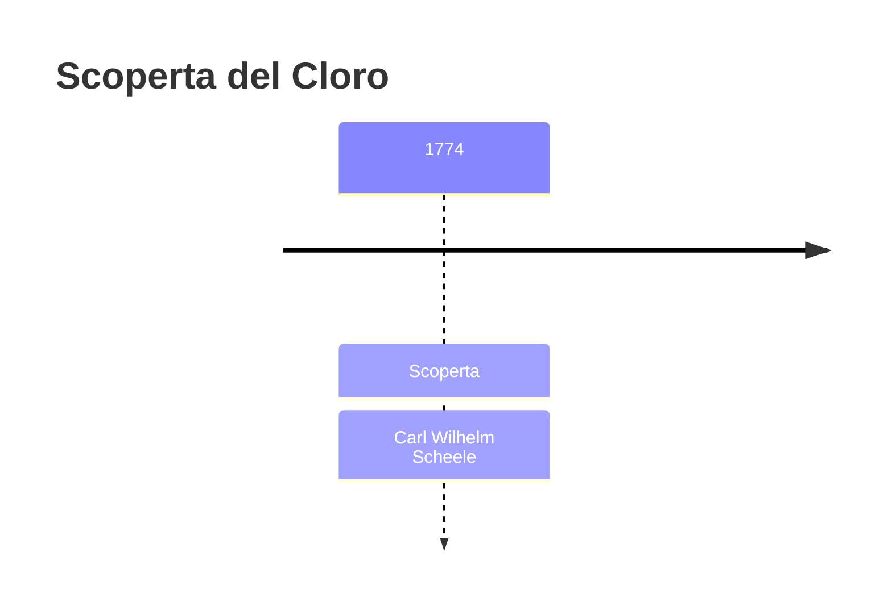
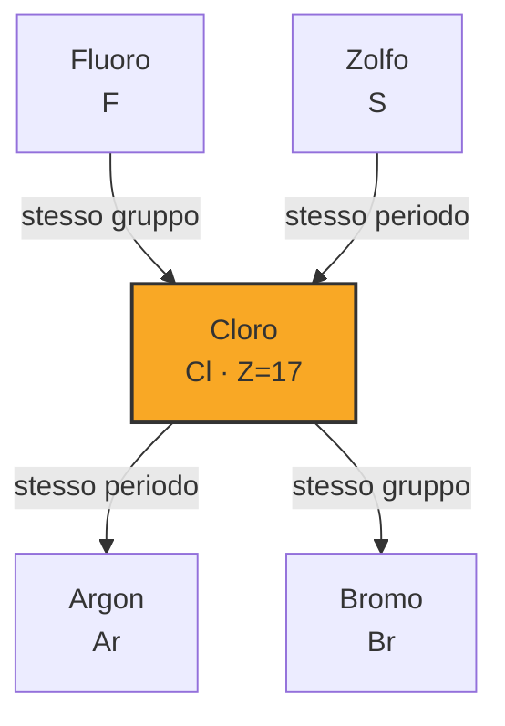

# Cloro (Cl)

> [!abstract] 28° elemento scoperto — 1774
> 

## Cronologia della scoperta

## Storia della scoperta

## Posizione nella tavola periodica

## Caratteristiche

### Dati fisico-chimici

| Proprietà | Valore |
|---|---|
| Numero atomico | 17 |
| Massa atomica | 35,45 u |
| Categoria | Alogeno |
| Gruppo | 17 |
| Periodo | 3 |
| Blocco | p |
| Configurazione elettronica | [Ne] 3s² 3p⁵ |
| Punto di fusione | -101,6 °C |
| Punto di ebollizione | -34,0 °C |
| Densità | 3,2 g/cm³ |
| Stati di ossidazione | — |

## Struttura atomica

![[atomo-Cloro.svg]]

## Usi e presenza in natura

## Nella cronologia

← Precedente: [[Bario]] (1772)
→ Successivo: [[Molibdeno]] (1778)

Epoca: [[Chimica pneumatica]] · Scopritore: [[Carl Wilhelm Scheele]]

## Fonti

