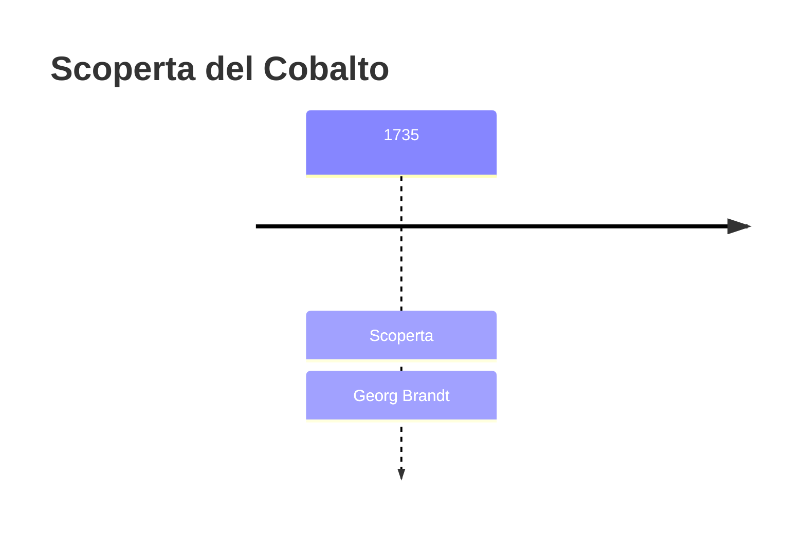
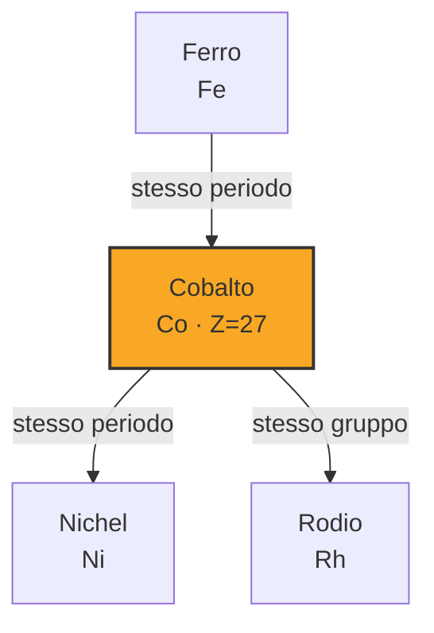

# Cobalto (Co)

> [!abstract] 17° elemento scoperto — 1735
> 

## Cronologia della scoperta

## Storia della scoperta

## Posizione nella tavola periodica

## Caratteristiche

### Dati fisico-chimici

| Proprietà | Valore |
|---|---|
| Numero atomico | 27 |
| Massa atomica | 58,9331944 u |
| Categoria | Metallo di transizione |
| Gruppo | 9 |
| Periodo | 4 |
| Blocco | d |
| Configurazione elettronica | [Ar] 3d⁷ 4s² |
| Punto di fusione | 1494,9 °C |
| Punto di ebollizione | 2926,9 °C |
| Densità | 8,9 g/cm³ |
| Stati di ossidazione | — |

## Struttura atomica

![[atomo-Cobalto.svg]]

## Usi e presenza in natura

## Nella cronologia

← Precedente: [[Idrogeno]] (1671)
→ Successivo: [[Silicio]] (1739)

Epoca: [[Alchimia e primo moderno]] · Scopritore: [[Georg Brandt]]

## Fonti

