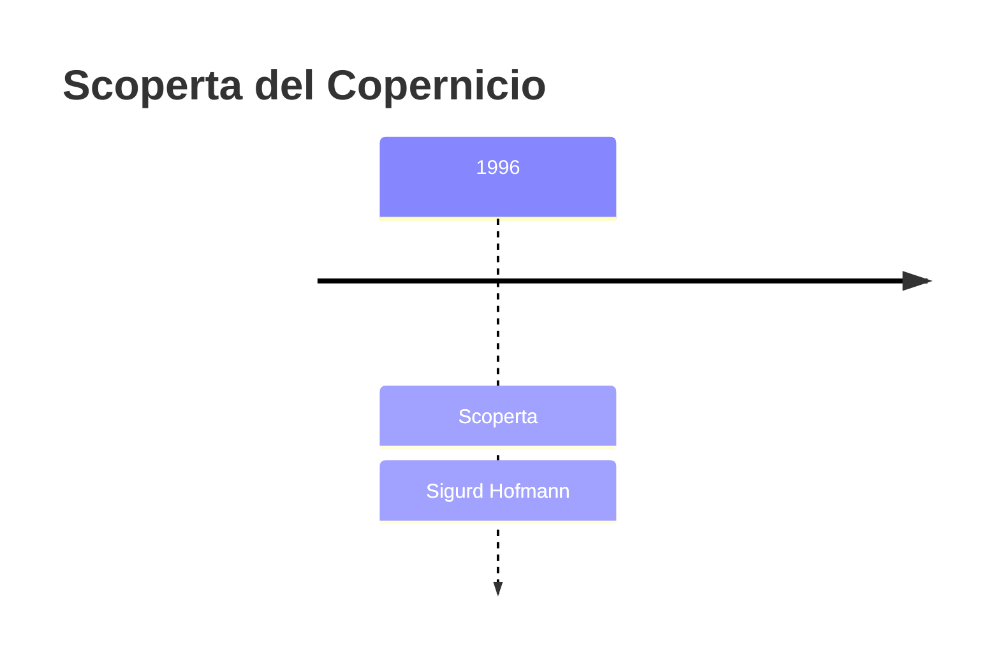
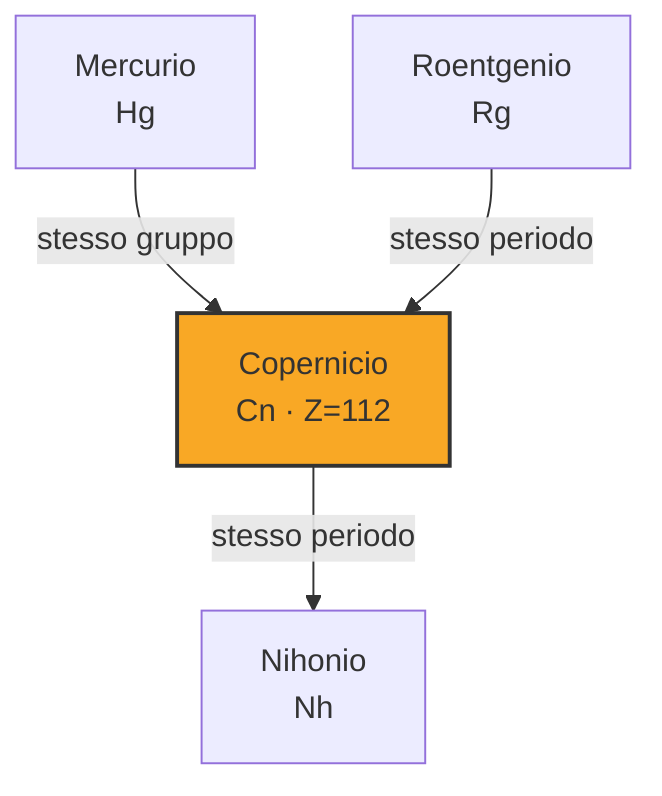
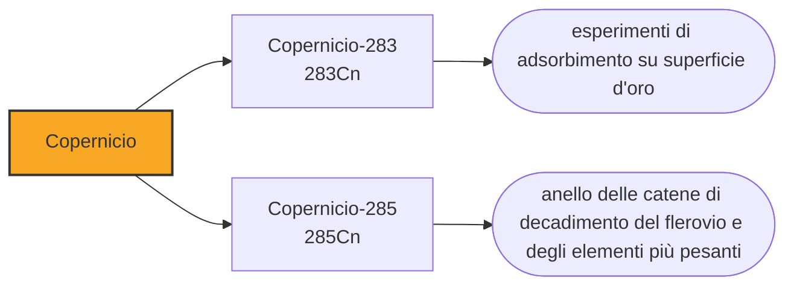

# Copernicio (Cn)

> [!abstract] 112° elemento scoperto — 1996
> Il copernicio sta nella colonna dei metalli, sotto il mercurio. Nel 2006 due suoi atomi sono stati fatti passare su una superficie d'oro per rispondere a una domanda che di solito non si pone: è davvero un metallo?

Il copernicio chiude la serie delle sei caselle prese dal laboratorio di Darmstadt, ed è l'elemento su cui resta aperta la più elementare delle domande. Non se ne discute la posizione nella tavola né la famiglia di appartenenza: si discute se, potendone accumulare abbastanza, si troverebbe davanti un metallo, un liquido o un gas.

## Cronologia della scoperta

> [!info] Nota sulla cronologia
> La data adottata è quella della sintesi, il 9 febbraio 1996; il riconoscimento IUPAC è del maggio 2009, dopo due giudizi di insufficienza e la ripetizione indipendente del RIKEN. Un secondo evento riportato insieme al primo è stato ritirato perché fabbricato. Il simbolo proposto, Cp, è stato cambiato in Cn perché già in uso per il cassiopeio e per il ciclopentadienile; il nome è ufficiale dal 19 febbraio 2010.

## Storia della scoperta

Il 9 febbraio 1996 il gruppo di Sigurd Hofmann bombardò piombo-208 con ioni di zinco-70 e ottenne un atomo di copernicio-277. Uno. Un secondo evento riportato insieme al primo si rivelò poi fabbricato, come il quarto atomo del darmstadtio, e fu ritirato: la scoperta restò appesa a un singolo nucleo autentico.

Ci vollero tredici anni perché la scoperta fosse riconosciuta. La commissione internazionale la giudicò insufficiente nel 2001 e di nuovo nel 2003, per discrepanze nei dati di uno dei nuclei della catena di decadimento; il GSI raccolse altri dati fra il 2001 e il 2005, e il RIKEN in Giappone rifece l'esperimento in modo indipendente. Solo allora, nel maggio del 2009, la IUPAC attribuì l'elemento ai tedeschi.

La ripetizione da parte di un altro laboratorio è la ragione per cui la vicenda si è chiusa, e non è un dettaglio burocratico: è la sola difesa contro il caso e contro l'errore quando la prova consiste in una manciata di eventi. Il criterio che aveva rallentato il roentgenio ha rallentato anche il copernicio, e in entrambi i casi ha funzionato.

Nel luglio del 2009 il GSI propose copernicium, per onorare, scrissero, uno scienziato che ha cambiato il nostro modo di vedere il mondo. La scelta è insolita: Niccolò Copernico non era né un fisico nucleare né un chimico, e la sua opera precede di quattro secoli l'idea stessa di elemento chimico. La IUPAC ufficializzò il nome il 19 febbraio 2010, cinquecentotrentasettesimo anniversario della nascita dell'astronomo.

Il simbolo proposto era Cp, e fu cambiato in Cn prima dell'ufficializzazione. Cp era già stato usato per il cassiopeio, vecchio nome del lutezio, e soprattutto indica oggi il ciclopentadienile, uno dei gruppi più comuni della chimica metallorganica: una formula come «CpFe» avrebbe avuto due letture incompatibili. È lo stesso genere di problema che aveva fatto discutere sul bohrio e sul boro.

## Posizione nella tavola periodica

## Caratteristiche

Il copernicio sta nel gruppo 12, sotto zinco, cadmio e mercurio, e quella colonna ha già una sua stranezza: il mercurio è l'unico metallo liquido a temperatura ambiente. La ragione è che i suoi elettroni esterni sono legati con insolita saldezza e partecipano poco al legame metallico. Nel copernicio lo stesso effetto è molto più forte.

In un atomo così pesante gli elettroni del guscio più esterno si muovono a una frazione notevole della velocità della luce, e la relatività li tira verso il nucleo, abbassandone l'energia. Il risultato è un guscio pieno e stabile che assomiglia più a quello di un gas nobile che a quello di un metallo, e un atomo poco disposto a legarsi ai propri simili.

L'esperimento decisivo è stato fatto a Dubna fra il 2006 e il 2007 su due atomi di copernicio-283, fatti scorrere lungo una superficie d'oro raffreddata a gradiente di temperatura. Un metallo del gruppo 12 si lega all'oro e si ferma presto; un gas nobile lo attraversa senza fermarsi. Il copernicio si è fermato, ma molto più in là del mercurio: è un metallo, il più volatile della propria colonna, con un legame all'oro debole.

Che cosa sarebbe a temperatura ambiente resta però indeciso. Alcuni calcoli lo danno gassoso, altri liquido e tenuto insieme da forze deboli, con una densità stimata attorno ai quattordici grammi per centimetro cubo, poco più del mercurio. Nessuna delle due ipotesi si potrà verificare finché non se ne accumulerà una quantità visibile, cosa che nessuna tecnica nota permette.

Si conoscono una dozzina di isotopi del copernicio. Il più longevo è il copernicio-285, che dura una trentina di secondi ed è il figlio del decadimento del flerovio; il copernicio-283, quello usato per la chimica, ne dura quattro. Gli isotopi ottenuti sparando zinco sul piombo, come l'atomo del 1996, durano meno di un millesimo di secondo.

### Dati fisico-chimici

| Proprietà | Valore |
|---|---|
| Numero atomico | 112 |
| Massa atomica | 285,0 u |
| Categoria | Metallo di transizione |
| Gruppo | 12 |
| Periodo | 7 |
| Blocco | d |
| Configurazione elettronica | [Rn] 5f¹⁴ 6d¹⁰ 7s² |
| Punto di fusione | dato non disponibile |
| Punto di ebollizione | 3296,9 °C |
| Densità | 14,0 g/cm³ |
| Stati di ossidazione | +2, +4 |

## Struttura atomica

![[atomo-Copernicio.svg]]

## Usi e presenza in natura

Il copernicio non ha usi e non ne avrà: non esiste in natura e se ne producono singoli atomi. È però uno dei pochi elementi di questa parte della tavola su cui un esperimento chimico si è potuto fare davvero, e questo lo rende prezioso per chi calcola.

La domanda che il copernicio mette alla prova è dove finisca il concetto stesso di metallo. Se un elemento della colonna dello zinco si comporta quasi da gas nobile, allora le famiglie della tavola periodica smettono di predire il comportamento macroscopico anche quando continuano a predire quello elettronico. Sapere di quanto il copernicio si discosti dal mercurio è il dato con cui si tarano le previsioni su tutti gli elementi che seguono.

## Curiosità

Nella tavola periodica i corpi celesti abbondano — l'uranio, il nettunio e il plutonio dai pianeti, il cerio e il palladio da due asteroidi, l'elio dal Sole, il tellurio e il selenio dalla Terra e dalla Luna — ma fra le caselle intitolate a persone un astronomo mancava. Il copernicio l'ha aggiunto cinque secoli dopo, e la motivazione ufficiale non cita l'astronomia: cita il fatto di aver cambiato il modo in cui guardiamo il mondo.

Con il copernicio finisce la serie di Darmstadt: sei caselle consecutive, dal 107 al 112, riempite dallo stesso laboratorio fra il 1981 e il 1996 con lo stesso metodo e in gran parte con le stesse persone. Con quel metodo, dopo il 112, sarebbe stata riempita ancora una casella — il 113, in Giappone e dieci anni più tardi — ma la corsa verso la fine della riga era già ripartita altrove, con una tecnica diversa.

## Nella cronologia

← Precedente: [[Roentgenio]] (1994)
→ Successivo: [[Livermorio]] (2000)

Epoca: [[Era nucleare]] · Scopritore: [[Sigurd Hofmann]]

## Fonti

- [Copernicium](https://en.wikipedia.org/wiki/Copernicium) — consultata il 10/09/2026
- [Copernicium — Royal Society of Chemistry](https://periodic-table.rsc.org/element/112/copernicium) — consultata il 10/09/2026
- [Nicolaus Copernicus](https://en.wikipedia.org/wiki/Nicolaus_Copernicus) — consultata il 10/09/2026
