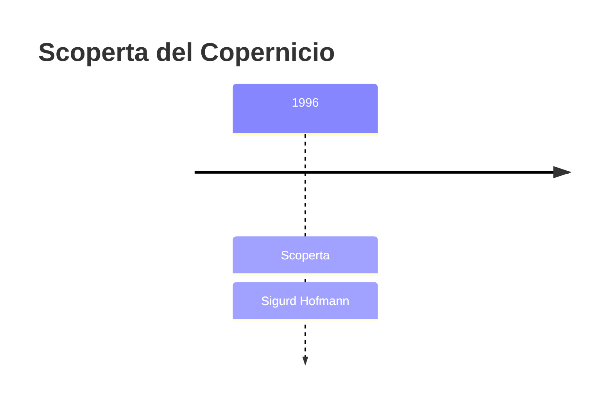
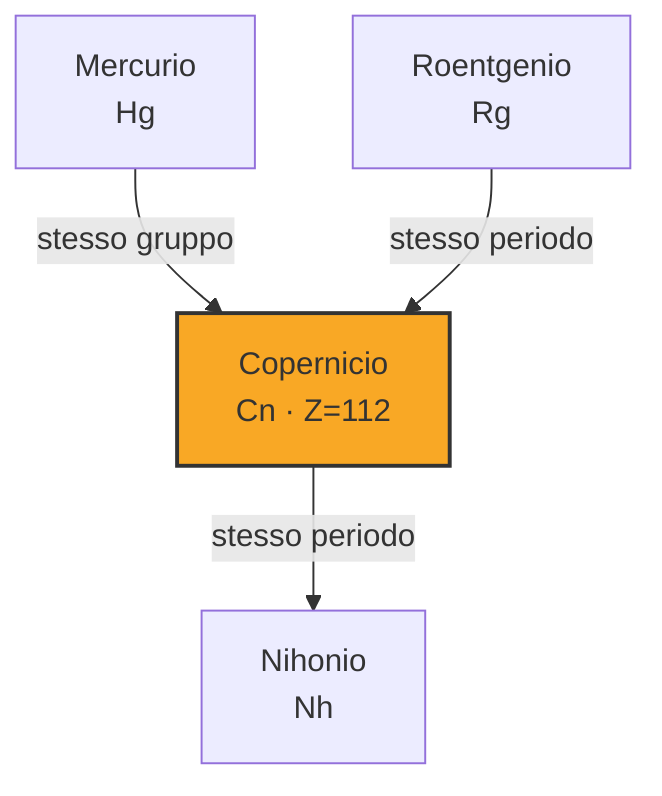

# Copernicio (Cn)

> [!abstract] 112° elemento scoperto — 1996
> 

## Cronologia della scoperta

## Storia della scoperta

## Posizione nella tavola periodica

## Caratteristiche

### Dati fisico-chimici

| Proprietà | Valore |
|---|---|
| Numero atomico | 112 |
| Massa atomica | 285,0 u |
| Categoria | Metallo di transizione |
| Gruppo | 12 |
| Periodo | 7 |
| Blocco | d |
| Configurazione elettronica | [Rn] 5f¹⁴ 6d¹⁰ 7s² |
| Punto di fusione | dato non disponibile |
| Punto di ebollizione | 3296,9 °C |
| Densità | 14,0 g/cm³ |
| Stati di ossidazione | — |

## Struttura atomica

![[atomo-Copernicio.svg]]

## Usi e presenza in natura

## Nella cronologia

← Precedente: [[Roentgenio]] (1994)
→ Successivo: [[Livermorio]] (2000)

Epoca: [[Era nucleare]] · Scopritore: [[Sigurd Hofmann]]

## Fonti

