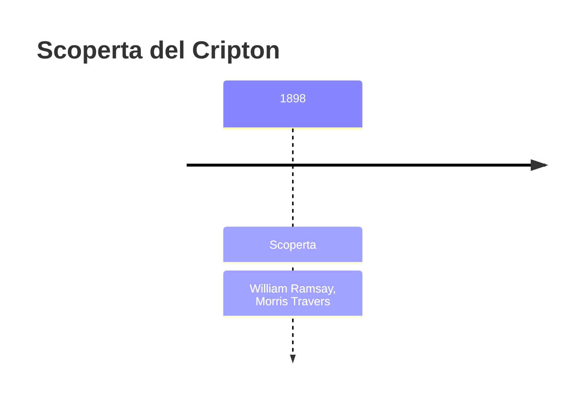
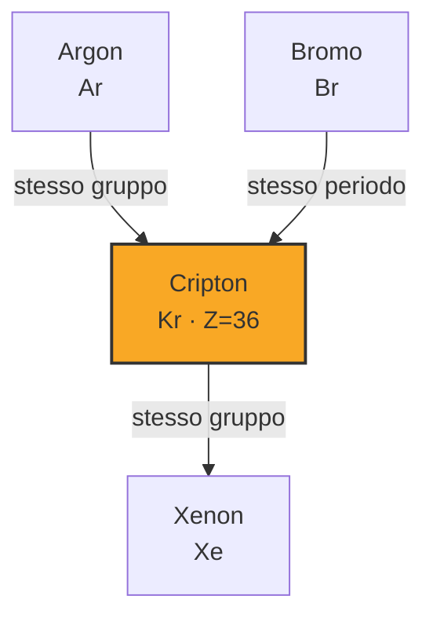
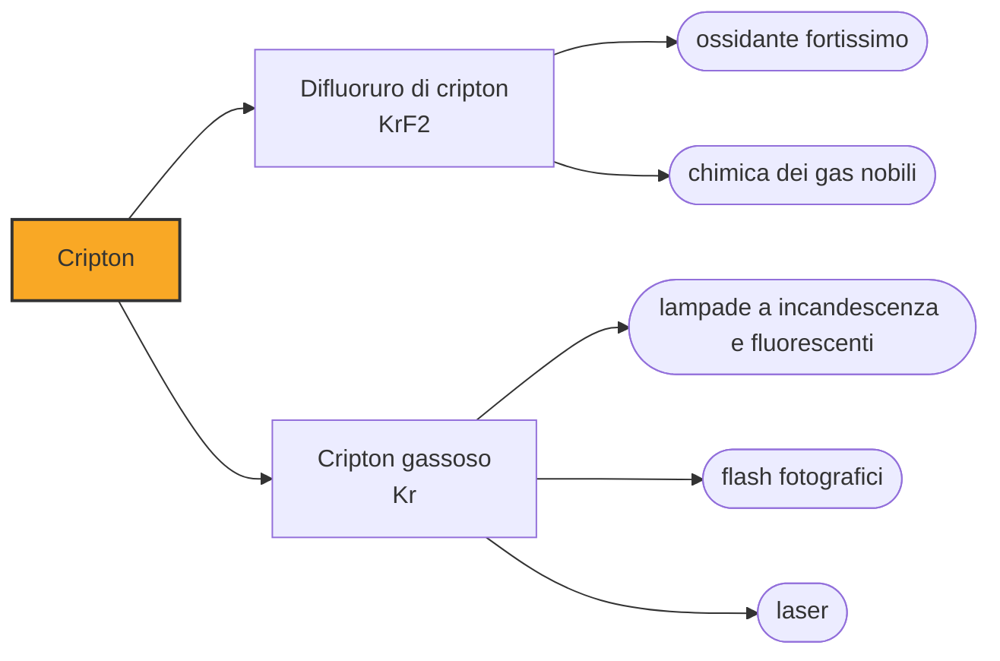

# Cripton (Kr)

> [!abstract] 78° elemento scoperto — 1898
> Per ventitré anni la lunghezza del metro non è stata la sbarra di platino conservata a Sèvres, ma un numero di lunghezze d'onda della luce arancione emessa da un gas trovato nel residuo dell'aria evaporata.

Il cripton è un gas nobile presente nell'aria in ragione di una parte per milione, incolore e quasi del tutto inerte. Il suo momento di gloria è stato metrologico: fra il 1960 e il 1983 il metro è stato definito come un multiplo della lunghezza d'onda di una delle sue righe spettrali.

## Cronologia della scoperta

> [!info] Nota sulla cronologia
> Primo dei tre gas nobili trovati da Ramsay e Travers nel 1898, ricavato dal residuo dell'aria liquida quasi completamente evaporata. Fra il 1960 e il 1983 la definizione del metro è stata basata su una riga spettrale del cripton-86.

## Storia della scoperta

Nel maggio del 1898 William Ramsay e Morris Travers lavoravano su quello che restava dopo aver fatto evaporare quasi tutta l'aria liquida: pochi centimetri cubi di gas che nessuno aveva ancora esaminato. Lo spettro mostrò due righe brillanti, una gialla e una verde, che non appartenevano a nulla di conosciuto.

Lo chiamarono cripton, dal greco kryptos, «nascosto», e la scelta descriveva due cose insieme: il modo in cui era stato trovato, in fondo a tutto e dopo aver tolto il resto, e il carattere di un gas che era rimasto nell'aria che tutti respiravano senza dare il minimo segno di sé per l'intera storia della chimica.

Il cripton fu il primo dei tre gas che Ramsay e Travers trovarono in quell'anno, e il metodo che aveva funzionato per lui — liquefare l'aria e raccogliere le frazioni secondo il punto di ebollizione — li portò nelle settimane successive al neon e allo xenon. Erano le tre caselle che restavano vuote nella colonna aperta dall'argon quattro anni prima.

Nel 1960 la Conferenza generale dei pesi e delle misure abbandonò il prototipo materiale del metro — la sbarra di platino-iridio conservata a Sèvres, che andava confrontata a mano e che si poteva danneggiare — e lo ridefinì come 1.650.763,73 lunghezze d'onda, nel vuoto, della radiazione emessa dal cripton-86 nella transizione fra due livelli energetici precisi. Era la prima volta che un'unità fondamentale veniva agganciata a una proprietà atomica invece che a un oggetto: chiunque avesse una lampada al cripton-86 e un interferometro poteva ricostruirsi il metro in casa propria.

Quella definizione durò fino al 1983, quando fu sostituita da una più precisa ancora: il metro come la distanza percorsa dalla luce nel vuoto in una frazione fissata di secondo. Il cripton aveva fatto da ponte fra il metro-oggetto e il metro-costante di natura, ed è un ruolo che nessun altro elemento ha avuto.

## Posizione nella tavola periodica

## Caratteristiche

Come gli altri gas nobili ha il guscio esterno completo e non forma legami in condizioni ordinarie, ma non è del tutto inerte: nel 1963 è stato preparato il difluoruro di cripton, che si ottiene facendo reagire il gas con il fluoro a bassissima temperatura ed è uno degli ossidanti più potenti che si conoscano.

È incolore, inodore e insapore, con una densità circa tre volte quella dell'aria, e liquefa a 120 kelvin. Nella scarica elettrica emette una luce biancastra tendente al verde-azzurro, meno vistosa di quella del neon ma con righe spettrali molto nette, che è la ragione per cui è servito alla metrologia.

Si ricava per distillazione frazionata dell'aria liquida negli stessi impianti che producono ossigeno e azoto, e in quantità minime: l'aria ne contiene circa una parte per milione, il che vuol dire che per un litro di cripton bisogna trattare un milione di litri d'aria. Una piccola frazione del cripton atmosferico è radiogenica, prodotta dalla fissione spontanea dell'uranio nella crosta, e un'altra piccola frazione arriva dai reattori nucleari, che liberano cripton-85 nei trattamenti del combustibile esausto.

### Dati fisico-chimici

| Proprietà | Valore |
|---|---|
| Numero atomico | 36 |
| Massa atomica | 83,7982 u |
| Categoria | Gas nobile |
| Gruppo | 18 |
| Periodo | 4 |
| Blocco | p |
| Configurazione elettronica | [Ar] 3d¹⁰ 4s² 4p⁶ |
| Punto di fusione | -157,4 °C |
| Punto di ebollizione | -153,2 °C |
| Densità | 3,749 g/cm³ |
| Stati di ossidazione | 0, +2 |

## Struttura atomica

![[atomo-Cripton.svg]]

## Usi e presenza in natura

Nelle lampade a incandescenza il cripton riduce l'evaporazione del filamento più dell'argon e permette temperature di lavoro più alte, cioè più luce a parità di consumo; nei tubi fluorescenti a risparmio energetico è mescolato all'argon per lo stesso motivo, e nei flash fotografici ad alta velocità dà una luce bianca con lo spettro adatto alla pellicola.

Il laser a fluoruro di cripton è uno degli strumenti della ricerca sulla fusione a confinamento inerziale, dove serve un impulso ultravioletto molto energetico e molto breve; laser a cripton ionizzato si usano in medicina e nella ricerca, dove servono righe nel rosso e nel giallo che l'argon non dà.

Il cripton-81, prodotto nell'atmosfera dai raggi cosmici, ha un'emivita di duecentoventinovemila anni e serve a datare acque sotterranee molto antiche: campioni di falda in cui il carbonio-14 è ormai esaurito si datano contando gli atomi di cripton-81 rimasti, con tecniche che ne rivelano poche migliaia per litro d'acqua.

## Curiosità

Nella storia delle unità di misura il cripton occupa un posto singolare: è l'unico elemento chimico su cui sia mai stata basata la definizione di una lunghezza. Il chilogrammo è rimasto un oggetto fino al 2019, il secondo dipende dal cesio, la lunghezza è passata per il cripton e poi per la velocità della luce.

Il pianeta natale di Superman, Krypton, e la kryptonite che lo indebolisce hanno preso il nome dall'elemento, non il contrario: il fumetto è del 1938, quarant'anni dopo la scoperta. È probabilmente il caso in cui il nome di un elemento chimico è arrivato al pubblico più vasto, e nel modo meno chimico possibile.

## Nella cronologia

← Precedente: [[Neon]] (1898)
→ Successivo: [[Xenon]] (1898)

Epoca: [[Spettroscopia e radioattività]] · Scopritori: [[William Ramsay]], [[Morris Travers]]

## Fonti

- [Krypton](https://en.wikipedia.org/wiki/Krypton) — consultata il 09/09/2026
- [Krypton — Royal Society of Chemistry](https://periodic-table.rsc.org/element/36/krypton) — consultata il 09/09/2026
- [History of the metre](https://en.wikipedia.org/wiki/History_of_the_metre) — consultata il 09/09/2026

---

> [!warning] Avvertenza
> Questo progetto è stato realizzato con l'assistenza di sistemi di
> intelligenza artificiale. I contenuti sono verificati sulle fonti citate,
> ma **possono contenere errori e imprecisioni**: prima di riutilizzarli,
> controlla la fonte.
